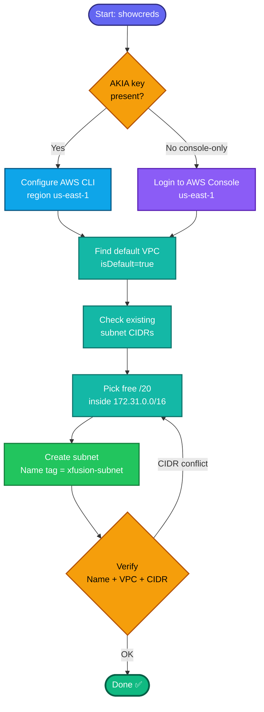

## Concept

A **subnet** is a range of IP addresses carved out of a VPC's CIDR block, bound to a **single Availability Zone**. It's where ENIs/instances actually live. Key points for this task:

- A subnet needs a **CIDR block that fits inside the VPC's CIDR** and doesn't overlap existing subnets. The default VPC uses `172.31.0.0/16`, and its default subnets are `/20` blocks — so you must pick a free range (e.g. `172.31.96.0/20` is commonly free, but confirm).
- The **"name"** (`xfusion-subnet`) is not a native property — it's a **`Name` tag**. The console's Name field just writes that tag; via CLI you use `--tag-specifications`.
- Subnet is **AZ-scoped** — you specify one AZ (or let AWS pick).

## Prerequisites

- `showcreds` first — if only console creds (no `AKIA`), use the console path (same pattern as your recent labs).
- Region **us-east-1**.
- The **default VPC ID** and a **non-overlapping CIDR** within it.

## OTS (CLI)

```bash
REGION=us-east-1

# 1. Default VPC + its CIDR
VPC_ID=$(aws ec2 describe-vpcs --filters "Name=isDefault,Values=true" \
  --query 'Vpcs[0].VpcId' --output text --region $REGION)
aws ec2 describe-vpcs --vpc-ids $VPC_ID --region $REGION \
  --query 'Vpcs[0].CidrBlock' --output text          # expect 172.31.0.0/16

# 2. See which CIDRs are already taken (avoid overlap)
aws ec2 describe-subnets --filters "Name=vpc-id,Values=$VPC_ID" --region $REGION \
  --query 'Subnets[].CidrBlock' --output text

# 3. Create the subnet (pick a FREE /20 — adjust if 96 is taken)
SUBNET_ID=$(aws ec2 create-subnet \
  --vpc-id $VPC_ID \
  --cidr-block 172.31.96.0/20 \
  --availability-zone us-east-1a \
  --tag-specifications 'ResourceType=subnet,Tags=[{Key=Name,Value=xfusion-subnet}]' \
  --region $REGION \
  --query 'Subnet.SubnetId' --output text)
echo "Created: $SUBNET_ID"
```

**Verify:**
```bash
aws ec2 describe-subnets --subnet-ids $SUBNET_ID --region us-east-1 \
  --query 'Subnets[0].{ID:SubnetId,CIDR:CidrBlock,AZ:AvailabilityZone,VPC:VpcId,Name:Tags[?Key==`Name`]|[0].Value}'
```

## Runbook (console path)

1. Console URL → sign in `kk_labs_user_188587` / `j%j!0P2qE%@@`.
2. Confirm region **US East (N. Virginia) us-east-1**.
3. **VPC → Subnets → Create subnet**.
4. **VPC ID:** select the **default VPC**.
5. Subnet settings:
   - **Subnet name:** `xfusion-subnet`
   - **Availability Zone:** pick any (e.g. `us-east-1a`) or "No preference".
   - **IPv4 CIDR block:** a free block inside `172.31.0.0/16` — the console suggests one; accept it if it doesn't clash.
6. **Create subnet** → verify it shows Name `xfusion-subnet` under the default VPC.

---

### Gotchas
- **CIDR overlap = `InvalidSubnet.Conflict`.** Always list existing subnet CIDRs first and pick a gap. In the console this is handled for you.
- **Name is a tag** — if the grader can't find `xfusion-subnet`, the `Name` tag wasn't set correctly.
- **Default VPC only** — don't create a new VPC.
- Region **us-east-1** everywhere.

---

## Colorful flow diagram



This SG/subnet series is clearly the KodeKloud AWS migration track — want me to bundle all these (key pair, security group, subnet) into a single Terraform module for your landing-zone portfolio repo?