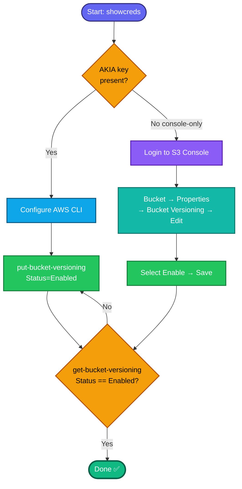

## Concept

**S3 versioning** keeps every version of an object in a bucket. Once enabled, overwriting or deleting an object doesn't destroy prior data — S3 retains older versions and, on delete, adds a **delete marker** instead of purging the object. This is the core primitive for accidental-deletion/corruption recovery.

Key facts:
- Versioning is a **bucket-level** setting with three states: `Unversioned` (never enabled), `Enabled`, `Suspended`. It's **off by default**.
- Once you enable it, you can only **suspend** it, never fully return to unversioned.
- **S3 is global in namespace but region-scoped for the bucket** — you don't pass a region to enable versioning, but the bucket lives in one region.

## Prerequisites

- `showcreds` first — if only console creds (no `AKIA`), use the console path (same pattern as your other labs this session).
- Bucket `datacenter-s3-2976` already exists (task says "one of the buckets they manage").

## OTS (CLI)

```bash
# Enable versioning
aws s3api put-bucket-versioning \
  --bucket datacenter-s3-2976 \
  --versioning-configuration Status=Enabled
```

**Verify:**
```bash
aws s3api get-bucket-versioning --bucket datacenter-s3-2976
```
Expected output:
```json
{
    "Status": "Enabled"
}
```

## Runbook (console path)

1. Console URL → sign in with the lab username/password.
2. Search **S3** → click bucket **`datacenter-s3-2976`**.
3. Go to the **Properties** tab.
4. Find **Bucket Versioning** → **Edit**.
5. Select **Enable** → **Save changes**.
6. Confirm the Properties tab now shows Bucket Versioning: **Enabled**.

---

### Gotchas
- **No region flag needed** for `put-bucket-versioning`, but the CLI must still resolve the bucket's region — if you hit a redirect error, add `--region us-east-1` (or the bucket's actual region).
- **`Status` is case-sensitive** — it must be exactly `Enabled`.
- Don't create a new bucket; the target already exists.
- Grader checks `Status=Enabled` via `get-bucket-versioning`.

---

## Colorful flow diagram



Want the Terraform equivalent (`aws_s3_bucket_versioning`) to add to your portfolio repo alongside the key pair / SG / subnet resources?