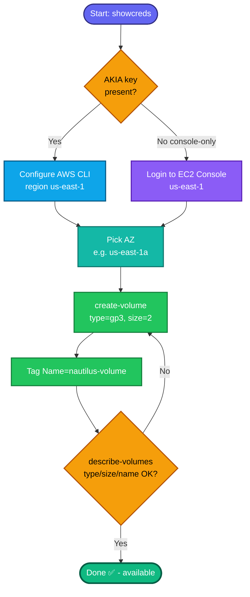

## Concept

An **EBS volume** is network-attached block storage for EC2 — think of it as a virtual disk you can attach to an instance. Key facts for this task:

- **Volume type `gp3`** is the current-generation general-purpose SSD. Unlike `gp2`, its baseline performance (3,000 IOPS / 125 MiB/s) is **decoupled from size**, so a tiny 2 GiB volume still gets full baseline IOPS. Cheaper and more flexible than gp2.
- **EBS volumes are AZ-scoped** — a volume exists in one Availability Zone and can only attach to instances in that same AZ. You must specify an AZ at creation.
- **"Name" is a `Name` tag**, not a native field — `nautilus-volume` is set via tagging (console Name field or CLI `--tag-specifications`).
- Size is in **GiB**; `2 GiB` = `--size 2`.

## Prerequisites

- `showcreds` first — if only console creds (no `AKIA`), use the console path (same pattern as your other labs this session).
- Region **us-east-1**; pick an AZ within it (e.g. `us-east-1a`).

## OTS (CLI)

```bash
REGION=us-east-1
AZ=us-east-1a

VOL_ID=$(aws ec2 create-volume \
  --volume-type gp3 \
  --size 2 \
  --availability-zone $AZ \
  --tag-specifications 'ResourceType=volume,Tags=[{Key=Name,Value=nautilus-volume}]' \
  --region $REGION \
  --query 'VolumeId' --output text)
echo "Created: $VOL_ID"
```

**Verify:**
```bash
aws ec2 describe-volumes --volume-ids $VOL_ID --region us-east-1 \
  --query 'Volumes[0].{ID:VolumeId,Type:VolumeType,Size:Size,AZ:AvailabilityZone,State:State,Name:Tags[?Key==`Name`]|[0].Value}'
```
Expect `Type=gp3`, `Size=2`, and `Name=nautilus-volume`.

## Runbook (console path)

1. Console URL → sign in with the lab username/password.
2. Confirm region **US East (N. Virginia) us-east-1**.
3. **EC2 → Elastic Block Store → Volumes → Create volume**.
4. Set:
   - **Volume type:** `gp3`
   - **Size:** `2` GiB
   - **Availability Zone:** e.g. `us-east-1a`
   - **Tags → Add tag:** Key `Name`, Value `nautilus-volume`
5. **Create volume** → verify it appears with type `gp3`, size `2 GiB`, name `nautilus-volume`.

---

### Gotchas
- **Name is a tag** — if you skip the tag (console Name field / CLI tag-spec), the grader won't find `nautilus-volume`.
- **AZ is mandatory** — no "regional" volume; any valid AZ in us-east-1 is fine unless the task pins one.
- **Size unit is GiB** — enter `2`, not `2048`.
- Volume will be in `available` state (unattached) — that's expected; the task doesn't ask to attach it.
- Region **us-east-1** everywhere.

---

## Colorful flow diagram



Want the Terraform `aws_ebs_volume` equivalent to bundle with the key pair / SG / subnet / S3 resources you've been building through this track?