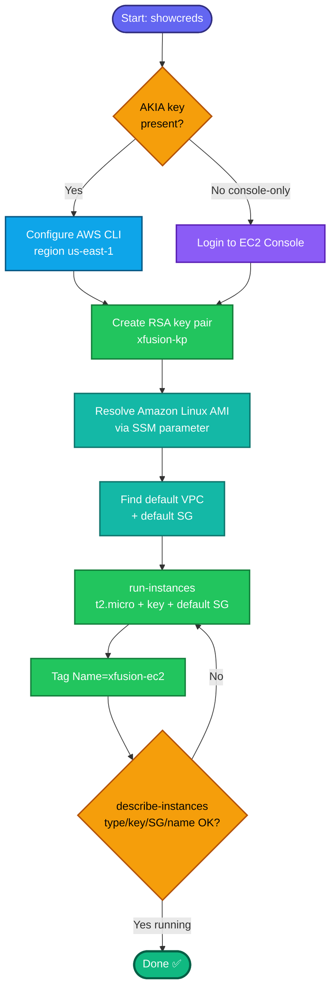

## Concept

An **EC2 instance** is a virtual server. Launching one ties together several resources you've already built in this track:

- **AMI (Amazon Machine Image)** — the OS template. "Amazon Linux" is AWS's own distro; you resolve its current AMI ID dynamically (it changes as AWS patches it) rather than hardcoding.
- **Instance type `t2.micro`** — 1 vCPU / 1 GiB RAM, the free-tier burstable type.
- **Key pair** — SSH credential; here you create a **new** RSA key `xfusion-kp` as part of the task.
- **Security group** — the "default" SG of the VPC (allows all traffic within the SG, all outbound). The task says attach the default one, so no custom rules.
- **Name** `xfusion-ec2` is a **`Name` tag**, set via `--tag-specifications`.

## Prerequisites

- `showcreds` first — if only console creds (no `AKIA`), use the console path (same pattern as your other labs).
- Region **us-east-1**.
- Default VPC + its **default security group ID**.

## OTS (CLI)

```bash
REGION=us-east-1

# 1. Create the RSA key pair
aws ec2 create-key-pair \
  --key-name xfusion-kp --key-type rsa --key-format pem \
  --region $REGION --query 'KeyMaterial' --output text > xfusion-kp.pem
chmod 400 xfusion-kp.pem

# 2. Resolve latest Amazon Linux 2 AMI via SSM (no hardcoding)
AMI_ID=$(aws ssm get-parameters \
  --names /aws/service/ami-amazon-linux-latest/amzn2-ami-hvm-x86_64-gp2 \
  --query 'Parameters[0].Value' --output text --region $REGION)
echo "AMI: $AMI_ID"

# 3. Default VPC + its default security group
VPC_ID=$(aws ec2 describe-vpcs --filters "Name=isDefault,Values=true" \
  --query 'Vpcs[0].VpcId' --output text --region $REGION)
SG_ID=$(aws ec2 describe-security-groups \
  --filters "Name=vpc-id,Values=$VPC_ID" "Name=group-name,Values=default" \
  --query 'SecurityGroups[0].GroupId' --output text --region $REGION)
echo "Default SG: $SG_ID"

# 4. Launch the instance
INSTANCE_ID=$(aws ec2 run-instances \
  --image-id $AMI_ID \
  --instance-type t2.micro \
  --key-name xfusion-kp \
  --security-group-ids $SG_ID \
  --tag-specifications 'ResourceType=instance,Tags=[{Key=Name,Value=xfusion-ec2}]' \
  --region $REGION \
  --query 'Instances[0].InstanceId' --output text)
echo "Launched: $INSTANCE_ID"
```

**Verify:**
```bash
aws ec2 describe-instances --instance-ids $INSTANCE_ID --region us-east-1 \
  --query 'Reservations[0].Instances[0].{ID:InstanceId,Type:InstanceType,Key:KeyName,State:State.Name,SG:SecurityGroups[0].GroupName,Name:Tags[?Key==`Name`]|[0].Value}'
```
Expect `Type=t2.micro`, `Key=xfusion-kp`, `SG=default`, `Name=xfusion-ec2`.

## Runbook (console path)

1. Console URL → sign in → confirm region **us-east-1**.
2. **EC2 → Instances → Launch instances**.
3. **Name:** `xfusion-ec2`.
4. **AMI:** select **Amazon Linux** (Amazon Linux 2 / 2023, free-tier eligible).
5. **Instance type:** `t2.micro`.
6. **Key pair → Create new key pair:**
   - Name: `xfusion-kp` · Type: **RSA** · Format: **.pem** → Create (downloads).
7. **Network settings → Edit → Firewall (security groups) → Select existing security group** → choose **default**.
8. **Launch instance** → verify it moves to `running` with the right name/type/key/SG.

---

### Gotchas
- **Create the key pair as part of launch** — the task explicitly wants a *new* `xfusion-kp`. If it already exists, you'll get a duplicate error; delete and recreate or reuse depending on grader tolerance.
- **Attach the *existing* default SG**, don't create a new one. In console, choose "Select existing security group" → `default` (not "Create security group").
- **AMI is dynamic** — use the SSM parameter so you always get a valid current Amazon Linux ID; a stale hardcoded ID throws `InvalidAMIID.NotFound`.
- **Name is a tag** — grader looks for `Name=xfusion-ec2`.
- Region **us-east-1** everywhere; `t2.micro` exactly.

---

## Colorful flow diagram



This is the full EC2 launch that ties together the key pair, SG, and networking pieces from earlier tasks. Want me to consolidate this whole KodeKloud AWS track (key pair → SG → subnet → S3 versioning → EBS volume → EC2) into one Terraform module for your portfolio repo?