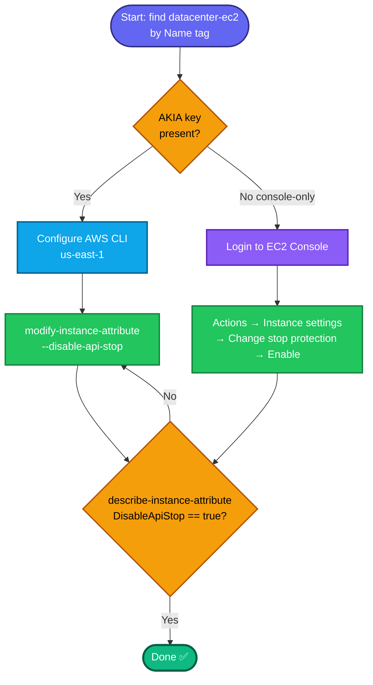

## Concept

**Stop protection** prevents an EC2 instance from being stopped via the API/console until the protection is explicitly disabled — it guards against accidental stops (which would interrupt workloads and can change the public IP). It's controlled by the instance attribute **`disableApiStop`**.

Don't confuse the two protections:
- **Stop protection** (`disableApiStop`) → blocks *stopping* the instance. ← this task
- **Termination protection** (`disableApiTermination`) → blocks *terminating* the instance.

Both are independent boolean attributes; the instance can be running or stopped when you set them (no stop/start needed).

## Prerequisites

- `showcreds` first — if only console creds (no `AKIA`), use the console path.
- Region **us-east-1**.
- Instance `datacenter-ec2` exists.

## OTS (CLI)

```bash
REGION=us-east-1

# 0. Resolve instance ID by Name tag
IID=$(aws ec2 describe-instances \
  --filters "Name=tag:Name,Values=datacenter-ec2" "Name=instance-state-name,Values=pending,running,stopped" \
  --query 'Reservations[0].Instances[0].InstanceId' --output text --region $REGION)
echo "Instance: $IID"

# 1. Enable stop protection
aws ec2 modify-instance-attribute \
  --instance-id $IID \
  --disable-api-stop \
  --region $REGION
```

**Verify:**
```bash
aws ec2 describe-instance-attribute \
  --instance-id $IID --attribute disableApiStop --region us-east-1 \
  --query 'DisableApiStop.Value'
```
Expected output: `true`

## Runbook (console path)

1. Console → region **us-east-1** → **EC2 → Instances**.
2. Select **`datacenter-ec2`**.
3. **Actions → Instance settings → Change stop protection**.
4. Tick **Enable** → **Save**.
5. Verify: re-open **Change stop protection** — it shows **Enabled** (or the Details tab shows Stop protection: Enabled).

---

### Gotchas
- **`--disable-api-stop`** is the flag that **enables** stop protection (the attribute is literally named `disableApiStop`, and setting it true = protected). Its opposite is `--enable-api-stop` (which *disables* protection). Counter-intuitive naming — read it as "disable the API-stop action."
- **No stop/start required** — this is a metadata attribute change; the instance stays in whatever state it's in.
- **Don't confuse with termination protection** — grader checks `DisableApiStop=true`, not `DisableApiTermination`.
- Region **us-east-1**.

---

## Colorful flow diagram



The `disableApiStop` vs `disableApiTermination` naming trips people up constantly — worth noting in your runbook collection. Want the Terraform equivalent (`disable_api_stop = true` on the `aws_instance`) for your portfolio repo?