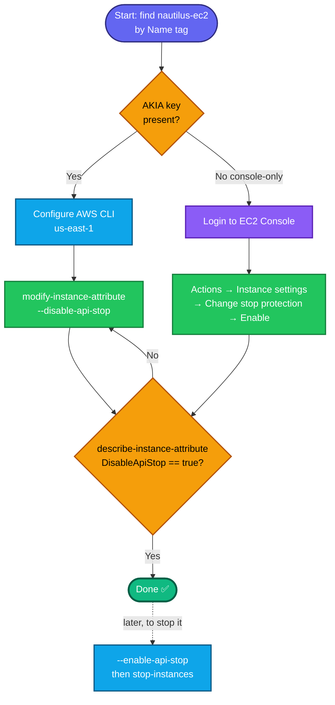
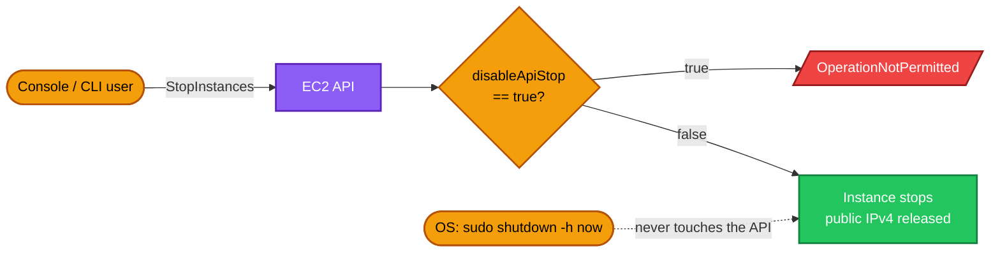

# Runbook: Enable EC2 Stop Protection — AWS

**Task family:** Nautilus / KodeKloud AWS migration labs
**Example deliverable:** stop protection enabled on instance `nautilus-ec2`, region `us-east-1`
**Author context:** aws-client lab host, time-boxed session credentials
**Siblings:** `07.AWS_EC2_chnage.md` (same task on `datacenter-ec2`) · `10.AWS_EC2_terminal_protection.md` (termination protection)

---

## Concept

**Stop protection** blocks the `StopInstances` API call — and therefore the console's **Stop instance** action — until the protection is explicitly removed. It exists because stopping an instance is disruptive in ways people underestimate: the workload dies, the **auto-assigned public IPv4 changes on the next start**, and instance-store data is lost forever.

It is a single boolean instance attribute: **`disableApiStop`**.

### The two protections, side by side

| | Stop protection | Termination protection |
|---|---|---|
| Attribute | `disableApiStop` | `disableApiTermination` |
| Blocks | `StopInstances` | `TerminateInstances` |
| CLI flag to **turn protection ON** | `--disable-api-stop` | `--disable-api-termination` |
| CLI flag to **turn protection OFF** | `--enable-api-stop` | `--enable-api-termination` |
| Error when it fires | `OperationNotPermitted` | `OperationNotPermitted` |
| Reversible damage if it fails? | Yes — restart it | **No** — the instance is gone |

They are **independent booleans**. Enabling one does nothing to the other, and both are live metadata changes — the instance keeps whatever state it is in, no stop/start required.

> **Read the flag as a sentence, not a switch.** `--disable-api-stop` means *"disable the API's ability to stop this instance."* Setting `disableApiStop = true` is the protected state. Almost everyone gets this backwards on the first attempt.

---

## Prerequisites

- Terminal on the **aws-client** host; run `showcreds` first — if it returns only console URL/username/password (no `AKIA` key), the CLI is closed, use the console path.
- Region **us-east-1**.
- The target instance exists and is in `pending`, `running`, `stopping` or `stopped` state.
- Credentials need `ec2:DescribeInstances`, `ec2:ModifyInstanceAttribute`, `ec2:DescribeInstanceAttribute`.

## TODO

1. Check creds → pick CLI or console path.
2. Resolve the `InstanceId` from the `Name` tag.
3. Set `disableApiStop = true`.
4. Verify the attribute reads `true` (non-destructively).

---

## OTS (CLI, one block)

```bash
REGION=us-east-1
INSTANCE_NAME=nautilus-ec2        # <- whatever the task names

# 0. Resolve instance ID by Name tag
IID=$(aws ec2 describe-instances \
  --filters "Name=tag:Name,Values=$INSTANCE_NAME" \
            "Name=instance-state-name,Values=pending,running,stopping,stopped" \
  --query 'Reservations[0].Instances[0].InstanceId' --output text --region $REGION)
echo "Instance: $IID"

# 1. Enable stop protection
aws ec2 modify-instance-attribute \
  --instance-id $IID \
  --disable-api-stop \
  --region $REGION
```

**Verify (safe, non-destructive — use this for the grader):**
```bash
aws ec2 describe-instance-attribute \
  --instance-id $IID --attribute disableApiStop --region $REGION \
  --query 'DisableApiStop.Value'
```
Expected output: `true`

**See both protections at once:**
```bash
for ATTR in disableApiStop disableApiTermination; do
  printf '%-24s %s\n' "$ATTR" \
    "$(aws ec2 describe-instance-attribute --instance-id $IID \
        --attribute $ATTR --region $REGION --output text --query '*.Value')"
done
```

---

## The reverse operation (turning protection back off)

You will need this before any legitimate stop, and it is the half of the task most runbooks forget:

```bash
# Remove stop protection, then stop the instance
aws ec2 modify-instance-attribute --instance-id $IID --enable-api-stop --region $REGION
aws ec2 stop-instances --instance-ids $IID --region $REGION
aws ec2 wait instance-stopped --instance-ids $IID --region $REGION
```

---

## Optional destructive proof (skip on a graded lab)

```bash
# SHOULD fail while protection is on
aws ec2 stop-instances --instance-ids $IID --region $REGION
```
Expected:
```
An error occurred (OperationNotPermitted) when calling the StopInstances operation:
The instance '<id>' may not be stopped. Modify its 'disableApiStop' instance
attribute and try again.
```
That error **is** the success signal. Unlike the termination equivalent this one is recoverable if protection turns out not to be on — you just start the instance again — but the public IPv4 will have changed, so prefer `describe-instance-attribute`.

---

## Runbook (console path)

1. Console URL → sign in with the lab username/password.
2. Region selector → **us-east-1** → **EC2 → Instances**.
3. Select **`nautilus-ec2`**.
4. **Actions → Instance settings → Change stop protection**.
5. Tick **Enable** → **Save**.
6. Verify: the **Details** tab shows **Stop protection: Enabled**, and the instance's **Stop instance** action is greyed out.

---

## What stop protection does *not* do

This is the part interviewers probe, because it is where people build false confidence:

| It does not stop… | Why | What actually covers you |
|---|---|---|
| **Termination** | Different attribute entirely | `disableApiTermination` (`10.AWS_EC2_terminal_protection.md`) |
| **An OS-initiated shutdown** | `sudo shutdown -h now` never calls the EC2 API | `InstanceInitiatedShutdownBehavior` (`stop` vs `terminate`) governs what happens next |
| **A Spot interruption** | AWS reclaiming capacity is not a `StopInstances` call | Don't run protection-worthy workloads on Spot without checkpointing |
| **Auto Scaling terminating the instance** | ASG has its own lifecycle path | ASG **instance scale-in protection**, a separate feature |
| **Underlying hardware failure or a scheduled retirement** | Nothing at the API layer can prevent physical events | Multi-AZ design, not instance flags |
| **Someone with IAM rights simply turning it off** | The flag is advisory to anyone holding `ec2:ModifyInstanceAttribute` | An IAM policy denying that action on tagged instances (below) |

**Instance-store root volumes can't be stopped at all** — so stop protection is meaningless there. Only EBS-backed instances have a stop state.

---

## Making it policy, not a sticky note

The flag protects against the slip of the hand. It does not protect against someone deliberately clearing it. In a real account you pair it with an IAM guardrail on a tag:

```json
{
  "Version": "2012-10-17",
  "Statement": [{
    "Sid": "DenyStopOnProtectedInstances",
    "Effect": "Deny",
    "Action": ["ec2:StopInstances", "ec2:ModifyInstanceAttribute"],
    "Resource": "arn:aws:ec2:*:*:instance/*",
    "Condition": {
      "StringEquals": { "ec2:ResourceTag/Protected": "true" }
    }
  }]
}
```

Attached to everyone except a break-glass role, that turns "please don't" into "you can't."

## IaC equivalents

```hcl
# Terraform
resource "aws_instance" "nautilus" {
  # ...
  disable_api_stop        = true
  disable_api_termination = true
}
```

```yaml
# CloudFormation
Resources:
  NautilusEc2:
    Type: AWS::EC2::Instance
    Properties:
      DisableApiStop: true
      DisableApiTermination: true
```

Declaring it in code is what makes the protection survive a rebuild — a flag set by hand in the console is drift, and the next `terraform apply` may quietly clear it.

---

### Gotchas

- **`--disable-api-stop` ENABLES protection.** The opposite flag is `--enable-api-stop`. Reading it as "disable the API-stop action" is the only way to keep it straight.
- **No stop/start required** — metadata change, instance keeps its current state.
- **Don't confuse it with termination protection** — the grader checks `DisableApiStop=true`, not `DisableApiTermination`.
- **`modify-instance-attribute` takes one attribute per call.** You cannot set stop and termination protection in a single command; run it twice.
- **The `Name` is a tag, not a property** — always resolve `InstanceId` via `--filters "Name=tag:Name,..."`.
- **Include `stopped` in the state filter.** If the instance is already stopped and your filter only lists `running`, the lookup returns `None` and every later command fails with a confusing error.
- Region **us-east-1**.

---

## Colorful flow diagram



## Where the API call actually lands



That dotted line is the whole lesson: the flag guards the **API**, not the machine. Anything that halts the instance without calling `StopInstances` walks straight past it.

---

## Key takeaways

1. `disableApiStop = true` is the **protected** state, and `--disable-api-stop` is the flag that sets it. The naming is inverted on purpose — it describes the action being disabled.
2. Stop and termination protection are **independent**; set both on anything that matters, in two separate calls.
3. It is an **API-layer guard**. OS shutdowns, Spot interruptions, ASG scale-in, and hardware failure all bypass it.
4. Verify with `describe-instance-attribute`, never by attempting the destructive action.
5. Declare it in Terraform/CloudFormation so it survives a rebuild, and back it with a tag-conditioned IAM Deny so it survives a colleague.
