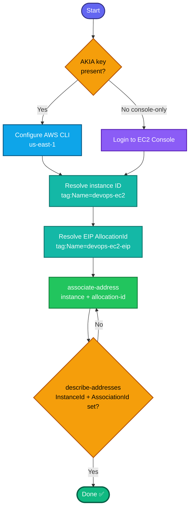

## Concept

An **Elastic IP (EIP)** is a static public IPv4 address you allocate to your account and can associate/re-associate to instances (or ENIs). Unlike the auto-assigned public IP — which changes on every stop/start — an EIP stays fixed, so it's used when a resource needs a stable public address.

For this task: the EIP `devops-ec2-eip` is already **allocated**; you just need to **associate** it with `devops-ec2`. The instance must be **running** for a clean association.

Note: `devops-ec2-eip` is a **`Name` tag** on the EIP allocation, not its address — you resolve the `AllocationId` from that tag.

## Prerequisites

- `showcreds` first — if only console creds (no `AKIA`), use the console path.
- Region **us-east-1**.
- Both resources exist; instance ideally `running`.

## OTS (CLI)

```bash
REGION=us-east-1

# 0. Resolve instance ID by Name tag
IID=$(aws ec2 describe-instances \
  --filters "Name=tag:Name,Values=devops-ec2" "Name=instance-state-name,Values=pending,running,stopped" \
  --query 'Reservations[0].Instances[0].InstanceId' --output text --region $REGION)
echo "Instance: $IID"

# 1. Resolve the EIP AllocationId by its Name tag
ALLOC_ID=$(aws ec2 describe-addresses \
  --filters "Name=tag:Name,Values=devops-ec2-eip" \
  --query 'Addresses[0].AllocationId' --output text --region $REGION)
echo "Allocation: $ALLOC_ID"

# 2. Associate the EIP with the instance
aws ec2 associate-address \
  --instance-id $IID \
  --allocation-id $ALLOC_ID \
  --region $REGION
```

**Verify:**
```bash
aws ec2 describe-addresses \
  --filters "Name=tag:Name,Values=devops-ec2-eip" --region us-east-1 \
  --query 'Addresses[0].{EIP:PublicIp,Instance:InstanceId,Assoc:AssociationId}'
```
Expect `Instance` = your `devops-ec2` ID and a non-null `AssociationId`.

## Runbook (console path)

1. Console → region **us-east-1** → **EC2 → Network & Security → Elastic IPs**.
2. Select **`devops-ec2-eip`**.
3. **Actions → Associate Elastic IP address**.
4. **Resource type:** Instance → **Instance:** select **`devops-ec2`**.
5. (Leave private IP as default) → **Associate**.
6. Verify: the EIP row now shows the associated instance ID.

---

### Gotchas
- **Resolve by Name tag** — both the instance and the EIP are found via `tag:Name`, since the given names aren't native IDs.
- **Instance should be running** — association works on a stopped instance too, but the public address only becomes reachable when running.
- **Re-association charges** — associating an EIP to a running instance is free; an EIP not associated with a running instance incurs a small hourly charge (not your concern for the lab, but good to know).
- **AssociationId must be non-null** after — that's the grader's signal.
- Region **us-east-1**.

---

## Colorful flow diagram



Want the Terraform `aws_eip_association` equivalent for your portfolio repo, or a combined "EC2 provisioning + EIP" module tying together the instance/key/SG/EIP tasks from this track?