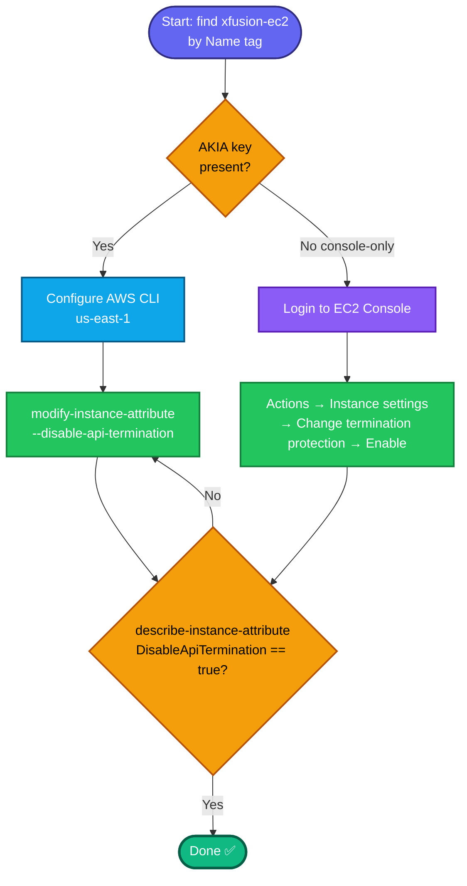

## Concept

**Termination protection** prevents an EC2 instance from being *terminated* (permanently deleted) via the API/console until the protection is explicitly disabled. It guards against accidental irreversible deletion. It's controlled by the instance attribute **`disableApiTermination`**.

Contrast with the previous task:
- **Stop protection** (`disableApiStop`) → blocks *stopping*.
- **Termination protection** (`disableApiTermination`) → blocks *terminating*. ← this task

Both are independent booleans; no stop/start needed — it's a live metadata change.

## Prerequisites

- `showcreds` first — if only console creds (no `AKIA`), use the console path.
- Region **us-east-1**.
- Instance `xfusion-ec2` exists.

## OTS (CLI)

```bash
REGION=us-east-1

# 0. Resolve instance ID by Name tag
IID=$(aws ec2 describe-instances \
  --filters "Name=tag:Name,Values=xfusion-ec2" "Name=instance-state-name,Values=pending,running,stopped" \
  --query 'Reservations[0].Instances[0].InstanceId' --output text --region $REGION)
echo "Instance: $IID"

# 1. Enable termination protection
aws ec2 modify-instance-attribute \
  --instance-id $IID \
  --disable-api-termination \
  --region $REGION
```

**Verify:**
```bash
aws ec2 describe-instance-attribute \
  --instance-id $IID --attribute disableApiTermination --region us-east-1 \
  --query 'DisableApiTermination.Value'
```
Expected output: `true`

## Runbook (console path)

1. Console → region **us-east-1** → **EC2 → Instances**.
2. Select **`xfusion-ec2`**.
3. **Actions → Instance settings → Change termination protection**.
4. Tick **Enable** → **Save**.
5. Verify: re-open **Change termination protection** — shows **Enabled** (or Details tab → Termination protection: Enabled).

---

### Gotchas
- **`--disable-api-termination`** is the flag that **enables** termination protection (attribute is `disableApiTermination`; setting it true = protected). Opposite is `--enable-api-termination` (which *removes* protection). Read it as "disable the API-terminate action."
- **No stop/start needed** — metadata change; instance keeps its current state.
- **Don't confuse with stop protection** — grader checks `DisableApiTermination=true`, not `DisableApiStop`.
- Region **us-east-1**.

### Optional validation (destructive — proves the block)
```bash
# SHOULD fail with OperationNotPermitted if protection is on
aws ec2 terminate-instances --instance-ids $IID --region us-east-1
```
Expected:
```
An error occurred (OperationNotPermitted) when calling the TerminateInstances operation:
The instance '<id>' may not be terminated. Modify its 'disableApiTermination'
instance attribute and try again.
```
That error **is** the success signal. Prefer the non-destructive `describe-instance-attribute` check for graded safety — a successful terminate would destroy the instance.

---

## Colorful flow diagram



You now have both protection tasks covered — `disableApiStop` and `disableApiTermination`. Want me to bundle these two into a single "instance hardening" runbook, or add both as `disable_api_stop`/`disable_api_termination` flags in a Terraform `aws_instance` for your portfolio?