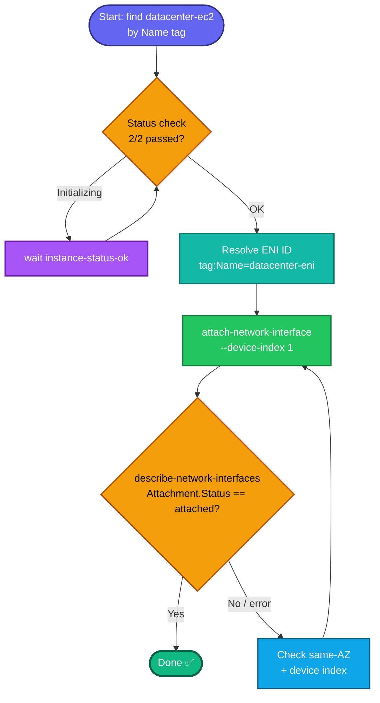

## Concept

An **Elastic Network Interface (ENI)** is a virtual network card. An instance always has a **primary ENI** (`eth0`), and you can attach **secondary ENIs** to give it additional private IPs, multiple subnets, or separate management/data planes. This task attaches an existing secondary ENI `datacenter-eni` to `datacenter-ec2`.

Key facts:
- ENI and instance must be in the **same Availability Zone** — an ENI is subnet-scoped, and subnets are AZ-scoped. If they're in different AZs, attach will fail.
- Attaching a secondary ENI needs a **device index** ≥ 1 (0 is the primary). Use `--device-index 1`.
- The attachment produces an **`AttachmentId`** and moves the ENI's status to **`in-use` / attached**.
- `datacenter-eni` is a **`Name` tag** on the ENI → resolve `NetworkInterfaceId` from it.

## Prerequisites

- `showcreds` first — if only console creds (no `AKIA`), use the console path.
- Region **us-east-1**.
- Instance **initialization complete** (task requires it) — wait for `2/2` status checks.
- ENI and instance in the **same AZ**.

## OTS (CLI)

```bash
REGION=us-east-1

# 0. Resolve instance ID by Name tag
IID=$(aws ec2 describe-instances \
  --filters "Name=tag:Name,Values=datacenter-ec2" "Name=instance-state-name,Values=pending,running,stopped" \
  --query 'Reservations[0].Instances[0].InstanceId' --output text --region $REGION)
echo "Instance: $IID"

# 1. Ensure initialization/status checks complete (handles 'Initializing')
aws ec2 wait instance-status-ok --instance-ids $IID --region $REGION
echo "Status checks OK"

# 2. Resolve the ENI ID by its Name tag
ENI_ID=$(aws ec2 describe-network-interfaces \
  --filters "Name=tag:Name,Values=datacenter-eni" \
  --query 'NetworkInterfaces[0].NetworkInterfaceId' --output text --region $REGION)
echo "ENI: $ENI_ID"

# 3. Attach the ENI at device index 1
aws ec2 attach-network-interface \
  --network-interface-id $ENI_ID \
  --instance-id $IID \
  --device-index 1 \
  --region $REGION
```

**Verify (status must be `attached`):**
```bash
aws ec2 describe-network-interfaces \
  --network-interface-ids $ENI_ID --region us-east-1 \
  --query 'NetworkInterfaces[0].{Status:Status,AttachStatus:Attachment.Status,Instance:Attachment.InstanceId,Device:Attachment.DeviceIndex}'
```
Expect `AttachStatus=attached` and `Instance` = your `datacenter-ec2` ID.

## Runbook (console path)

1. Console → region **us-east-1** → **EC2 → Instances**.
2. Select **`datacenter-ec2`** → confirm **Status check = 2/2 checks passed** (wait if Initializing).
3. Go to **Network & Security → Network Interfaces**.
4. Select **`datacenter-eni`** → **Actions → Attach**.
5. Choose instance **`datacenter-ec2`** → **Attach**.
6. Verify the ENI's **Status** shows **in-use** and Attachment status **attached**.

---

### Gotchas
- **Wait for init first** — task explicitly requires it; `aws ec2 wait instance-status-ok` blocks until `Initializing` clears. Attaching before checks pass can be flagged.
- **Same AZ required** — cross-AZ attach fails with an error. Both were created in the lab's AZ, so this should be fine, but it's the #1 cause of failure if it errors.
- **Device index ≥ 1** — index 0 is the primary ENI; reusing it fails.
- **Resolve by Name tag** — the given names are tags, not IDs.
- Grader checks attachment **status = attached**; verify before submitting.
- Region **us-east-1**.

---

## Colorful flow diagram



That's the ENI attach with the init-gate and same-AZ caveat baked in. Want the Terraform `aws_network_interface_attachment` equivalent for your portfolio repo?