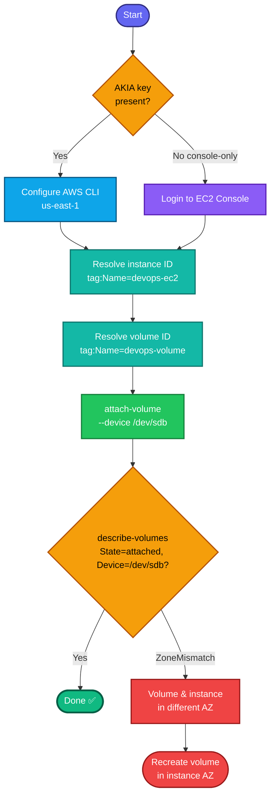

## Concept

Attaching an **EBS volume** to an instance exposes it as a block device the OS can then format and mount. Key facts for this task:

- **Volume and instance must be in the same Availability Zone** — an EBS volume is AZ-scoped and can only attach to instances in that same AZ. This is the #1 attach failure cause.
- **Device name** (`/dev/sdb`) is the mount point AWS presents to the instance. `/dev/sda1` (or `/dev/xvda`) is typically the root volume; secondary volumes use `/dev/sdb`, `/dev/sdc`, etc. The task pins **`/dev/sdb`** exactly.
- Attaching only makes the block device *available* — it does **not** format or mount it. The task only asks to attach, so no filesystem work needed.
- `devops-volume` is a **`Name` tag** → resolve `VolumeId` from it. Volume must be in `available` state (not already attached).

## Prerequisites

- `showcreds` first — if only console creds (no `AKIA`), use the console path.
- Region **us-east-1**.
- Volume in `available` state; instance and volume in the **same AZ**.

## OTS (CLI)

```bash
REGION=us-east-1

# 0. Resolve instance ID by Name tag
IID=$(aws ec2 describe-instances \
  --filters "Name=tag:Name,Values=devops-ec2" "Name=instance-state-name,Values=pending,running,stopped" \
  --query 'Reservations[0].Instances[0].InstanceId' --output text --region $REGION)
echo "Instance: $IID"

# 1. Resolve the volume ID by its Name tag
VOL_ID=$(aws ec2 describe-volumes \
  --filters "Name=tag:Name,Values=devops-volume" \
  --query 'Volumes[0].VolumeId' --output text --region $REGION)
echo "Volume: $VOL_ID"

# 2. Attach the volume at device /dev/sdb
aws ec2 attach-volume \
  --volume-id $VOL_ID \
  --instance-id $IID \
  --device /dev/sdb \
  --region $REGION
```

**Verify (state must be `attached`):**
```bash
aws ec2 describe-volumes --volume-ids $VOL_ID --region us-east-1 \
  --query 'Volumes[0].Attachments[0].{State:State,Device:Device,Instance:InstanceId}'
```
Expect `State=attached`, `Device=/dev/sdb`, `Instance` = your `devops-ec2` ID.

## Runbook (console path)

1. Console → region **us-east-1** → **EC2 → Elastic Block Store → Volumes**.
2. Select **`devops-volume`** (must show state **Available**).
3. **Actions → Attach volume**.
4. **Instance:** select **`devops-ec2`**.
5. **Device name:** set to **`/dev/sdb`** (overwrite the default if it suggests another).
6. **Attach volume**.
7. Verify the volume state becomes **in-use** and attachment shows `/dev/sdb` on `devops-ec2`.

---

### Gotchas
- **Same AZ is mandatory** — if the volume and instance are in different AZs, attach fails with `InvalidVolume.ZoneMismatch`. Check with `describe-volumes ... AvailabilityZone` vs the instance's AZ if it errors (you'd need to recreate the volume in the right AZ — can't move it).
- **Exact device name** — grader checks `/dev/sdb`. Don't accept the console's auto-suggested `/dev/sdf` etc.
- **Volume must be `available`** — if it's already attached elsewhere, detach first.
- **Attach ≠ mount** — the task stops at attach; no `mkfs`/`mount` required.
- Region **us-east-1**.

---

## Colorful flow diagram



Want the Terraform `aws_volume_attachment` equivalent, or the follow-on steps (`mkfs` + `mount` + `/etc/fstab`) for when a task later asks you to actually use this disk inside the instance?

# Runbook: Attach an EBS Volume to an EC2 Instance — AWS

**Task family:** Nautilus / KodeKloud AWS migration labs
**Example deliverable:** attach `devops-volume` to `devops-ec2` at device `/dev/sdb`, region `us-east-1`
**Host context:** aws-client lab host, time-boxed session credentials

---

## 1. Concept

Attaching an **EBS volume** exposes it to an instance as a block device the OS can
later format and mount.

- **Same-AZ rule:** an EBS volume is AZ-scoped and can only attach to an instance
  in the *same* Availability Zone. Cross-AZ attach fails with
  `InvalidVolume.ZoneMismatch`. A volume cannot be moved between AZs — you'd
  snapshot and recreate it in the target AZ.
- **Device name** (`/dev/sdb`) is what you request at the API. Root is usually
  `/dev/sda1` / `/dev/xvda`; secondary volumes use `/dev/sdb`, `/dev/sdc`, …
- **Attach ≠ mount.** Attaching only makes the block device *available*. It does
  not create a filesystem or mount it. If the task says only "attach," stop there.
- **Name is a `Name` tag**, not a native ID — resolve `VolumeId` from the tag.
- Volume must be in `available` state (not already attached elsewhere).

---

## 2. Prerequisites

- `showcreds` first. If it returns only console URL/username/password (no `AKIA`
  key), use the console path — the CLI cannot authenticate without an access key.
- Region **us-east-1**.
- Volume `available`; volume and instance in the **same AZ**.

---

## 3. CLI path — attach

```bash
REGION=us-east-1

# 0. Resolve instance ID by Name tag
IID=$(aws ec2 describe-instances \
  --filters "Name=tag:Name,Values=devops-ec2" "Name=instance-state-name,Values=pending,running,stopped" \
  --query 'Reservations[0].Instances[0].InstanceId' --output text --region $REGION)

# 1. Resolve volume ID by Name tag
VOL_ID=$(aws ec2 describe-volumes \
  --filters "Name=tag:Name,Values=devops-volume" \
  --query 'Volumes[0].VolumeId' --output text --region $REGION)

# 2. Attach at /dev/sdb
aws ec2 attach-volume \
  --volume-id $VOL_ID --instance-id $IID --device /dev/sdb --region $REGION
```

### Verify (API — this is what the grader checks)
```bash
aws ec2 describe-volumes --volume-ids $VOL_ID --region us-east-1 \
  --query 'Volumes[0].Attachments[0].{State:State,Device:Device,Instance:InstanceId}'
```
Expect `State=attached`, `Device=/dev/sdb`, `Instance` = the target instance ID.

---

## 4. Console path — attach

1. Console → region **us-east-1** → **EC2 → Elastic Block Store → Volumes**.
2. Select `devops-volume` (state must be **Available**).
3. **Actions → Attach volume**.
4. **Instance:** `devops-ec2`. **Device name:** `/dev/sdb` (overwrite any suggestion).
5. **Attach volume** → volume state becomes **in-use**, attachment shows `/dev/sdb`.

---

## 5. In-OS validation (optional — confirmation only)

The grader validates via the API, not SSH. In-OS checks are just to see the disk
with your own eyes. Many lab instances are deliberately **keyless** and **not
SSM-connected**, so a shell may be unreachable — that is expected and does not
affect grading.

### 5.1 Getting a shell when there is no key pair

Check the key first:
```bash
aws ec2 describe-instances --filters "Name=tag:Name,Values=devops-ec2" \
  --query 'Reservations[0].Instances[0].KeyName' --output text --region us-east-1
# 'None' => instance launched without a key pair; standard ssh -i is impossible
```

Fallbacks, in order:
- **SSM Session Manager** — `aws ssm start-session --target $IID --region us-east-1`.
  Needs SSM agent + an IAM role with SSM perms. `TargetNotConnected` => not available.
- **EC2 Instance Connect** — pushes a temporary key (valid 60s). Requires **port 22
  open** in the SG and a public network path.

### 5.2 EC2 Instance Connect (keyless SSH)
```bash
# open port 22 if the SG blocks it (only if lab creds permit)
SG_ID=$(aws ec2 describe-instances --filters "Name=tag:Name,Values=devops-ec2" \
  --query 'Reservations[0].Instances[0].SecurityGroups[0].GroupId' --output text --region us-east-1)
aws ec2 describe-security-groups --group-ids $SG_ID --region us-east-1 \
  --query 'SecurityGroups[0].IpPermissions[?FromPort==`22`]'   # [] means 22 is closed
aws ec2 authorize-security-group-ingress \
  --group-id $SG_ID --protocol tcp --port 22 --cidr 0.0.0.0/0 --region us-east-1

# throwaway key, push it, and connect within 60s (chain with &&)
ssh-keygen -t rsa -b 2048 -f /tmp/eic -N ""
AZ=$(aws ec2 describe-instances --instance-ids $IID \
  --query 'Reservations[0].Instances[0].Placement.AvailabilityZone' --output text --region us-east-1)
aws ec2-instance-connect send-ssh-public-key --instance-id $IID \
  --availability-zone $AZ --instance-os-user ec2-user \
  --ssh-public-key file:///tmp/eic.pub --region us-east-1 \
&& ssh -o ConnectTimeout=10 -o StrictHostKeyChecking=no -i /tmp/eic ec2-user@<public-ip>
```

> **SSH hangs with no prompt?** That's TCP to port 22 never connecting — a
> security-group/network block, not an auth failure. `send-ssh-public-key` returns
> `Success: true` regardless, because it hits the AWS control plane, not port 22.
> Use `ConnectTimeout` so it fails fast, and remember the pushed key dies after 60s.

### 5.3 Confirm the disk inside the OS
```bash
lsblk
sudo file -s /dev/xvdb        # 'data' => attached, no filesystem (expected for attach-only)
lsblk -o NAME,SIZE,SERIAL     # SERIAL = EBS volume id; match against the volume
```

---

## 6. Device-name mapping (key takeaway)

The `/dev/sdX` name you request at the API rarely matches what the OS shows. This
never affects grading — the grader checks the requested device name.

| Instance family | Virtualization | `/dev/sdb` appears in OS as |
|-----------------|----------------|-----------------------------|
| t2              | Xen            | `xvdb`                      |
| t3, m5, c5, …   | Nitro          | `nvme1n1` (NVMe)            |

On Nitro, map NVMe back to the volume with `sudo nvme list`,
`lsblk -o +SERIAL`, or `ls -l /dev/disk/by-id/`.

---

## 7. Gotchas

| Symptom | Cause | Fix |
|---|---|---|
| `InvalidVolume.ZoneMismatch` | Volume and instance in different AZs | Snapshot + recreate volume in instance's AZ |
| Grader fails despite in-OS disk visible | Wrong device name at API | Re-attach with `--device /dev/sdb` |
| `ssh` hangs, no prompt | Port 22 blocked / no route | Open 22 in SG; check public subnet route |
| `KeyName = None` | Instance launched keyless | Use EC2 Instance Connect or SSM, not `ssh -i` |
| `TargetNotConnected` (SSM) | No SSM agent / IAM role | Fall back to Instance Connect |
| Volume won't attach | Already `in-use` elsewhere | Detach first, then attach |

---

## 8. Follow-on (only if a later task asks to *use* the disk)

```bash
sudo mkfs -t xfs /dev/xvdb            # or ext4; use nvme1n1 on Nitro
sudo mkdir -p /data
sudo mount /dev/xvdb /data
echo '/dev/xvdb /data xfs defaults,nofail 0 2' | sudo tee -a /etc/fstab
```
Attach-only tasks stop at Section 3/4 — do **not** format or mount unless required.
```
```