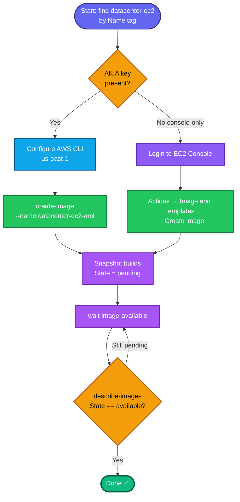

## Concept

An **AMI (Amazon Machine Image)** is a reusable template capturing an instance's root volume (and optionally attached volumes) — OS, config, installed software. Creating one from a running instance lets you launch identical copies later, which is core to migration/golden-image workflows.

Key facts:
- **`create-image`** snapshots the instance's EBS volumes and registers them as an AMI. By default AWS **reboots** the instance to guarantee a filesystem-consistent image. `--no-reboot` skips that (faster, but risks an inconsistent image if apps are mid-write).
- The AMI moves through **`pending` → `available`**. The task requires `available`, so you must **wait** for the backing snapshot(s) to finish — this can take a few minutes.
- The AMI **`Name`** here is the actual `--name` parameter (a registered attribute), not just a `Name` tag — though AWS also surfaces it. Setting `--name datacenter-ec2-ami` covers it.
- `datacenter-ec2` is a **`Name` tag** → resolve `InstanceId` from it.

## Prerequisites

- `showcreds` first — if only console creds (no `AKIA`), use the console path.
- Region **us-east-1**.
- Instance `datacenter-ec2` exists.

## OTS (CLI)

```bash
REGION=us-east-1

# 0. Resolve instance ID by Name tag
IID=$(aws ec2 describe-instances \
  --filters "Name=tag:Name,Values=datacenter-ec2" "Name=instance-state-name,Values=pending,running,stopped" \
  --query 'Reservations[0].Instances[0].InstanceId' --output text --region $REGION)
echo "Instance: $IID"

# 1. Create the AMI
AMI_ID=$(aws ec2 create-image \
  --instance-id $IID \
  --name datacenter-ec2-ami \
  --region $REGION \
  --query 'ImageId' --output text)
echo "AMI: $AMI_ID"

# 2. Wait until the AMI is 'available' (blocks until snapshot completes)
aws ec2 wait image-available --image-ids $AMI_ID --region $REGION
echo "AMI is available"
```

**Verify:**
```bash
aws ec2 describe-images --image-ids $AMI_ID --region us-east-1 \
  --query 'Images[0].{Name:Name,State:State,ID:ImageId}'
```
Expect `Name=datacenter-ec2-ami`, `State=available`.

## Runbook (console path)

1. Console → region **us-east-1** → **EC2 → Instances**.
2. Select **`datacenter-ec2`**.
3. **Actions → Image and templates → Create image**.
4. **Image name:** `datacenter-ec2-ami`.
5. Leave defaults (reboot enabled for consistency) → **Create image**.
6. Go to **EC2 → Images → AMIs** → watch status change from **Pending** to **Available** (refresh; takes a few minutes).
7. Confirm the AMI shows name `datacenter-ec2-ami` and status **Available**.

---

### Gotchas
- **Must be `available`, not `pending`** — the task explicitly requires it. Don't submit while the AMI is still building. `aws ec2 wait image-available` blocks until it's done (default timeout ~40 min, ample here).
- **Default reboot** — creating an image reboots the instance briefly unless you pass `--no-reboot`. For a lab this is usually fine; if the task said "don't disrupt the instance," you'd add `--no-reboot`.
- **Name uniqueness** — AMI names must be unique per account/region. If `datacenter-ec2-ami` already exists (rerun), deregister the old one first.
- **Backing snapshots** — `create-image` also creates EBS snapshots; those are what take time. The AMI can't be `available` until they complete.
- Region **us-east-1**.

---

## Colorful flow diagram



The `aws ec2 wait image-available` gate is the important bit here — it's what guarantees you don't submit while the AMI is still `pending`. Want the Terraform `aws_ami_from_instance` equivalent for your portfolio repo?

Nothing's wrong — that's expected behavior. The `aws ec2 wait image-available` command **blocks silently** while the AMI builds, and it won't print `AMI is available` until the image actually reaches the `available` state. No output = it's still working, not stuck.

## Why it takes time

Creating an AMI isn't instant metadata — under the hood AWS is:
1. (By default) rebooting the instance for a consistent image.
2. Taking **EBS snapshot(s)** of the root volume (and any attached volumes).
3. Copying those snapshot blocks to S3-backed storage.
4. Registering the AMI once snapshots complete.

Step 2–3 is the slow part. Snapshot time scales with **how much data is on the volume** — typically **2–10 minutes** for a small lab instance, longer for bigger disks. The AMI stays `pending` the whole time and only flips to `available` at the end.

## Check progress in another terminal (don't kill the wait)

The `wait` polls every ~15s for up to ~40 min. Leave it running. If you want to *see* progress, open a second shell or run:

```bash
# is it still pending or now available?
aws ec2 describe-images --image-ids ami-09f9b00456da38e87 --region us-east-1 \
  --query 'Images[0].State' --output text

# watch the backing snapshot progress (0% → 100%)
aws ec2 describe-snapshots \
  --filters "Name=description,Values=*ami-09f9b00456da38e87*" --region us-east-1 \
  --query 'Snapshots[].{Progress:Progress,State:State}' --output table
```

The snapshot `Progress` climbing toward `100%` is your real-time indicator. Once it hits 100% and `State=completed`, the AMI flips to `available` and your original `wait` command will finally print `AMI is available`.

## What to do

- **Just wait** — it's normal. The command is doing its job.
- If you're impatient, poll `describe-images ... State` in a second terminal.
- Don't `^C` the wait unless it exceeds ~15 min (which would suggest a genuinely large volume or a stuck snapshot — rare in labs).

Once it prints `AMI is available`, run the final verify:
```bash
aws ec2 describe-images --image-ids ami-09f9b00456da38e87 --region us-east-1 \
  --query 'Images[0].{Name:Name,State:State,ID:ImageId}'
```
`State=available` + `Name=datacenter-ec2-ami` = task complete. The wait finishing *is* the signal you're done.