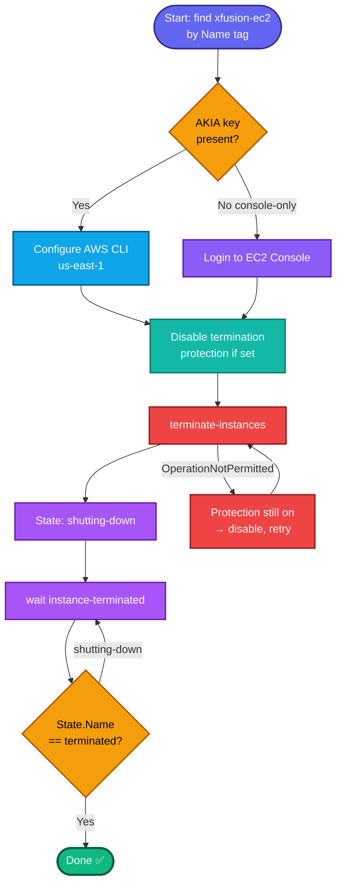

## Concept

Deleting an EC2 instance = **terminating** it (permanent, irreversible — the instance and its root volume, by default, are destroyed). Terminating moves the instance through **`running` → `shutting-down` → `terminated`**. The task requires you to reach the final **`terminated`** state before submitting, so you must **wait**.

Two things that can block termination:
- **Termination protection** (`disableApiTermination=true`) — if set, `terminate-instances` fails with `OperationNotPermitted`. You'd disable it first.
- A **terminated** instance still shows in the console for ~1 hour (as a tombstone) before disappearing — that's normal, it's genuinely gone.

`xfusion-ec2` is a **`Name` tag** → resolve `InstanceId` from it.

## Prerequisites

- `showcreds` first — if only console creds (no `AKIA`), use the console path.
- Region **us-east-1**.
- Instance `xfusion-ec2` exists.

## OTS (CLI)

```bash
REGION=us-east-1

# 0. Resolve instance ID by Name tag
IID=$(aws ec2 describe-instances \
  --filters "Name=tag:Name,Values=xfusion-ec2" "Name=instance-state-name,Values=pending,running,stopped,stopping" \
  --query 'Reservations[0].Instances[0].InstanceId' --output text --region $REGION)
echo "Instance: $IID"

# 1. (Safety) disable termination protection in case it's enabled
aws ec2 modify-instance-attribute \
  --instance-id $IID --no-disable-api-termination --region $REGION 2>/dev/null

# 2. Terminate
aws ec2 terminate-instances --instance-ids $IID --region $REGION

# 3. Wait until fully terminated (blocks until state = terminated)
aws ec2 wait instance-terminated --instance-ids $IID --region $REGION
echo "Instance is terminated"
```

**Verify:**
```bash
aws ec2 describe-instances --instance-ids $IID --region us-east-1 \
  --query 'Reservations[0].Instances[0].State.Name' --output text
```
Expected output: `terminated`

## Runbook (console path)

1. Console → region **us-east-1** → **EC2 → Instances**.
2. Select **`xfusion-ec2`**.
3. (If termination is protected: **Actions → Instance settings → Change termination protection** → uncheck Enable → Save.)
4. **Instance state → Terminate (delete) instance** → confirm.
5. Watch the state go **shutting-down → terminated** (refresh; takes a minute or two).
6. Confirm the instance shows **terminated** before submitting.

---

### Gotchas
- **Must reach `terminated`, not `shutting-down`** — task explicitly requires it. `aws ec2 wait instance-terminated` blocks until the final state, preventing a premature submit.
- **Termination protection blocks it** — if you get `OperationNotPermitted`, disable protection first (step 1 handles this preemptively; the `2>/dev/null` ignores the harmless case where it wasn't set).
- **Irreversible** — no undo. Make sure you're terminating the right instance (verify the ID resolved from the Name tag).
- **Tombstone lingers ~1 hr** — a terminated instance stays visible briefly; that's expected, it's still counted as terminated.
- Region **us-east-1**.

---

## Colorful flow diagram



That's the delete flow with the termination-protection guard baked in (relevant since you enabled it on an instance in an earlier task). Want the Terraform equivalent — just removing the `aws_instance` resource and running `terraform apply` — noted for your portfolio?