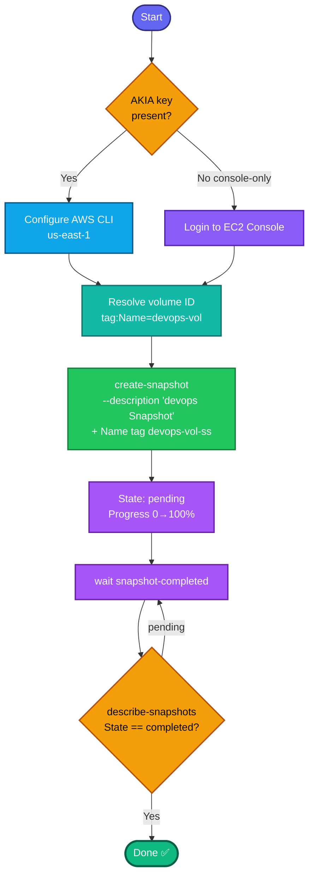

## Concept

An **EBS snapshot** is a point-in-time, incremental backup of a volume, stored durably in S3-backed storage (invisible to you). Snapshots are the basis for backups, cloning volumes, and creating AMIs. Key facts:

- Snapshots are **incremental** — only changed blocks since the last snapshot are stored — but the **first** snapshot of a volume copies all used blocks, so it takes the longest.
- Status flows **`pending` → `completed`**. The task requires `completed`, so you must **wait**.
- The snapshot **`Name` (`devops-vol-ss`) is a `Name` tag**; the **`description` (`devops Snapshot`) is a native field** set with `--description`. Two different mechanisms — don't conflate them.
- You can snapshot a volume while it's **in-use** (attached and running) — no need to detach.
- `devops-vol` is a **`Name` tag** → resolve `VolumeId` from it.

## Prerequisites

- `showcreds` first — if only console creds (no `AKIA`), use the console path.
- Region **us-east-1**.
- Volume `devops-vol` exists.

## OTS (CLI)

```bash
REGION=us-east-1

# 0. Resolve the volume ID by its Name tag
VOL_ID=$(aws ec2 describe-volumes \
  --filters "Name=tag:Name,Values=devops-vol" \
  --query 'Volumes[0].VolumeId' --output text --region $REGION)
echo "Volume: $VOL_ID"

# 1. Create the snapshot with description + Name tag in one call
SNAP_ID=$(aws ec2 create-snapshot \
  --volume-id $VOL_ID \
  --description "devops Snapshot" \
  --tag-specifications 'ResourceType=snapshot,Tags=[{Key=Name,Value=devops-vol-ss}]' \
  --region $REGION \
  --query 'SnapshotId' --output text)
echo "Snapshot: $SNAP_ID"

# 2. Wait until status = completed (blocks until done)
aws ec2 wait snapshot-completed --snapshot-ids $SNAP_ID --region $REGION
echo "Snapshot completed"
```

**Verify:**
```bash
aws ec2 describe-snapshots --snapshot-ids $SNAP_ID --region us-east-1 \
  --query 'Snapshots[0].{State:State,Desc:Description,Name:Tags[?Key==`Name`]|[0].Value,Progress:Progress}'
```
Expect `State=completed`, `Desc=devops Snapshot`, `Name=devops-vol-ss`.

## Runbook (console path)

1. Console → region **us-east-1** → **EC2 → Elastic Block Store → Volumes**.
2. Select **`devops-vol`** → **Actions → Create snapshot**.
3. **Description:** `devops Snapshot`.
4. **Tags → Add tag:** Key `Name`, Value `devops-vol-ss`.
5. **Create snapshot**.
6. Go to **Elastic Block Store → Snapshots** → watch status go from **Pending** to **Completed** (refresh; time depends on volume size).
7. Confirm the snapshot shows name `devops-vol-ss`, description `devops Snapshot`, status **Completed**.

---

### Gotchas
- **Name vs description are different fields** — `Name` is a **tag**, `description` is a **native attribute**. Set both, exactly as given (case-sensitive: `devops Snapshot`, not `Devops snapshot`).
- **Must be `completed`, not `pending`** — task requires it. `aws ec2 wait snapshot-completed` blocks until 100%; don't submit early.
- **First snapshot is slowest** — full copy of used blocks. A silent `wait` is normal, not stuck.
- **No detach needed** — snapshotting an attached, live volume is fine.
- Region **us-east-1**.

---

## Colorful flow diagram



The Name-tag-vs-native-description split is the easy thing to get wrong here — the grader checks both independently. Want the Terraform `aws_ebs_snapshot` equivalent for your portfolio repo?