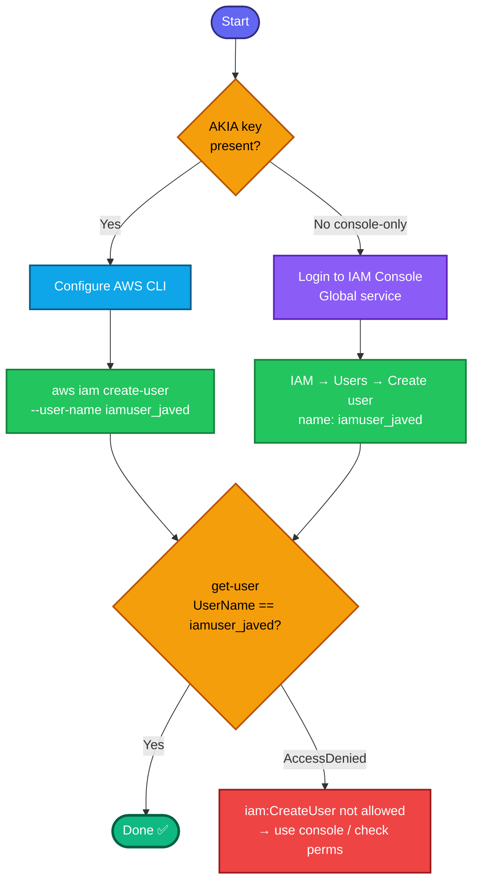

## Concept

An **IAM user** is a persistent identity representing a person or application that needs to interact with AWS. It's the foundational IAM entity — you attach policies (permissions) and credentials (password for console, access keys for CLI) to it.

Key facts for this task:
- **IAM is a global service** — users aren't tied to a region. You *can* pass `--region`, but it's irrelevant for IAM; the user exists account-wide. (Console shows IAM under "Global.")
- A freshly created user has **no permissions and no credentials** by default — it can't do anything until you attach policies / create login or access keys. The task only asks to *create* the user, so none of that is required.
- The task specifies only the **user name** (`iamuser_javed`) — nothing else to configure.

## Prerequisites

- `showcreds` first — if only console creds (no `AKIA`), use the console path.
- Your credentials need **`iam:CreateUser`** permission (this is the action that was *denied* for your lab user in an earlier task — worth checking it's allowed here).

## OTS (CLI)

```bash
# IAM is global — no region needed
aws iam create-user --user-name iamuser_javed
```

**Verify:**
```bash
aws iam get-user --user-name iamuser_javed \
  --query 'User.{Name:UserName,ID:UserId,ARN:Arn,Created:CreateDate}'
```
Expect the user details with `Name=iamuser_javed`.

## Runbook (console path)

1. Console → **IAM** (search bar) — note it's a **Global** service, no region selector.
2. Left menu → **Users → Create user**.
3. **User name:** `iamuser_javed`.
4. (Console access / permissions steps are optional — the task doesn't require them; you can skip "Provide user access to console" and add no policies.)
5. Click through → **Create user**.
6. Verify `iamuser_javed` appears in the Users list.

---

### Gotchas
- **No region matters** — IAM is global. Don't overthink us-east-1 here; the user is account-wide.
- **Exact name** — `iamuser_javed` (underscore, lowercase). Grader checks the username literally.
- **Permission dependency** — if you get `AccessDenied ... iam:CreateUser`, your lab user isn't allowed to create IAM users via CLI; use the console (which authenticates as the same user but may still be denied — if so, the lab intends a different path or the console user has broader rights).
- **Idempotency** — creating a user that already exists returns `EntityAlreadyExists`. Not an issue on first run.

---

## Colorful flow diagram



This kicks off the IAM series — users, groups, roles, policies usually follow. Want the Terraform `aws_iam_user` equivalent, and should I start bundling the IAM tasks into their own runbook as they come?