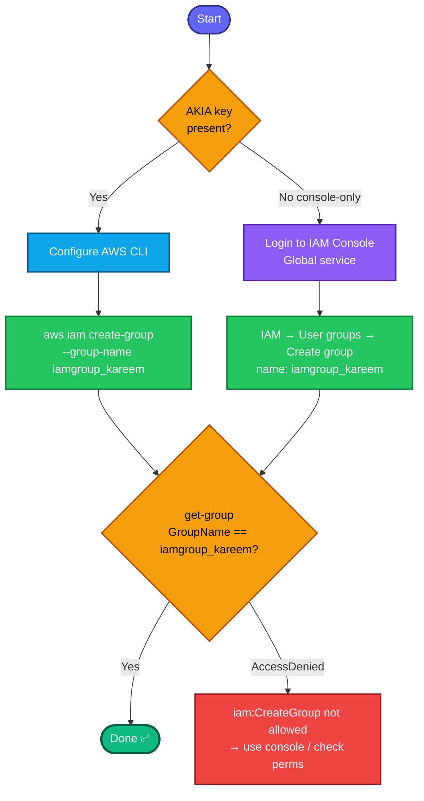

## Concept

An **IAM group** is a collection of IAM users that share a common set of permissions. Instead of attaching policies to each user individually, you attach them to the group, and every member inherits them — the standard way to manage permissions at scale (e.g. a `developers` group, an `admins` group).

Key facts for this task:
- **IAM is global** — groups aren't region-scoped.
- A group can exist with **no members and no policies** — perfectly valid. The task only asks to *create* the group, so no users or policies need attaching.
- A group is **not an identity you can log in as** — it's purely a permissions container for users.
- The task specifies only the **group name** (`iamgroup_kareem`).

## Prerequisites

- `showcreds` first — if only console creds (no `AKIA`), use the console path.
- Credentials need **`iam:CreateGroup`** permission.

## OTS (CLI)

```bash
# IAM is global — no region needed
aws iam create-group --group-name iamgroup_kareem
```

**Verify:**
```bash
aws iam get-group --group-name iamgroup_kareem \
  --query 'Group.{Name:GroupName,ID:GroupId,ARN:Arn,Created:CreateDate}'
```
Expect the group details with `Name=iamgroup_kareem`.

## Runbook (console path)

1. Console → **IAM** (Global service — no region selector).
2. Left menu → **User groups → Create group**.
3. **User group name:** `iamgroup_kareem`.
4. (Adding users / attaching policies is optional — skip both; the task doesn't require them.)
5. **Create group**.
6. Verify `iamgroup_kareem` appears in the User groups list.

---

### Gotchas
- **No region matters** — IAM is global.
- **Exact name** — `iamgroup_kareem` (underscore, lowercase). Grader checks it literally.
- **Empty group is fine** — no need to add members or policies unless a follow-on task says so.
- **Permission dependency** — `AccessDenied ... iam:CreateGroup` means your lab user can't create groups via CLI; fall back to the console.
- **Idempotency** — recreating an existing group returns `EntityAlreadyExists`.

---

## Colorful flow diagram



Next in the IAM series is usually attaching a policy to this group or adding the user (`iamuser_javed`) into it. Want the Terraform `aws_iam_group` equivalent for your portfolio repo?