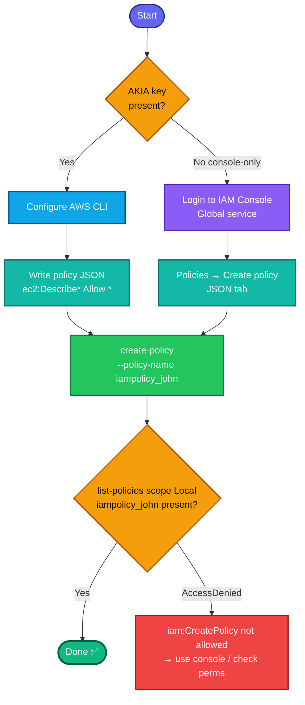

## Concept

An **IAM policy** is a JSON document defining permissions — which **actions** are allowed/denied on which **resources**. A **customer-managed policy** (what you're creating) is a standalone, reusable policy you can attach to users/groups/roles.

For **EC2 read-only console access**, the permissions are the `Describe*` actions — these are the read/list calls the EC2 console makes to render instances, AMIs, and snapshots. AWS actually has a ready-made managed policy for exactly this (`AmazonEC2ReadOnlyAccess`), but the task wants a **custom policy named `iampolicy_john`**, so you author the JSON.

Key facts:
- **IAM is global** — the region in the task is a red herring for the policy object itself; it exists account-wide. (You can ignore `--region`.)
- **`ec2:Describe*`** covers viewing instances, AMIs, snapshots, and virtually all EC2 read operations in one wildcard — the cleanest way to satisfy "view all instances, AMIs, and snapshots."
- Read-only = no `Resource` restriction needed; `"Resource": "*"` with only `Describe` actions is inherently read-only (Describe calls don't support resource-level scoping anyway).

## Prerequisites

- `showcreds` first — if only console creds (no `AKIA`), use the console path.
- Credentials need **`iam:CreatePolicy`** permission.

## OTS (CLI)

```bash
# 1. Write the policy document
cat > /tmp/iampolicy_john.json <<'EOF'
{
  "Version": "2012-10-17",
  "Statement": [
    {
      "Effect": "Allow",
      "Action": "ec2:Describe*",
      "Resource": "*"
    }
  ]
}
EOF

# 2. Create the customer-managed policy (IAM is global)
aws iam create-policy \
  --policy-name iampolicy_john \
  --policy-document file:///tmp/iampolicy_john.json
```

**Verify:**
```bash
# Grab the ARN and inspect the default version
ARN=$(aws iam list-policies --scope Local \
  --query "Policies[?PolicyName=='iampolicy_john'].Arn | [0]" --output text)
echo "ARN: $ARN"

aws iam get-policy-version --policy-arn $ARN \
  --version-id $(aws iam get-policy --policy-arn $ARN --query 'Policy.DefaultVersionId' --output text) \
  --query 'PolicyVersion.Document'
```
Expect the JSON showing `ec2:Describe*` Allow on `*`.

## Runbook (console path)

1. Console → **IAM** (Global) → **Policies → Create policy**.
2. Switch to the **JSON** tab and paste:
   ```json
   {
     "Version": "2012-10-17",
     "Statement": [
       { "Effect": "Allow", "Action": "ec2:Describe*", "Resource": "*" }
     ]
   }
   ```
   *(Alternatively, use the Visual editor: Service = EC2, Access level = expand **List** and **Read**, Resources = All — but the JSON above is faster and exact.)*
3. **Next** → **Policy name:** `iampolicy_john`.
4. **Create policy**.
5. Verify `iampolicy_john` appears under **Policies** (filter type: Customer managed).

---

### Gotchas
- **`ec2:Describe*` is the key** — it's the read-only action set the console uses for instances, AMIs, snapshots, volumes, etc. Some graders/AWS docs point to the managed `AmazonEC2ReadOnlyAccess` (which adds `elasticloadbalancing:Describe*`, `cloudwatch:Describe*`, `autoscaling:Describe*` for a fuller console experience). If the grader is strict about "EC2 console read-only," the safe superset is below.
- **IAM is global** — ignore the `us-east-1` mention for the policy object.
- **Exact policy name** — `iampolicy_john`. Grader checks it literally.
- **Customer-managed, not inline** — `create-policy` makes a standalone managed policy (correct). Don't create it as an inline policy on a user.

**Fuller read-only superset** (matches AWS's own `AmazonEC2ReadOnlyAccess`, use if the grader wants the complete console experience):
```json
{
  "Version": "2012-10-17",
  "Statement": [
    { "Effect": "Allow", "Action": "ec2:Describe*", "Resource": "*" },
    { "Effect": "Allow", "Action": "elasticloadbalancing:Describe*", "Resource": "*" },
    { "Effect": "Allow", "Action": ["cloudwatch:ListMetrics","cloudwatch:GetMetricStatistics","cloudwatch:Describe*"], "Resource": "*" },
    { "Effect": "Allow", "Action": "autoscaling:Describe*", "Resource": "*" }
  ]
}
```

---

## Colorful flow diagram



The `ec2:Describe*` wildcard is the crux — it's exactly the read-only surface the EC2 console needs for instances/AMIs/snapshots. Want the Terraform `aws_iam_policy` equivalent, or should I start a consolidated IAM runbook now that you've got user + group + policy in this series?