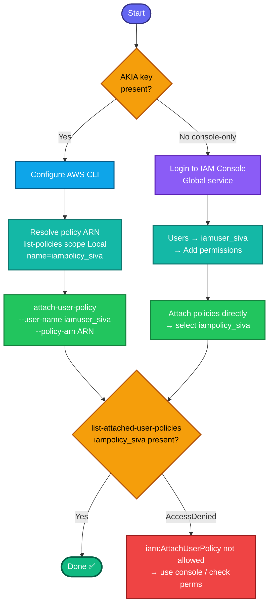

## Concept

Attaching a **managed policy to a user** grants that user all permissions defined in the policy. This is the "wiring" step of IAM — you've created identities (users) and permission sets (policies) separately; attaching connects them.

Key facts:
- **IAM is global** — no region involved.
- You attach by **policy ARN**, not name — so you first resolve `iampolicy_siva`'s ARN. Since it's a **customer-managed** policy (created by the team, not AWS), use `--scope Local` when listing.
- A user can have multiple attached managed policies (up to 10 by default) plus inline ones. Attaching is additive and idempotent-ish (re-attaching the same policy is a no-op, not an error).
- `iampolicy_siva` being custom means its ARN looks like `arn:aws:iam::<account-id>:policy/iampolicy_siva` (not the `aws:policy/...` AWS-managed prefix).

## Prerequisites

- `showcreds` first — if only console creds (no `AKIA`), use the console path.
- Credentials need **`iam:AttachUserPolicy`** permission.
- Both `iamuser_siva` and `iampolicy_siva` already exist.

## OTS (CLI)

```bash
# 0. Resolve the customer-managed policy ARN by name
POLICY_ARN=$(aws iam list-policies --scope Local \
  --query "Policies[?PolicyName=='iampolicy_siva'].Arn | [0]" --output text)
echo "Policy ARN: $POLICY_ARN"

# 1. Attach the policy to the user
aws iam attach-user-policy \
  --user-name iamuser_siva \
  --policy-arn $POLICY_ARN
```

**Verify:**
```bash
aws iam list-attached-user-policies --user-name iamuser_siva \
  --query 'AttachedPolicies[].{Name:PolicyName,ARN:PolicyArn}' --output table
```
Expect a row showing `iampolicy_siva` and its ARN.

## Runbook (console path)

1. Console → **IAM** (Global) → **Users** → click **`iamuser_siva`**.
2. **Permissions** tab → **Add permissions → Attach policies directly**.
3. In the policy search box, type `iampolicy_siva` (filter to **Customer managed** if needed).
4. Tick the checkbox next to **`iampolicy_siva`**.
5. **Next → Add permissions**.
6. Verify `iampolicy_siva` now shows under the user's **Permissions policies**.

---

### Gotchas
- **Attach by ARN, not name** — the CLI needs the full ARN; resolve it first. `--scope Local` ensures you match the *custom* policy, not a same-named AWS-managed one.
- **`[0]` in the query** — guards against multiple matches returning a list; grabs the single ARN cleanly.
- **Direct attach vs group** — this task wants the policy attached **directly to the user**, not via a group. In the console, use "Attach policies directly," not the group path.
- **Idempotent** — re-attaching an already-attached policy succeeds silently; no harm on rerun.
- **IAM is global** — no region flag needed.

---

## Colorful flow diagram



The "attach by ARN, resolve with `--scope Local`" pattern is the reusable bit — same approach works for `attach-group-policy` and `attach-role-policy`. Want the Terraform `aws_iam_user_policy_attachment` equivalent, or a consolidated IAM runbook now that you've covered user, group, policy, and attachment?