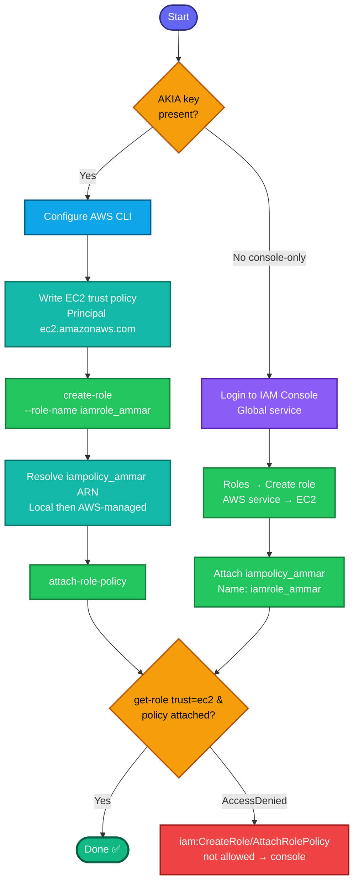

## Concept

An **IAM role** is an identity with permissions that can be **assumed** (temporarily) rather than logged into. Unlike a user, a role has no long-term credentials — instead it has a **trust policy** defining *who* can assume it, and **permission policies** defining *what* it can do once assumed.

For an **EC2 service role** (entity type = AWS Service, use case = EC2):
- The **trust policy** allows the `ec2.amazonaws.com` service principal to assume the role. This is what lets an EC2 instance use the role (via an instance profile) to call AWS APIs without embedded keys.
- You then **attach** the permission policy `iampolicy_ammar`.
- Console auto-creates an **instance profile** with the same name; via CLI on older tooling you sometimes create it separately, but the task only requires the role + attached policy.

Two pieces to build: (1) create role **with the EC2 trust policy**, (2) **attach** `iampolicy_ammar`.

## Prerequisites

- `showcreds` first — if only console creds (no `AKIA`), use the console path.
- Credentials need **`iam:CreateRole`** + **`iam:AttachRolePolicy`**.
- Policy `iampolicy_ammar` already exists (or is AWS-managed).

## OTS (CLI)

```bash
# 1. Trust policy — allow EC2 service to assume the role
cat > /tmp/ec2-trust.json <<'EOF'
{
  "Version": "2012-10-17",
  "Statement": [
    {
      "Effect": "Allow",
      "Principal": { "Service": "ec2.amazonaws.com" },
      "Action": "sts:AssumeRole"
    }
  ]
}
EOF

# 2. Create the role with that trust policy
aws iam create-role \
  --role-name iamrole_ammar \
  --assume-role-policy-document file:///tmp/ec2-trust.json

# 3. Resolve the policy ARN (check Local first for custom, fall back to AWS-managed)
POLICY_ARN=$(aws iam list-policies --scope Local \
  --query "Policies[?PolicyName=='iampolicy_ammar'].Arn | [0]" --output text)
[ "$POLICY_ARN" = "None" ] && POLICY_ARN=$(aws iam list-policies \
  --query "Policies[?PolicyName=='iampolicy_ammar'].Arn | [0]" --output text)
echo "Policy ARN: $POLICY_ARN"

# 4. Attach the policy to the role
aws iam attach-role-policy \
  --role-name iamrole_ammar \
  --policy-arn $POLICY_ARN
```

**Verify:**
```bash
# Role exists + trust policy targets EC2
aws iam get-role --role-name iamrole_ammar \
  --query 'Role.{Name:RoleName,Trust:AssumeRolePolicyDocument.Statement[0].Principal.Service}'

# Policy attached
aws iam list-attached-role-policies --role-name iamrole_ammar \
  --query 'AttachedPolicies[].PolicyName' --output table
```
Expect `Trust=ec2.amazonaws.com` and `iampolicy_ammar` in the attached list.

## Runbook (console path)

1. Console → **IAM** (Global) → **Roles → Create role**.
2. **Trusted entity type:** **AWS service**.
3. **Use case:** **EC2** → **Next**.
4. **Add permissions:** search `iampolicy_ammar`, tick it → **Next**.
5. **Role name:** `iamrole_ammar` → **Create role**.
6. Verify the role lists **EC2** as trusted entity and **`iampolicy_ammar`** under permissions.

---

### Gotchas
- **Trust policy is what makes it an "EC2 service role"** — the `ec2.amazonaws.com` principal + `sts:AssumeRole` is the entity-type/use-case selection in JSON form. Miss it and it's not an EC2 role.
- **Resolve policy ARN correctly** — `iampolicy_ammar` is likely custom (`--scope Local`); the fallback handles the case where it's AWS-managed. Attach needs the ARN, not the name.
- **Exact names** — `iamrole_ammar` / `iampolicy_ammar`, checked literally.
- **Console auto-creates the instance profile**; CLI does not. The task doesn't require attaching the role to an instance, so no instance profile step needed — but if a later task launches an EC2 with this role, you'd need `create-instance-profile` + `add-role-to-instance-profile`.
- **IAM is global** — no region.

---

## Colorful flow diagram



The trust-policy-vs-permission-policy distinction is the core IAM-role concept — trust = *who can assume*, permissions = *what it can do*. Want the Terraform equivalent (`aws_iam_role` with `assume_role_policy` + `aws_iam_role_policy_attachment`), or a consolidated IAM runbook now that you've covered user, group, policy, attachment, and role?