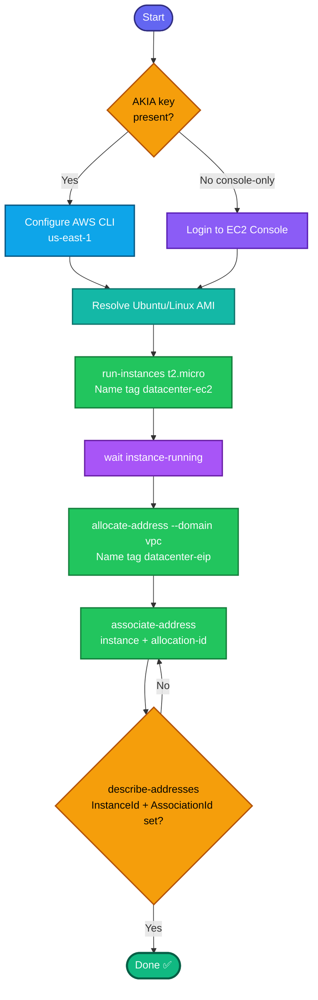

## Concept

This task chains three things: **launch an instance**, **allocate an Elastic IP**, and **associate** the two. An EIP gives the instance a **static public IPv4** that survives stop/start (unlike the auto-assigned public IP), which is exactly what a "stable access point" needs.

Key facts:
- **Allocate ≠ associate.** `allocate-address` reserves the EIP in your account; `associate-address` binds it to the instance. Both steps required.
- Both **`Name` values are tags** — `datacenter-ec2` on the instance, `datacenter-eip` on the EIP allocation. Set via `--tag-specifications`.
- The instance should be **running** before associating (association works on a stopped instance too, but the address only becomes reachable when running).
- Use any Linux AMI — Ubuntu or Amazon Linux both fine. Resolve dynamically to avoid stale IDs.

## Prerequisites

- `showcreds` first — if only console creds (no `AKIA`), use the console path.
- Region **us-east-1**.
- Default VPC (for default SG / subnet).

## OTS (CLI)

```bash
REGION=us-east-1

# 1. Resolve a current Ubuntu 22.04 AMI (Canonical's official owner id)
AMI_ID=$(aws ec2 describe-images --owners 099720109477 \
  --filters "Name=name,Values=ubuntu/images/hvm-ssd/ubuntu-jammy-22.04-amd64-server-*" \
            "Name=state,Values=available" \
  --query 'sort_by(Images, &CreationDate)[-1].ImageId' --output text --region $REGION)
echo "AMI: $AMI_ID"
# (Alternative: Amazon Linux 2 via SSM)
# AMI_ID=$(aws ssm get-parameters --names /aws/service/ami-amazon-linux-latest/amzn2-ami-hvm-x86_64-gp2 \
#   --query 'Parameters[0].Value' --output text --region $REGION)

# 2. Launch the instance (Name tag = datacenter-ec2)
IID=$(aws ec2 run-instances \
  --image-id $AMI_ID \
  --instance-type t2.micro \
  --tag-specifications 'ResourceType=instance,Tags=[{Key=Name,Value=datacenter-ec2}]' \
  --region $REGION \
  --query 'Instances[0].InstanceId' --output text)
echo "Instance: $IID"

# 3. Wait until it's running
aws ec2 wait instance-running --instance-ids $IID --region $REGION

# 4. Allocate an Elastic IP (Name tag = datacenter-eip)
ALLOC_ID=$(aws ec2 allocate-address --domain vpc \
  --tag-specifications 'ResourceType=elastic-ip,Tags=[{Key=Name,Value=datacenter-eip}]' \
  --region $REGION \
  --query 'AllocationId' --output text)
echo "Allocation: $ALLOC_ID"

# 5. Associate the EIP with the instance
aws ec2 associate-address \
  --instance-id $IID --allocation-id $ALLOC_ID --region $REGION
```

**Verify:**
```bash
aws ec2 describe-addresses \
  --filters "Name=tag:Name,Values=datacenter-eip" --region us-east-1 \
  --query 'Addresses[0].{EIP:PublicIp,Instance:InstanceId,Assoc:AssociationId}'
```
Expect `Instance` = your `datacenter-ec2` ID and a non-null `AssociationId`.

## Runbook (console path)

1. Console → region **us-east-1** → **EC2 → Instances → Launch instances**.
2. **Name:** `datacenter-ec2`. **AMI:** Ubuntu (or Amazon Linux). **Type:** `t2.micro`.
3. Key pair "proceed without" is fine (task doesn't require SSH). Default SG/subnet.
4. **Launch instance** → wait for **running**.
5. **Network & Security → Elastic IPs → Allocate Elastic IP address** → Allocate.
6. Select the new EIP → add tag **Name = `datacenter-eip`** (Tags → Manage tags).
7. **Actions → Associate Elastic IP address** → Resource type **Instance** → select **`datacenter-ec2`** → **Associate**.
8. Verify the EIP row shows the associated instance ID.

---

### Gotchas
- **Two distinct steps** — allocate then associate. Forgetting the tag on the EIP means the grader can't find `datacenter-eip`.
- **Tag the EIP explicitly** — in the console the allocation has no Name until you add the tag; via CLI the `--tag-specifications 'ResourceType=elastic-ip...'` handles it.
- **Dynamic AMI** — a hardcoded Ubuntu ID goes stale and throws `InvalidAMIID.NotFound`; resolve the latest.
- **Instance running before associate** for a reachable IP.
- **Idle EIP costs** — an allocated-but-unassociated EIP bills hourly; associating to a running instance is free. (Not a lab concern, but good hygiene.)
- Region **us-east-1**; type exactly `t2.micro`.

---

## Colorful flow diagram



This ties together the instance-launch and EIP-association patterns from your earlier tasks into one flow. Want the Terraform equivalent (`aws_instance` + `aws_eip` with `instance = ...`), or a consolidated EC2/networking runbook covering the launch + EIP + ENI + volume tasks you've now done?