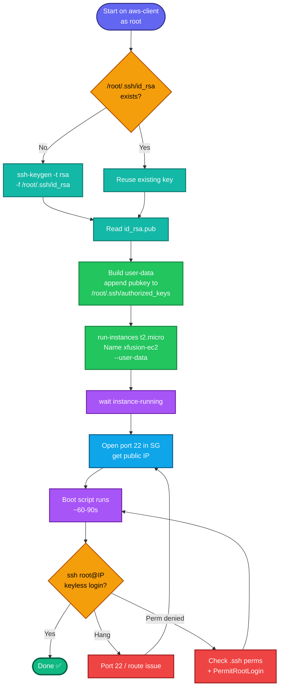

## Concept

This is a **local-key → remote-authorization** task, different from the console-created key pairs earlier. Here you:

1. **Generate an SSH keypair *on aws-client*** (`/root/.ssh/id_rsa` + `id_rsa.pub`).
2. **Get that public key into the EC2 instance's `/root/.ssh/authorized_keys`** so `ssh root@<instance>` works passwordlessly from aws-client.

The catch: AWS default AMIs **disable direct root SSH** and log you in as `ec2-user`/`ubuntu`. So you can't just import the key as a normal EC2 key pair (that lands in the *default* user's authorized_keys, not root's). The reliable way to place it under **root** is a **user-data bootstrap script** that runs at first boot and appends your public key to `/root/.ssh/authorized_keys`.

## Prerequisites

- `showcreds` first — if only console creds (no `AKIA`), the CLI is closed; but this task *needs* the CLI (key generated on aws-client + user-data). If no `AKIA`, you'd launch via console and paste user-data there.
- Region **us-east-1**.
- SG must allow **port 22** from aws-client; instance needs a public IP.

## OTS (CLI, run on aws-client as root)

```bash
REGION=us-east-1

# 1. Generate the key on aws-client IF it doesn't already exist
[ -f /root/.ssh/id_rsa ] || ssh-keygen -t rsa -b 2048 -f /root/.ssh/id_rsa -N ""
PUBKEY=$(cat /root/.ssh/id_rsa.pub)
echo "Public key: $PUBKEY"

# 2. Build user-data to inject the pubkey into root's authorized_keys
cat > /tmp/userdata.sh <<EOF
#!/bin/bash
mkdir -p /root/.ssh
chmod 700 /root/.ssh
echo "$PUBKEY" >> /root/.ssh/authorized_keys
chmod 600 /root/.ssh/authorized_keys
# allow root SSH with key (PermitRootLogin defaults to prohibit-password/without-password)
sed -i 's/^#\?PermitRootLogin.*/PermitRootLogin prohibit-password/' /etc/ssh/sshd_config
systemctl restart sshd 2>/dev/null || systemctl restart ssh 2>/dev/null
EOF

# 3. Resolve a Linux AMI (Amazon Linux 2 via SSM)
AMI_ID=$(aws ssm get-parameters \
  --names /aws/service/ami-amazon-linux-latest/amzn2-ami-hvm-x86_64-gp2 \
  --query 'Parameters[0].Value' --output text --region $REGION)

# 4. Default SG (must allow 22 – see note)
VPC_ID=$(aws ec2 describe-vpcs --filters "Name=isDefault,Values=true" \
  --query 'Vpcs[0].VpcId' --output text --region $REGION)
SG_ID=$(aws ec2 describe-security-groups \
  --filters "Name=vpc-id,Values=$VPC_ID" "Name=group-name,Values=default" \
  --query 'SecurityGroups[0].GroupId' --output text --region $REGION)

# 5. Launch xfusion-ec2 with the user-data
IID=$(aws ec2 run-instances \
  --image-id $AMI_ID \
  --instance-type t2.micro \
  --security-group-ids $SG_ID \
  --user-data file:///tmp/userdata.sh \
  --tag-specifications 'ResourceType=instance,Tags=[{Key=Name,Value=xfusion-ec2}]' \
  --region $REGION \
  --query 'Instances[0].InstanceId' --output text)
echo "Instance: $IID"

aws ec2 wait instance-running --instance-ids $IID --region $REGION

# 6. Ensure port 22 is open from aws-client
aws ec2 authorize-security-group-ingress \
  --group-id $SG_ID --protocol tcp --port 22 --cidr 0.0.0.0/0 --region $REGION 2>/dev/null

# 7. Get the public IP
PUB_IP=$(aws ec2 describe-instances --instance-ids $IID \
  --query 'Reservations[0].Instances[0].PublicIpAddress' --output text --region $REGION)
echo "Public IP: $PUB_IP"
```

**Verify (passwordless root SSH from aws-client):**
```bash
# give user-data ~60-90s to run on first boot, then:
ssh -o StrictHostKeyChecking=no root@$PUB_IP hostname
```
A successful login with no password prompt = task complete.

## Runbook (console path, if CLI creds unavailable)

1. On aws-client: `ssh-keygen -t rsa -b 2048 -f /root/.ssh/id_rsa -N ""` (skip if exists); `cat /root/.ssh/id_rsa.pub`.
2. Console → **EC2 → Launch instances** → Name `xfusion-ec2`, Linux AMI, `t2.micro`.
3. **Advanced details → User data** → paste the same bootstrap script (with your actual public key inline).
4. Network: ensure SG allows **SSH (22)** from anywhere/your host.
5. Launch → wait running → note public IP.
6. From aws-client: `ssh root@<public-ip>` → should log in keyless.

---

### Gotchas
- **Root SSH is disabled by default** — that's why the key must go into **`/root/.ssh/authorized_keys`** specifically, and `PermitRootLogin` must allow key auth. A plain EC2 key-pair import won't satisfy "root's authorized keys."
- **Idempotent keygen** — the `[ -f /root/.ssh/id_rsa ] ||` guard respects "if it doesn't already exist."
- **Permissions matter** — `.ssh` must be `700`, `authorized_keys` `600`, owned by root, or sshd rejects the key silently.
- **user-data runs once at first boot** — give it ~1–2 min before testing SSH.
- **Port 22 reachability** — if SSH hangs (no prompt), it's the SG/route, not the key (you saw this exact symptom earlier).
- Region **us-east-1**; type `t2.micro`; instance name tag `xfusion-ec2`.

---

## Colorful flow diagram



The user-data-injects-pubkey-into-root pattern is the reusable trick here — it's how you get keyless root access when the AMI won't give it to you by default. Want the Terraform equivalent (`tls_private_key` + `aws_instance` with a `user_data` template), or should I bundle this into your EC2 runbook collection?