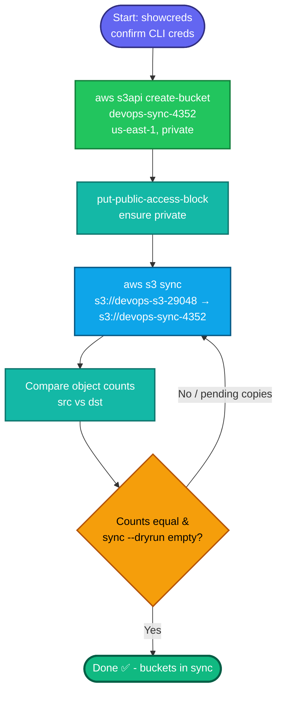

## Concept

This task is a classic **S3-to-S3 migration**: create a new **private** bucket, then **sync** all objects from source to destination, then **verify** parity. Key facts:

- **`aws s3 sync`** is the right tool — it recursively copies objects and, on re-run, only transfers what's missing/changed (incremental). It's the reliable way to guarantee completeness on large datasets.
- **Server-side copy:** `s3 sync bucket→bucket` copies objects **directly between buckets within AWS** — data never routes through aws-client, so it's fast and doesn't consume local disk/bandwidth.
- **Private by default:** new S3 buckets are private unless you explicitly open them. With Block Public Access on (default), the bucket is private — no extra step needed, but don't add any public ACL/policy.
- **`us-east-1` naming quirk:** for us-east-1 you **omit** `--create-bucket-configuration` (passing a LocationConstraint of us-east-1 actually errors). Other regions require it.
- Verification = compare **object counts** and ideally **ETags/sizes** between source and destination.

## Prerequisites

- `showcreds` first — this task explicitly requires the **CLI**, so you need a working `AKIA`/secret. If only console creds, you'd need to check whether the lab granted CLI access.
- Region **us-east-1** (default).
- Source bucket `devops-s3-29048` exists with data.

## OTS (CLI)

```bash
REGION=us-east-1
SRC=devops-s3-29048
DST=devops-sync-4352

# 1. Create the new PRIVATE bucket (us-east-1: no LocationConstraint)
aws s3api create-bucket --bucket $DST --region $REGION

# (Belt-and-suspenders: ensure it stays private — usually on by default)
aws s3api put-public-access-block --bucket $DST \
  --public-access-block-configuration \
  BlockPublicAcls=true,IgnorePublicAcls=true,BlockPublicPolicy=true,RestrictPublicBuckets=true

# 2. Sync ALL data source → destination (server-side, incremental)
aws s3 sync s3://$SRC s3://$DST
```

**Verify (data consistency):**
```bash
# Object counts should match
echo "Source count:"
aws s3 ls s3://$SRC --recursive | wc -l
echo "Dest count:"
aws s3 ls s3://$DST --recursive --summarize | tail -3

# Diff check — a second sync with --dryrun should show NOTHING left to copy
aws s3 sync s3://$SRC s3://$DST --dryrun
# (empty output = fully in sync)
```
Equal counts + empty `--dryrun` = complete, accurate migration.

## Runbook (step-by-step)

1. `showcreds` → confirm CLI creds work (`aws sts get-caller-identity`).
2. Create the bucket: `aws s3api create-bucket --bucket devops-sync-4352 --region us-east-1`.
3. Confirm it's private (Block Public Access on — default).
4. Sync: `aws s3 sync s3://devops-s3-29048 s3://devops-sync-4352`.
5. Watch the transfer output; it lists each `copy:` operation.
6. Verify counts match and re-run sync `--dryrun` returns nothing.
7. Optionally spot-check a few object ETags/sizes match.

---

### Gotchas
- **us-east-1 create-bucket** — do **not** add `--create-bucket-configuration LocationConstraint=us-east-1`; it throws `InvalidLocationConstraint`. Only non-us-east-1 regions need it.
- **Bucket name global uniqueness** — S3 names are globally unique; `devops-sync-4352` must be free (the lab-assigned name should be).
- **`sync` vs `cp`** — use `sync` (idempotent, verifiable, resumable). `cp --recursive` works but re-copies everything on rerun and is harder to verify.
- **Keep it private** — don't attach any public bucket policy or ACL. Task says *private*.
- **Empty source** — if `devops-s3-29048` has objects under prefixes, `sync` handles them recursively; nothing extra needed.
- **Consistency proof** — the `--dryrun` re-sync showing zero pending copies is the cleanest evidence both buckets match.

---

## Colorful flow diagram



The `aws s3 sync ... --dryrun` returning empty is the gold-standard consistency proof — it's what confirms "no loss or corruption" the task asks for. Want the Terraform/boto3 equivalent, or a note on `aws s3 sync --delete` for cases where you also need to remove extras from the destination?