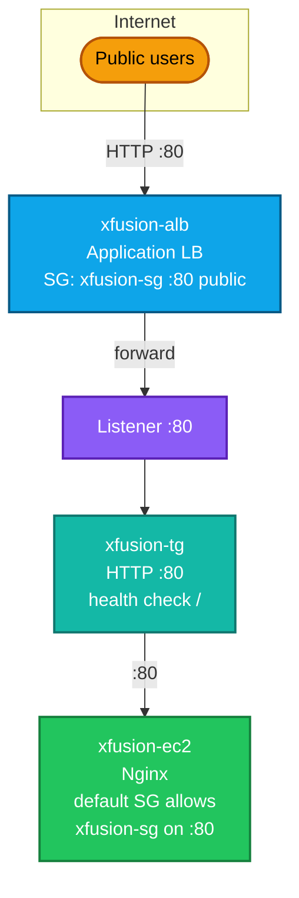
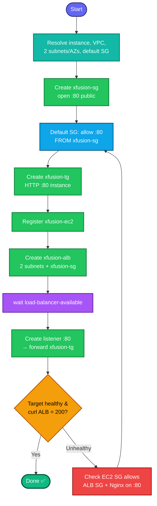

## Concept

An **Application Load Balancer (ALB)** is a Layer-7 load balancer that routes HTTP/HTTPS traffic to registered targets. The moving parts and how they connect:

- **Target group (`xfusion-tg`)** — a logical group of backends (here, `xfusion-ec2`) with a health check. The ALB routes to healthy targets in this group.
- **Listener** — the rule that says "traffic arriving on port 80 → forward to `xfusion-tg`."
- **Security group (`xfusion-sg`)** — opens port 80 to the public **on the ALB**.
- **EC2's own SG** — must allow port 80 **from the ALB's SG** (not the world) so the ALB can reach Nginx. This is the "appropriate changes to the default SG" step.

Critical requirement: **an ALB needs at least two subnets in two different Availability Zones.** This trips people up — a single-subnet ALB won't create.

Traffic path: `Internet → :80 → ALB (xfusion-sg) → xfusion-tg → :80 → xfusion-ec2 (default SG allows ALB SG)`.

## Prerequisites

- `showcreds` first — this is CLI-heavy; you need working `AKIA`/secret (or do it in console).
- Region **us-east-1**.
- `xfusion-ec2` exists, Nginx serving on port 80.
- Default VPC with ≥2 subnets in different AZs.

## OTS (CLI)

```bash
REGION=us-east-1

# 0. Context: instance, VPC, subnets (need >=2 AZs)
IID=$(aws ec2 describe-instances --filters "Name=tag:Name,Values=xfusion-ec2" \
  "Name=instance-state-name,Values=running,stopped" \
  --query 'Reservations[0].Instances[0].InstanceId' --output text --region $REGION)

VPC_ID=$(aws ec2 describe-vpcs --filters "Name=isDefault,Values=true" \
  --query 'Vpcs[0].VpcId' --output text --region $REGION)

# two subnets in distinct AZs
SUBNETS=$(aws ec2 describe-subnets --filters "Name=vpc-id,Values=$VPC_ID" \
  --query 'Subnets[?MapPublicIpOnLaunch==`true`].SubnetId' --output text --region $REGION)
SUB1=$(echo $SUBNETS | awk '{print $1}')
SUB2=$(echo $SUBNETS | awk '{print $2}')
echo "Instance=$IID VPC=$VPC_ID Subnets=$SUB1 $SUB2"

# Default SG on the instance (to modify later)
DEFAULT_SG=$(aws ec2 describe-instances --instance-ids $IID \
  --query 'Reservations[0].Instances[0].SecurityGroups[0].GroupId' --output text --region $REGION)

# 1. Create ALB security group (open :80 to public)
SG_ID=$(aws ec2 create-security-group \
  --group-name xfusion-sg \
  --description "ALB SG open port 80" \
  --vpc-id $VPC_ID --region $REGION \
  --query 'GroupId' --output text)
aws ec2 authorize-security-group-ingress \
  --group-id $SG_ID --protocol tcp --port 80 --cidr 0.0.0.0/0 --region $REGION

# 2. Allow the instance's default SG to receive :80 FROM the ALB SG
aws ec2 authorize-security-group-ingress \
  --group-id $DEFAULT_SG --protocol tcp --port 80 \
  --source-group $SG_ID --region $REGION 2>/dev/null

# 3. Create the target group (target type = instance, port 80, HTTP)
TG_ARN=$(aws elbv2 create-target-group \
  --name xfusion-tg \
  --protocol HTTP --port 80 \
  --vpc-id $VPC_ID \
  --target-type instance \
  --health-check-protocol HTTP --health-check-path / \
  --region $REGION \
  --query 'TargetGroups[0].TargetGroupArn' --output text)

# 4. Register xfusion-ec2 in the target group
aws elbv2 register-targets \
  --target-group-arn $TG_ARN --targets Id=$IID --region $REGION

# 5. Create the ALB (needs >=2 subnets, the ALB SG)
ALB_ARN=$(aws elbv2 create-load-balancer \
  --name xfusion-alb \
  --type application --scheme internet-facing \
  --subnets $SUB1 $SUB2 \
  --security-groups $SG_ID \
  --region $REGION \
  --query 'LoadBalancers[0].LoadBalancerArn' --output text)

# 6. Wait until the ALB is active
aws elbv2 wait load-balancer-available --load-balancer-arns $ALB_ARN --region $REGION

# 7. Create a listener on :80 forwarding to the target group
aws elbv2 create-listener \
  --load-balancer-arn $ALB_ARN \
  --protocol HTTP --port 80 \
  --default-actions Type=forward,TargetGroupArn=$TG_ARN \
  --region $REGION
```

**Verify:**
```bash
# Target health should become 'healthy' (give it a minute)
aws elbv2 describe-target-health --target-group-arn $TG_ARN --region us-east-1 \
  --query 'TargetHealthDescriptions[].TargetHealth.State' --output text

# Hit the ALB DNS name over HTTP
ALB_DNS=$(aws elbv2 describe-load-balancers --load-balancer-arns $ALB_ARN \
  --query 'LoadBalancers[0].DNSName' --output text --region us-east-1)
echo "http://$ALB_DNS"
curl -s -o /dev/null -w "%{http_code}\n" http://$ALB_DNS
```
Expect target `healthy` and `curl` returning `200` (Nginx sample page).

## Runbook (console path)

1. **EC2 → Security Groups → Create** `xfusion-sg` (VPC = default), inbound **HTTP :80 from 0.0.0.0/0**.
2. **EC2 → Target Groups → Create** `xfusion-tg`: target type **Instances**, HTTP :80, default VPC → register **`xfusion-ec2`** on port 80.
3. **EC2 → Load Balancers → Create → Application Load Balancer** `xfusion-alb`: internet-facing, select **≥2 subnets/AZs**, attach **`xfusion-sg`**, listener **HTTP :80 → forward to `xfusion-tg`**.
4. **Edit the instance's default SG** → add inbound **HTTP :80 sourced from `xfusion-sg`** (so the ALB can reach Nginx).
5. Wait for ALB **active** and target **healthy**, then browse the ALB DNS name.

---

### Gotchas
- **Two AZs mandatory** — `create-load-balancer` fails with one subnet. Pick two subnets in different AZs (`SUB1 $SUB2`).
- **EC2 SG must allow the ALB SG on :80** — the #1 reason targets show **unhealthy**. Source it from `xfusion-sg`, not `0.0.0.0/0` (least privilege, and it's what "appropriate changes to the default SG" means).
- **Health check path** — default `/` works for the Nginx sample page. If Nginx returns non-200 on `/`, the target stays unhealthy.
- **Target type `instance`** — since you register the EC2 instance directly (not IPs).
- **ALB takes ~2–3 min to become active**; targets take another minute to pass health checks. `wait load-balancer-available` + patience.
- **Instance must be running** with Nginx up on :80.
- Region **us-east-1**; exact names `xfusion-alb`, `xfusion-tg`, `xfusion-sg`.

---

## Colorful architecture + flow diagram





This is the most interconnected task in the track — SG, TG, ALB, listener, and the cross-SG reference all have to line up, and the **EC2-SG-allows-ALB-SG** rule is the classic gotcha that leaves targets unhealthy. Want the Terraform equivalent (`aws_lb` + `aws_lb_target_group` + `aws_lb_listener` + `aws_lb_target_group_attachment` + the two SGs), or a consolidated ALB runbook `.md` for your portfolio?

------------------

# Setting Up an Application Load Balancer (ALB) — A Beginner's Complete Guide

**Goal:** Put a load balancer in front of an EC2 instance running Nginx, so that
public users reach the web server through the load balancer on port 80.

**What we built:** `xfusion-alb` (load balancer) → `xfusion-tg` (target group) →
`xfusion-ec2` (the web server), secured by `xfusion-sg` (security group).

---

## Part 1 — Understand the pieces (in plain English)

Think of a restaurant:

| AWS thing | Restaurant analogy | What it actually does |
|-----------|--------------------|-----------------------|
| **EC2 instance** (`xfusion-ec2`) | The kitchen that cooks food | The server running Nginx that serves the web page |
| **Application Load Balancer** (`xfusion-alb`) | The host at the front door | Takes every visitor and sends them to a working kitchen |
| **Target group** (`xfusion-tg`) | The list of kitchens that are open | The list of servers the load balancer is allowed to send traffic to, plus a "is this kitchen open?" health check |
| **Listener** | The rule "front door is on Main Street, port 80" | Says "traffic arriving on port 80 → send to the target group" |
| **Security group** (`xfusion-sg`) | The bouncer's rulebook | A firewall deciding who can come in and on which door (port) |

**The one-sentence version:** A visitor arrives at the load balancer's front door
(port 80). The load balancer checks its list of healthy servers (the target group)
and forwards the visitor to one of them (our Nginx server, also on port 80).

### Two words you must not confuse

- **Region** = a whole city (e.g. `us-east-1` = Northern Virginia). Everything in
  this task lives in ONE region.
- **Availability Zone (AZ)** = a separate building within that city
  (`us-east-1a`, `us-east-1c`, `us-east-1f`…). A region has several AZs.

> A load balancer does **not** route between regions/cities. It routes between
> servers inside one region. The multiple AZs exist so that if one building loses
> power, the load balancer still works from another building. It's about
> **survival, not routing.**

---

## Part 2 — The picture

```
        Public users on the internet
                    |
                    |  HTTP request on port 80
                    v
    +---------------------------------------+
    |   xfusion-alb (Application Load        |
    |   Balancer)                            |
    |   Firewall: xfusion-sg allows port 80  |
    |   from everyone (0.0.0.0/0)            |
    +---------------------------------------+
                    |
                    |  Listener rule: port 80 -> xfusion-tg
                    v
    +---------------------------------------+
    |   xfusion-tg (Target group)            |
    |   Health check: is the server up?      |
    +---------------------------------------+
                    |
                    |  forward to port 80
                    v
    +---------------------------------------+
    |   xfusion-ec2 (Nginx web server)       |
    |   Its firewall must allow port 80      |
    |   FROM the load balancer's firewall    |
    +---------------------------------------+
```

---

## Part 3 — The golden rule that caused all the trouble

**The load balancer can only send traffic to a server if the load balancer has a
"presence" (a subnet) in the same building (AZ) as that server.**

- Our server `xfusion-ec2` was in building **`us-east-1c`**.
- We first set up the load balancer with presences in buildings **`1a`** and
  **`1f`** — but NOT `1c`.
- Result: the load balancer had no way into the building where the server lived,
  so it refused to use it. Visitors got a **503 error** ("no server available").

**Lesson:** When choosing which buildings (subnets/AZs) the load balancer lives in,
you MUST include the building your server is in.

---

## Part 4 — Step-by-step commands (what we ran)

> Run these on the `aws-client` machine. Each `VARIABLE=$(...)` line saves a value
> (an ID) so later commands can reuse it. If you close the terminal, these values
> are lost and must be re-run.

### 4.1 Find the basic facts

```bash
REGION=us-east-1

# The web server's ID (found by its name tag)
IID=$(aws ec2 describe-instances --filters "Name=tag:Name,Values=xfusion-ec2" \
  "Name=instance-state-name,Values=running,stopped" \
  --query 'Reservations[0].Instances[0].InstanceId' --output text --region $REGION)

# Which network (VPC) and which building (AZ) is the server in? — WRITE THIS DOWN
aws ec2 describe-instances --instance-ids $IID --region $REGION \
  --query 'Reservations[0].Instances[0].{VPC:VpcId,Subnet:SubnetId,AZ:Placement.AvailabilityZone}' \
  --output table

# The default network
VPC_ID=$(aws ec2 describe-vpcs --filters "Name=isDefault,Values=true" \
  --query 'Vpcs[0].VpcId' --output text --region $REGION)
```

### 4.2 Create the load balancer's firewall (open port 80 to the public)

```bash
SG_ID=$(aws ec2 create-security-group \
  --group-name xfusion-sg \
  --description "ALB SG open port 80" \
  --vpc-id $VPC_ID --region $REGION \
  --query 'GroupId' --output text)

# Allow anyone on the internet to reach port 80 (web traffic)
aws ec2 authorize-security-group-ingress \
  --group-id $SG_ID --protocol tcp --port 80 --cidr 0.0.0.0/0 --region $REGION
```

### 4.3 Let the server accept traffic FROM the load balancer

```bash
# The server's own firewall
DEFAULT_SG=$(aws ec2 describe-instances --instance-ids $IID \
  --query 'Reservations[0].Instances[0].SecurityGroups[0].GroupId' --output text --region $REGION)

# Allow port 80 into the server, but ONLY from the load balancer's firewall
aws ec2 authorize-security-group-ingress \
  --group-id $DEFAULT_SG --protocol tcp --port 80 \
  --source-group $SG_ID --region $REGION
```

### 4.4 Create the target group (the list of servers)

```bash
TG_ARN=$(aws elbv2 create-target-group \
  --name xfusion-tg \
  --protocol HTTP --port 80 \
  --vpc-id $VPC_ID \
  --target-type instance \
  --health-check-protocol HTTP --health-check-path / \
  --region $REGION \
  --query 'TargetGroups[0].TargetGroupArn' --output text)

# Add our server to that list
aws elbv2 register-targets --target-group-arn $TG_ARN --targets Id=$IID --region $REGION
```

### 4.5 Create the load balancer — INCLUDING the server's building (AZ)

> This is the step to get right. Pick two subnets in two different AZs, and make
> sure ONE of them is in the same AZ as the server (here, `us-east-1c`).

```bash
# subnet-...c = the server's building (us-east-1c)  <-- the crucial one
# subnet-...a = a second building (needed because a load balancer requires >=2)
ALB_ARN=$(aws elbv2 create-load-balancer \
  --name xfusion-alb \
  --type application --scheme internet-facing \
  --subnets <subnet-in-1c> <subnet-in-1a> \
  --security-groups $SG_ID \
  --region $REGION \
  --query 'LoadBalancers[0].LoadBalancerArn' --output text)

# Wait until it finishes starting up (takes a couple of minutes)
aws elbv2 wait load-balancer-available --load-balancer-arns $ALB_ARN --region $REGION
```

### 4.6 Create the listener (the "port 80 → target group" rule)

```bash
aws elbv2 create-listener \
  --load-balancer-arn $ALB_ARN \
  --protocol HTTP --port 80 \
  --default-actions Type=forward,TargetGroupArn=$TG_ARN \
  --region $REGION
```

---

## Part 5 — Check it worked

```bash
# 1. Is the server "healthy" in the target group?
sleep 60   # give the health check a minute
aws elbv2 describe-target-health --target-group-arn $TG_ARN --region us-east-1 \
  --query 'TargetHealthDescriptions[].{State:TargetHealth.State,Reason:TargetHealth.Reason}' \
  --output table

# 2. Get the load balancer's public web address
ALB_DNS=$(aws elbv2 describe-load-balancers --load-balancer-arns $ALB_ARN \
  --query 'LoadBalancers[0].DNSName' --output text --region us-east-1)
echo "http://$ALB_DNS"

# 3. Ask the web page for a response code
curl -s -o /dev/null -w "%{http_code}\n" http://$ALB_DNS
```

**Success looks like:**
- Target state = **`healthy`**
- `curl` returns **`200`** (means "OK, page delivered")

---

## Part 6 — What each error meant (the troubleshooting we did)

| What we saw | Plain meaning | The fix |
|-------------|---------------|---------|
| Target state `unused`, reason `Target.NotInUse` | The load balancer isn't even trying to use the server — because it has no presence in the server's building (AZ) | Include the server's AZ (`us-east-1c`) in the load balancer's subnets |
| `curl` returns **503** | "No healthy server available" — the direct result of the `unused` problem above | Same fix — cover the server's AZ |
| Target state `unhealthy` (different from `unused`) | The load balancer CAN reach the server's building, but the health check fails | Make sure the server's firewall allows port 80 **from the load balancer's firewall**, and that Nginx is actually running |
| `AccessDenied ... SetSubnets` | The lab account isn't allowed to modify an existing load balancer's buildings | Delete the load balancer and recreate it with the correct buildings from the start |

> **`unused` vs `unhealthy` — the key distinction:**
> - `unused` = a **wiring/building** problem (wrong AZ). The load balancer isn't
>   trying.
> - `unhealthy` = a **firewall or app** problem. The load balancer is trying, but
>   the server isn't answering the health check.

---

## Part 7 — The permission wall (why we deleted and recreated)

This particular lab blocked the command that *edits* a load balancer's subnets
(`SetSubnets`), but allowed *deleting* and *creating* one. So instead of patching
the misconfigured load balancer, we:

1. Deleted the wrong load balancer (`delete-load-balancer`).
2. Created a fresh one with the correct AZs (including `us-east-1c`).
3. Recreated the listener.

**Note:** the target group (`xfusion-tg`) and its registered server survive a load
balancer deletion — you only recreate the load balancer and its listener.

---

## Part 8 — The complete traffic journey (final working state)

1. A user opens `http://xfusion-alb-....elb.amazonaws.com` in a browser.
2. The request hits the load balancer on **port 80**. Its firewall (`xfusion-sg`)
   allows this from anyone.
3. The **listener** rule says "port 80 → send to `xfusion-tg`."
4. The **target group** picks a **healthy** server — our `xfusion-ec2`.
5. The request is forwarded to the server on **port 80**. The server's firewall
   allows this because it trusts the load balancer's firewall.
6. **Nginx** answers with the web page → response code **200** → the user sees it.

Done.

---

## Quick glossary

- **ALB (Application Load Balancer):** the traffic director for web (HTTP) requests.
- **Target group:** the list of servers the ALB may send traffic to, with a health check.
- **Listener:** the rule mapping an incoming port to a target group.
- **Security group:** a firewall attached to a resource, controlling ports and sources.
- **VPC:** your private network in AWS (the "city's road system").
- **Subnet:** a slice of the network living in one AZ (a "neighbourhood in one building").
- **Availability Zone (AZ):** an isolated datacenter building within a region.
- **Region:** a geographic location containing multiple AZs.
- **Health check:** the ALB repeatedly asking a server "are you OK?" on a URL path.
- **200 / 503:** HTTP response codes — 200 = success, 503 = no healthy server.
```