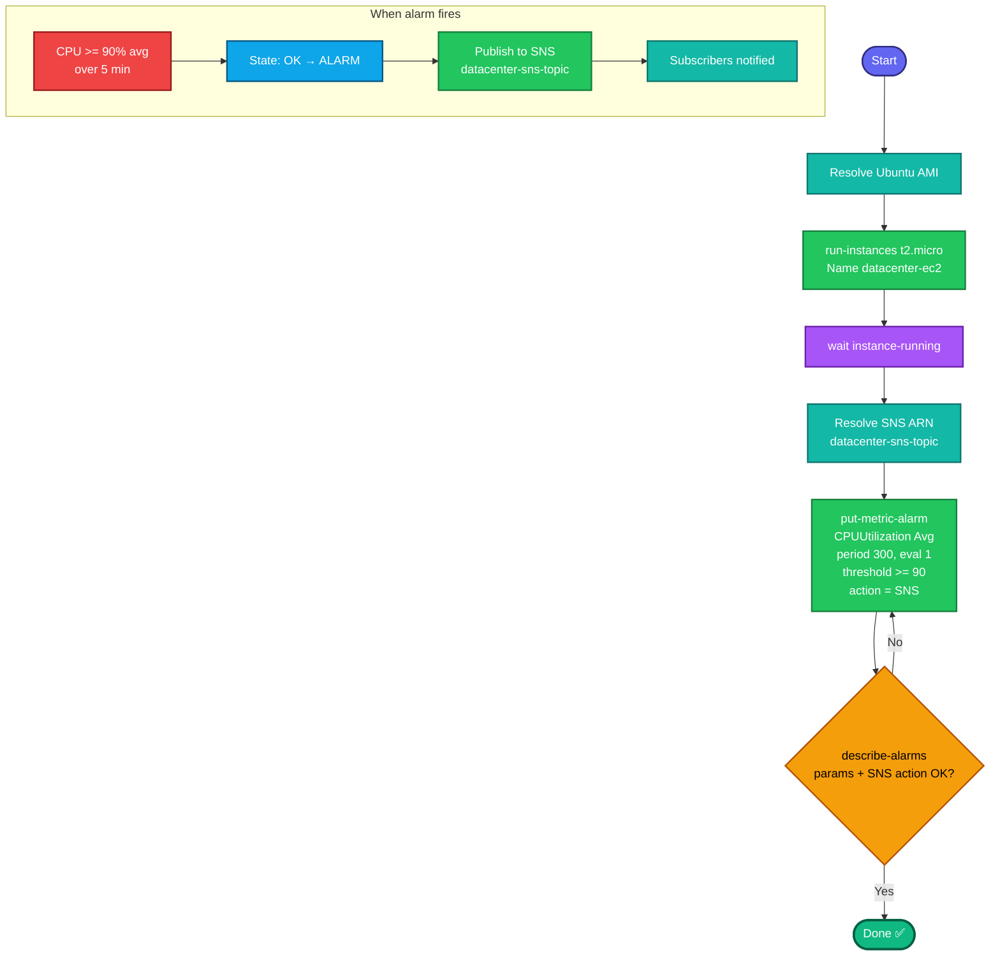

## Concept

**CloudWatch alarms** watch a metric and change state (`OK` → `ALARM`) when it crosses a threshold, optionally firing an **action** — here, publishing to an **SNS topic** that then notifies subscribers (email/SMS/etc).

The alarm's behavior is defined by a few parameters that map directly to the task:

- **Metric:** `CPUUtilization` in the `AWS/EC2` namespace, scoped to your instance via the `InstanceId` **dimension**.
- **Statistic:** `Average` — averages the CPU over each period.
- **Period:** `300` seconds = one 5-minute window.
- **Threshold + comparison:** `>= 90` → `GreaterThanOrEqualToThreshold`.
- **Evaluation periods:** `1` — "1 consecutive 5-minute period" means evaluate a single 300s window.
- **Alarm action:** the SNS topic ARN, triggered when state enters `ALARM`.

So: launch the Ubuntu instance, resolve the SNS topic ARN, then create the alarm wired to that instance and topic.

## Prerequisites

- `showcreds` first — this is CLI-friendly; need working `AKIA`/secret (or console).
- Region **us-east-1**.
- SNS topic `datacenter-sns-topic` already exists.

## OTS (CLI)

```bash
REGION=us-east-1

# 1. Resolve a current Ubuntu 22.04 AMI (Canonical owner id 099720109477)
AMI_ID=$(aws ec2 describe-images --owners 099720109477 \
  --filters "Name=name,Values=ubuntu/images/hvm-ssd/ubuntu-jammy-22.04-amd64-server-*" \
            "Name=state,Values=available" \
  --query 'sort_by(Images, &CreationDate)[-1].ImageId' --output text --region $REGION)

# 2. Launch the instance (Name tag = datacenter-ec2)
IID=$(aws ec2 run-instances \
  --image-id $AMI_ID \
  --instance-type t2.micro \
  --tag-specifications 'ResourceType=instance,Tags=[{Key=Name,Value=datacenter-ec2}]' \
  --region $REGION \
  --query 'Instances[0].InstanceId' --output text)
echo "Instance: $IID"
aws ec2 wait instance-running --instance-ids $IID --region $REGION

# 3. Resolve the SNS topic ARN by name
SNS_ARN=$(aws sns list-topics --region $REGION \
  --query "Topics[?contains(TopicArn, 'datacenter-sns-topic')].TopicArn | [0]" --output text)
echo "SNS: $SNS_ARN"

# 4. Create the CloudWatch alarm
aws cloudwatch put-metric-alarm \
  --alarm-name datacenter-alarm \
  --alarm-description "CPU >= 90% for one 5-min period" \
  --namespace AWS/EC2 \
  --metric-name CPUUtilization \
  --dimensions Name=InstanceId,Value=$IID \
  --statistic Average \
  --period 300 \
  --evaluation-periods 1 \
  --threshold 90 \
  --comparison-operator GreaterThanOrEqualToThreshold \
  --alarm-actions $SNS_ARN \
  --region $REGION
```

**Verify:**
```bash
aws cloudwatch describe-alarms --alarm-names datacenter-alarm --region us-east-1 \
  --query 'MetricAlarms[0].{Name:AlarmName,Metric:MetricName,Stat:Statistic,Period:Period,Eval:EvaluationPeriods,Threshold:Threshold,Op:ComparisonOperator,Actions:AlarmActions,State:StateValue}'
```
Expect `Metric=CPUUtilization`, `Stat=Average`, `Period=300`, `Eval=1`, `Threshold=90.0`, `Op=GreaterThanOrEqualToThreshold`, and the SNS ARN in `Actions`.

## Runbook (console path)

1. **EC2 → Launch instances** → Name `datacenter-ec2`, Ubuntu AMI, `t2.micro` → Launch → wait running.
2. **CloudWatch → Alarms → All alarms → Create alarm**.
3. **Select metric → EC2 → Per-Instance Metrics** → find your instance's **CPUUtilization** → Select metric.
4. **Statistic:** Average · **Period:** 5 minutes.
5. **Conditions:** Threshold type Static · **Greater/Equal `>= 90`**.
6. (Additional config) **Datapoints to alarm: 1 of 1** (one consecutive period).
7. **Next → Notification:** In alarm → send to SNS topic **`datacenter-sns-topic`**.
8. **Next → Alarm name:** `datacenter-alarm` → Create.

---

### Gotchas
- **`InstanceId` dimension is essential** — without it, the alarm watches nothing specific and won't bind to your instance. Set `Name=InstanceId,Value=$IID`.
- **Period 300 + evaluation-periods 1** = exactly "one consecutive 5-minute period." Don't set period to 60 or eval to 3.
- **`>= 90` → `GreaterThanOrEqualToThreshold`** — the task says "exceeds 90%" but specifies threshold `>= 90`; use the operator matching what's written (GreaterThanOrEqualToThreshold). If a grader is strict on "exceeds," `GreaterThanThreshold` is the literal reading — but the numbered spec says `>= 90%`, so GTE is correct here.
- **SNS ARN, not name** — resolve the full ARN; `alarm-actions` needs the ARN.
- **Alarm may show `INSUFFICIENT_DATA` initially** — normal until the instance emits CPU metrics (basic monitoring reports every 5 min). Not a failure.
- Region **us-east-1**; exact names `datacenter-ec2`, `datacenter-alarm`.

---

## Colorful flow diagram



The `period 300` + `evaluation-periods 1` pairing is the crux — that's the exact encoding of "one consecutive 5-minute period." Want the Terraform equivalent (`aws_cloudwatch_metric_alarm`), or should I fold all these monitoring/EC2 tasks into a consolidated runbook for your portfolio?