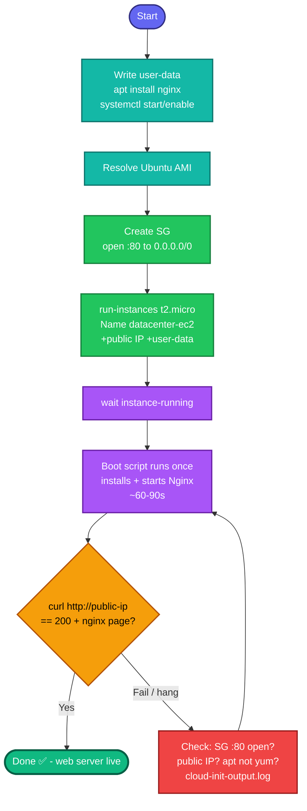

## Concept

This task uses a **user-data bootstrap script** — a shell script AWS runs **once, at first boot**, as root. It's the standard way to auto-configure a fresh instance (install packages, start services) without manually SSHing in afterward. Here it installs and starts **Nginx** so the web server is live the moment the instance boots.

The pieces:
- **User data** runs automatically on launch → installs Nginx, starts it, enables it on boot.
- **Security group** must open **port 80 to `0.0.0.0/0`** so the internet can reach the web page.
- **Ubuntu specifics:** package manager is `apt`; service is managed by `systemctl`; default web user path serves from `/var/www/html`.

Traffic path when done: `Internet → :80 → instance SG (allows 80) → Nginx`.

## Prerequisites

- `showcreds` first — CLI-friendly; need working `AKIA`/secret (or console).
- Region **us-east-1**.
- Default VPC + a subnet with a public IP (auto-assign on).

## OTS (CLI)

```bash
REGION=us-east-1

# 1. User-data script (runs once at first boot, as root)
cat > /tmp/nginx-userdata.sh <<'EOF'
#!/bin/bash
apt-get update -y
apt-get install -y nginx
systemctl start nginx
systemctl enable nginx
EOF

# 2. Resolve a current Ubuntu 22.04 AMI (Canonical owner id)
AMI_ID=$(aws ec2 describe-images --owners 099720109477 \
  --filters "Name=name,Values=ubuntu/images/hvm-ssd/ubuntu-jammy-22.04-amd64-server-*" \
            "Name=state,Values=available" \
  --query 'sort_by(Images, &CreationDate)[-1].ImageId' --output text --region $REGION)

# 3. Default VPC + create a security group opening port 80
VPC_ID=$(aws ec2 describe-vpcs --filters "Name=isDefault,Values=true" \
  --query 'Vpcs[0].VpcId' --output text --region $REGION)

SG_ID=$(aws ec2 create-security-group \
  --group-name datacenter-web-sg \
  --description "Allow HTTP 80 from internet" \
  --vpc-id $VPC_ID --region $REGION \
  --query 'GroupId' --output text)

aws ec2 authorize-security-group-ingress \
  --group-id $SG_ID --protocol tcp --port 80 --cidr 0.0.0.0/0 --region $REGION

# 4. Launch the instance with the user-data + SG + public IP
IID=$(aws ec2 run-instances \
  --image-id $AMI_ID \
  --instance-type t2.micro \
  --security-group-ids $SG_ID \
  --associate-public-ip-address \
  --user-data file:///tmp/nginx-userdata.sh \
  --tag-specifications 'ResourceType=instance,Tags=[{Key=Name,Value=datacenter-ec2}]' \
  --region $REGION \
  --query 'Instances[0].InstanceId' --output text)
echo "Instance: $IID"

aws ec2 wait instance-running --instance-ids $IID --region $REGION

# 5. Get the public IP
PUB_IP=$(aws ec2 describe-instances --instance-ids $IID \
  --query 'Reservations[0].Instances[0].PublicIpAddress' --output text --region $REGION)
echo "Public IP: $PUB_IP"
```

**Verify (give user-data ~60–90s to finish on first boot):**
```bash
# HTTP check — expect 200 and the Nginx welcome page
curl -s -o /dev/null -w "%{http_code}\n" http://$PUB_IP
curl -s http://$PUB_IP | grep -i nginx
```
`200` + "Welcome to nginx" = web server up and internet-reachable.

## Runbook (console path)

1. **EC2 → Launch instances** → Name `datacenter-ec2`, Ubuntu AMI, `t2.micro`.
2. **Network settings → Auto-assign public IP: Enable.**
3. **Firewall (security groups) → Create security group** → add inbound rule **HTTP :80 from Anywhere (0.0.0.0/0)**.
4. **Advanced details → User data** → paste:
   ```bash
   #!/bin/bash
   apt-get update -y
   apt-get install -y nginx
   systemctl start nginx
   systemctl enable nginx
   ```
5. **Launch instance** → wait running.
6. Browse `http://<public-ip>` → should show the Nginx welcome page.

---

### Gotchas
- **`#!/bin/bash` on line 1 is mandatory** — user-data without a shebang isn't executed as a script. The `<<'EOF'` (quoted) prevents your shell from expanding anything inside.
- **Ubuntu = `apt`, not `yum`** — using `yum` (Amazon Linux syntax) fails on Ubuntu. Match the package manager to the AMI.
- **Port 80 open to `0.0.0.0/0`** — the task says "from the internet"; a narrower CIDR would fail the "accessible from internet" requirement.
- **Public IP required** — no public IP = unreachable. Ensure auto-assign is on (or attach an EIP).
- **user-data runs once, ~1–2 min** — if `curl` fails immediately, wait; the script may still be installing.
- **Debugging user-data:** if Nginx never comes up, the boot log is at `/var/log/cloud-init-output.log` on the instance (needs SSH/EC2 Instance Connect to view).
- Region **us-east-1**; exact name `datacenter-ec2`.

---

## Colorful flow diagram



The `#!/bin/bash` shebang + matching `apt` to Ubuntu are the two things that most often silently break user-data. Want the Terraform equivalent (`aws_instance` with a `user_data` heredoc + `aws_security_group`), or should I consolidate all these EC2/user-data tasks into one runbook for your portfolio?