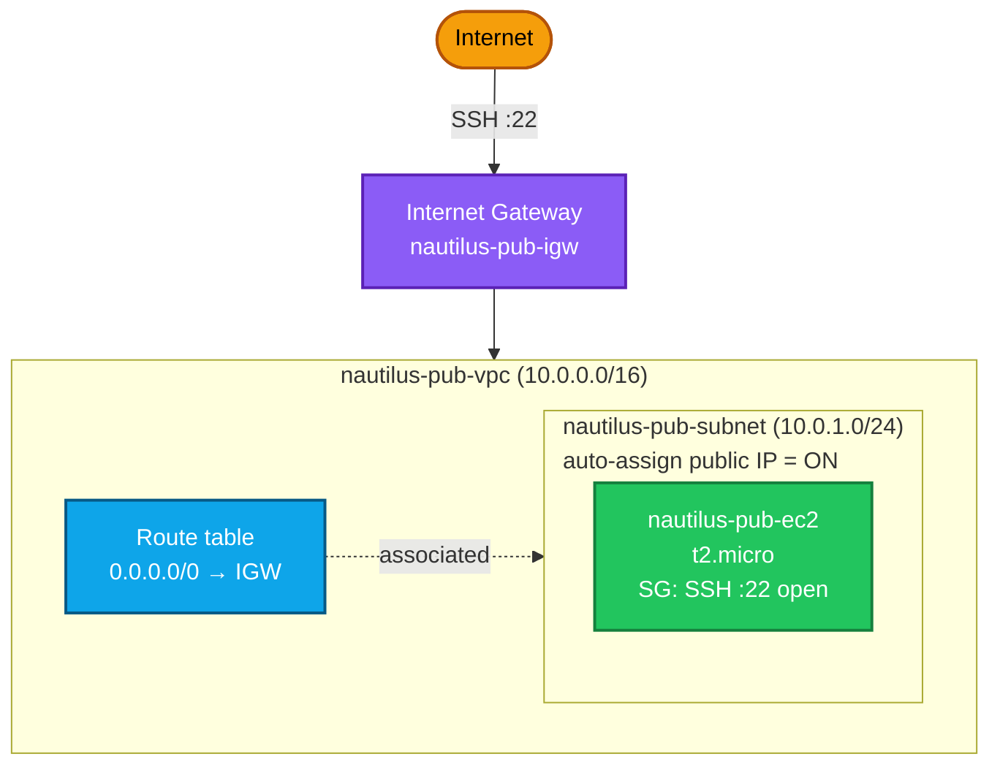
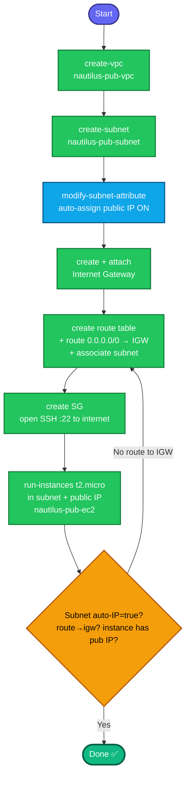

## Concept

This task builds a **public VPC from scratch** — a network that can reach and be reached by the internet. A VPC is "public" only if you assemble several pieces correctly; missing any one breaks internet access. The pieces:

1. **VPC** — your isolated private network (a CIDR block, e.g. `10.0.0.0/16`).
2. **Subnet** — a slice of that CIDR in one AZ, with **auto-assign public IP** enabled so instances get a public address automatically.
3. **Internet Gateway (IGW)** — the door between the VPC and the internet. Without it, nothing is public.
4. **Route table** — must have a route `0.0.0.0/0 → IGW` so traffic can leave the subnet to the internet. **This is the step people forget**, and it's what actually makes a subnet "public."
5. **Security group** — opens **SSH port 22** to the internet.
6. **EC2 instance** — launched in the subnet with a public IP + the SSH SG.

> A subnet is only truly "public" when it has **both** auto-assign public IP **and** a route to an internet gateway. Auto-assign alone gives an IP that goes nowhere.

## Prerequisites

- `showcreds` first — CLI-heavy; need working `AKIA`/secret (or console).
- Region **us-east-1**.
- Pick a CIDR that doesn't matter for grading (e.g. `10.0.0.0/16` VPC, `10.0.1.0/24` subnet).

## OTS (CLI)

```bash
REGION=us-east-1

# 1. Create the VPC
VPC_ID=$(aws ec2 create-vpc --cidr-block 10.0.0.0/16 --region $REGION \
  --tag-specifications 'ResourceType=vpc,Tags=[{Key=Name,Value=nautilus-pub-vpc}]' \
  --query 'Vpc.VpcId' --output text)
echo "VPC: $VPC_ID"

# 2. Create the subnet
SUBNET_ID=$(aws ec2 create-subnet --vpc-id $VPC_ID --cidr-block 10.0.1.0/24 \
  --availability-zone us-east-1a --region $REGION \
  --tag-specifications 'ResourceType=subnet,Tags=[{Key=Name,Value=nautilus-pub-subnet}]' \
  --query 'Subnet.SubnetId' --output text)
echo "Subnet: $SUBNET_ID"

# 3. Enable auto-assign public IP on the subnet
aws ec2 modify-subnet-attribute --subnet-id $SUBNET_ID \
  --map-public-ip-on-launch --region $REGION

# 4. Create + attach an Internet Gateway
IGW_ID=$(aws ec2 create-internet-gateway --region $REGION \
  --tag-specifications 'ResourceType=internet-gateway,Tags=[{Key=Name,Value=nautilus-pub-igw}]' \
  --query 'InternetGateway.InternetGatewayId' --output text)
aws ec2 attach-internet-gateway --internet-gateway-id $IGW_ID --vpc-id $VPC_ID --region $REGION

# 5. Create a route table, add default route to the IGW, associate to the subnet
RT_ID=$(aws ec2 create-route-table --vpc-id $VPC_ID --region $REGION \
  --tag-specifications 'ResourceType=route-table,Tags=[{Key=Name,Value=nautilus-pub-rt}]' \
  --query 'RouteTable.RouteTableId' --output text)
aws ec2 create-route --route-table-id $RT_ID \
  --destination-cidr-block 0.0.0.0/0 --gateway-id $IGW_ID --region $REGION
aws ec2 associate-route-table --route-table-id $RT_ID --subnet-id $SUBNET_ID --region $REGION

# 6. Security group opening SSH (22) to the internet
SG_ID=$(aws ec2 create-security-group --group-name nautilus-pub-sg \
  --description "Allow SSH 22 from internet" --vpc-id $VPC_ID --region $REGION \
  --query 'GroupId' --output text)
aws ec2 authorize-security-group-ingress --group-id $SG_ID \
  --protocol tcp --port 22 --cidr 0.0.0.0/0 --region $REGION

# 7. Resolve an Ubuntu AMI and launch the instance in the subnet
AMI_ID=$(aws ec2 describe-images --owners 099720109477 \
  --filters "Name=name,Values=ubuntu/images/hvm-ssd/ubuntu-jammy-22.04-amd64-server-*" \
            "Name=state,Values=available" \
  --query 'sort_by(Images, &CreationDate)[-1].ImageId' --output text --region $REGION)

IID=$(aws ec2 run-instances --image-id $AMI_ID --instance-type t2.micro \
  --subnet-id $SUBNET_ID --security-group-ids $SG_ID --associate-public-ip-address \
  --tag-specifications 'ResourceType=instance,Tags=[{Key=Name,Value=nautilus-pub-ec2}]' \
  --region $REGION --query 'Instances[0].InstanceId' --output text)
echo "Instance: $IID"
aws ec2 wait instance-running --instance-ids $IID --region $REGION
```

**Verify:**
```bash
# Subnet auto-assigns public IPs?
aws ec2 describe-subnets --subnet-ids $SUBNET_ID --region us-east-1 \
  --query 'Subnets[0].MapPublicIpOnLaunch'          # expect: true

# Route to IGW exists?
aws ec2 describe-route-tables --route-table-ids $RT_ID --region us-east-1 \
  --query 'RouteTables[0].Routes[?DestinationCidrBlock==`0.0.0.0/0`].GatewayId'   # expect: igw-...

# Instance got a public IP?
aws ec2 describe-instances --instance-ids $IID --region us-east-1 \
  --query 'Reservations[0].Instances[0].{PubIP:PublicIpAddress,Subnet:SubnetId,State:State.Name}' --output table
```
Expect `MapPublicIpOnLaunch=true`, a route to `igw-...`, and the instance with a public IP.

## Runbook (console path)

1. **VPC → Create VPC** → "VPC only", Name `nautilus-pub-vpc`, CIDR `10.0.0.0/16`.
2. **Subnets → Create subnet** → in that VPC, Name `nautilus-pub-subnet`, CIDR `10.0.1.0/24` → Create.
3. Select the subnet → **Actions → Edit subnet settings → Enable auto-assign public IPv4** → Save.
4. **Internet Gateways → Create** → attach to `nautilus-pub-vpc`.
5. **Route Tables → Create** (in the VPC) → **Routes → Edit → Add route** `0.0.0.0/0 → Internet Gateway` → **Subnet associations → Edit → associate `nautilus-pub-subnet`**.
6. **EC2 → Launch instances** → Name `nautilus-pub-ec2`, Ubuntu, `t2.micro`, **Network = nautilus-pub-vpc / nautilus-pub-subnet**, enable public IP, SG inbound **SSH :22 from 0.0.0.0/0**.
7. Launch → confirm the instance has a public IP.

---

### Gotchas
- **The route to the IGW is what makes it "public."** Auto-assign IP + IGW attached but **no `0.0.0.0/0 → igw` route** = instance has a public IP that can't reach the internet. This is the single most common mistake.
- **IGW must be both created AND attached** to the VPC — two separate steps.
- **New VPC = new default SG/route table** — don't confuse them with the default VPC's. Explicitly create and associate the public route table.
- **Auto-assign at subnet level** (`--map-public-ip-on-launch`) plus `--associate-public-ip-address` at launch — belt and suspenders; either gives the instance a public IP, but the task explicitly wants the *subnet* to auto-assign.
- **SSH from internet** = `0.0.0.0/0` on port 22 (task says "accessible over the internet").
- Region **us-east-1**; exact names on all resources.

---

## Colorful architecture + flow diagram





The one thing that separates a "public" from a "private" subnet is the **`0.0.0.0/0 → IGW` route** — auto-assign IP is necessary but not sufficient. That's the concept the Networking Team's request really hinges on. Want the Terraform equivalent (a full public-VPC module: `aws_vpc` + `aws_subnet` + `aws_internet_gateway` + `aws_route_table` + `aws_route` + `aws_security_group` + `aws_instance`), or a beginner-friendly guide like the ALB one?