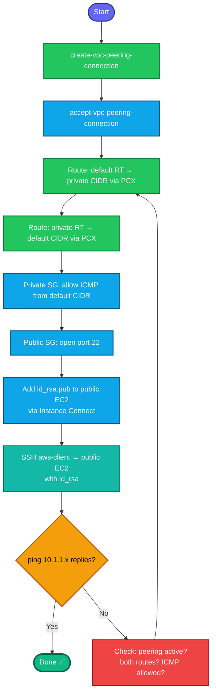

## Concept

**VPC Peering** privately links two VPCs so resources talk via **private IPs** — no internet, no VPN. The connection object alone is inert; traffic flows only when you also **accept** it, **add routes on both sides**, and **open security groups**. Full chain for ping to work: `peering accepted → routes both directions → private SG allows ICMP from default CIDR → SSH key on public instance → ping from public to private`.

## Prerequisites

- `showcreds` first — CLI-heavy; need working `AKIA`/secret.
- Region **us-east-1**. Both VPCs/subnets/instances already exist.
- `/root/.ssh/id_rsa.pub` on aws-client (generate if missing).
- CIDRs don't overlap: default `172.31.0.0/16` vs private `10.1.0.0/16` ✅.

## OTS (CLI, on aws-client)

```bash
REGION=us-east-1

# 0. Resolve both VPCs + CIDRs
DEFAULT_VPC=$(aws ec2 describe-vpcs --filters "Name=isDefault,Values=true" \
  --query 'Vpcs[0].VpcId' --output text --region $REGION)
DEFAULT_CIDR=$(aws ec2 describe-vpcs --vpc-ids $DEFAULT_VPC \
  --query 'Vpcs[0].CidrBlock' --output text --region $REGION)
PRIV_VPC=$(aws ec2 describe-vpcs --filters "Name=tag:Name,Values=nautilus-private-vpc" \
  --query 'Vpcs[0].VpcId' --output text --region $REGION)
PRIV_CIDR=10.1.0.0/16

# 1. Create peering (default → private)
PCX=$(aws ec2 create-vpc-peering-connection \
  --vpc-id $DEFAULT_VPC --peer-vpc-id $PRIV_VPC --region $REGION \
  --tag-specifications 'ResourceType=vpc-peering-connection,Tags=[{Key=Name,Value=nautilus-vpc-peering}]' \
  --query 'VpcPeeringConnection.VpcPeeringConnectionId' --output text)

# 2. Accept it (starts as pending-acceptance)
aws ec2 accept-vpc-peering-connection --vpc-peering-connection-id $PCX --region $REGION

# 3. Resolve route tables — default main RT + private subnet's RT
DEFAULT_RT=$(aws ec2 describe-route-tables \
  --filters "Name=vpc-id,Values=$DEFAULT_VPC" "Name=association.main,Values=true" \
  --query 'RouteTables[0].RouteTableId' --output text --region $REGION)
PRIV_SUBNET=$(aws ec2 describe-subnets --filters "Name=tag:Name,Values=nautilus-private-subnet" \
  --query 'Subnets[0].SubnetId' --output text --region $REGION)
PRIV_RT=$(aws ec2 describe-route-tables \
  --filters "Name=association.subnet-id,Values=$PRIV_SUBNET" \
  --query 'RouteTables[0].RouteTableId' --output text --region $REGION)
[ "$PRIV_RT" = "None" ] && PRIV_RT=$(aws ec2 describe-route-tables \
  --filters "Name=vpc-id,Values=$PRIV_VPC" "Name=association.main,Values=true" \
  --query 'RouteTables[0].RouteTableId' --output text --region $REGION)

# 4. Routes on BOTH sides
aws ec2 create-route --route-table-id $DEFAULT_RT \
  --destination-cidr-block $PRIV_CIDR --vpc-peering-connection-id $PCX --region $REGION
aws ec2 create-route --route-table-id $PRIV_RT \
  --destination-cidr-block $DEFAULT_CIDR --vpc-peering-connection-id $PCX --region $REGION

# 5. Allow ICMP into the private instance from default CIDR
PRIV_IID=$(aws ec2 describe-instances --filters "Name=tag:Name,Values=nautilus-private-ec2" \
  --query 'Reservations[0].Instances[0].InstanceId' --output text --region $REGION)
PRIV_SG=$(aws ec2 describe-instances --instance-ids $PRIV_IID \
  --query 'Reservations[0].Instances[0].SecurityGroups[0].GroupId' --output text --region $REGION)
aws ec2 authorize-security-group-ingress --group-id $PRIV_SG \
  --protocol icmp --port -1 --cidr $DEFAULT_CIDR --region $REGION

# 6. Public instance details + OPEN PORT 22 on its SG (the gotcha)
PUB_IID=$(aws ec2 describe-instances --filters "Name=tag:Name,Values=nautilus-public-ec2" \
  --query 'Reservations[0].Instances[0].InstanceId' --output text --region $REGION)
PUB_IP=$(aws ec2 describe-instances --instance-ids $PUB_IID \
  --query 'Reservations[0].Instances[0].PublicIpAddress' --output text --region $REGION)
PUB_SG=$(aws ec2 describe-instances --instance-ids $PUB_IID \
  --query 'Reservations[0].Instances[0].SecurityGroups[0].GroupId' --output text --region $REGION)
PRIV_PRIVATE_IP=$(aws ec2 describe-instances --instance-ids $PRIV_IID \
  --query 'Reservations[0].Instances[0].PrivateIpAddress' --output text --region $REGION)
AZ=$(aws ec2 describe-instances --instance-ids $PUB_IID \
  --query 'Reservations[0].Instances[0].Placement.AvailabilityZone' --output text --region $REGION)

aws ec2 authorize-security-group-ingress \
  --group-id $PUB_SG --protocol tcp --port 22 --cidr 0.0.0.0/0 --region $REGION

# 7. Ensure your key exists, then add id_rsa.pub to public instance via Instance Connect
[ -f /root/.ssh/id_rsa.pub ] || ssh-keygen -t rsa -b 2048 -f /root/.ssh/id_rsa -N ""
PUBKEY=$(cat /root/.ssh/id_rsa.pub)
ssh-keygen -t rsa -b 2048 -f /tmp/eic -N "" 2>/dev/null

aws ec2-instance-connect send-ssh-public-key --instance-id $PUB_IID \
  --availability-zone $AZ --instance-os-user ec2-user \
  --ssh-public-key file:///tmp/eic.pub --region $REGION \
&& ssh -o ConnectTimeout=10 -o StrictHostKeyChecking=no -i /tmp/eic ec2-user@$PUB_IP \
   "echo '$PUBKEY' >> ~/.ssh/authorized_keys && echo KEY_ADDED"
```

**Verify (SSH in with your real key, ping the private instance):**
```bash
ssh -o ConnectTimeout=10 -o StrictHostKeyChecking=no -i /root/.ssh/id_rsa ec2-user@$PUB_IP \
  "ping -c 4 $PRIV_PRIVATE_IP"
```
4 ping replies = peering + routes + ICMP all working end to end.

**If ping fails after SSH works — check the three peering layers:**
```bash
# active?
aws ec2 describe-vpc-peering-connections --filters "Name=tag:Name,Values=nautilus-vpc-peering" \
  --region us-east-1 --query 'VpcPeeringConnections[0].Status.Code' --output text   # want: active
# default RT route to private CIDR?
aws ec2 describe-route-tables --route-table-ids $DEFAULT_RT --region us-east-1 \
  --query 'RouteTables[0].Routes[?DestinationCidrBlock==`10.1.0.0/16`]'
# private SG allows ICMP?
aws ec2 describe-security-groups --group-ids $PRIV_SG --region us-east-1 \
  --query 'SecurityGroups[0].IpPermissions[?IpProtocol==`icmp`]'
```

## Gotchas (the ones this task actually hits)

- **Routes on BOTH sides** — the #1 failure. Ping needs the *return* route on the private RT, not just the default RT. Both tables, both directions.
- **Accept the peering** — it's `pending-acceptance` until accepted; routes to an unaccepted PCX don't work.
- **Public instance SG blocks port 22 by default** — you *will* hit `Connection timed out` on SSH until you add the :22 rule (`[]` from the SG check confirms it). This is the step the task hints at but doesn't spell out.
- **Instance Connect key expires in 60s** — chain `send-ssh-public-key && ssh` with `&&`; don't run them separately.
- **`Success: true` but SSH hangs/times out** = network/SG block, not auth — Instance Connect hits the control plane regardless of port-22 reachability.
- **ICMP is its own protocol** (`--protocol icmp --port -1`) — SGs block it by default; SSH working doesn't imply ping works.
- **Ping the PRIVATE IP** (`10.1.1.x`) — the private instance has no public IP; it's only reachable over the peering link.
- Region **us-east-1**; peering name exactly `nautilus-vpc-peering`.

## Colorful diagram

```mermaid
flowchart LR
    AWSC([aws-client]):::user -->|SSH :22 via id_rsa| PUB

    subgraph DEF["Default VPC (172.31.0.0/16)"]
      PUB[nautilus-public-ec2<br/>public IP<br/>SG: :22 open]:::ec2
      DRT[Default RT<br/>10.1.0.0/16 → PCX]:::rt
    end
    subgraph PRIV["nautilus-private-vpc (10.1.0.0/16)"]
      PRV[nautilus-private-ec2<br/>10.1.1.x private<br/>SG: ICMP from default CIDR]:::ec2
      PRT[Private RT<br/>172.31.0.0/16 → PCX]:::rt
    end

    PUB <-->|private IPs| PCX{{nautilus-vpc-peering<br/>ACCEPTED}}:::gw
    PCX <--> PRV
    PUB -.ping 10.1.1.x.-> PRV

    classDef user fill:#f59e0b,stroke:#b45309,color:#000,stroke-width:2px
    classDef gw fill:#8b5cf6,stroke:#5b21b6,color:#fff,stroke-width:2px
    classDef rt fill:#0ea5e9,stroke:#075985,color:#fff,stroke-width:2px
    classDef ec2 fill:#22c55e,stroke:#15803d,color:#fff,stroke-width:2px
```



The two things that trip people on this exact task: **the return route on the private RT** and **opening port 22 on the public instance's SG** (which you just confirmed was `[]`). Get those two plus the ICMP rule and the ping lands.