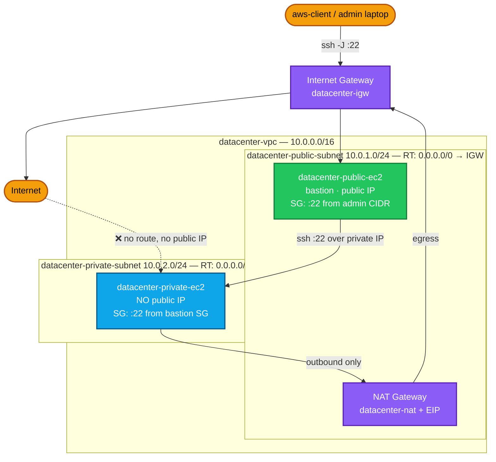
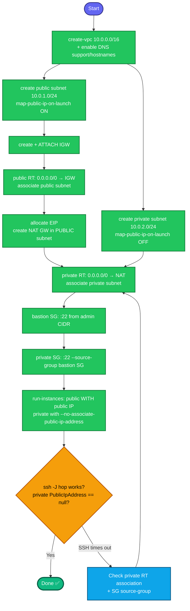

# Public + Private EC2 Topology (Bastion Pattern) — Complete Documentation

**Goal:** Build a VPC with a **public** and a **private** subnet, launch one EC2 in each, and reach the private instance over SSH **only** through the public one. The private instance must have **no public IP** and must never be reachable from the internet — while still being able to reach *out* for package updates via a NAT Gateway.

**Proof of success:** `ssh` from aws-client → public instance → private instance succeeds using the private instance's **private IP**, and `curl https://aws.amazon.com` works from the private instance while nothing on the internet can initiate a connection to it.

**Related:** `27.AWS_VPC_PublicIP.md` (the public half alone) · `45.AWS_NAT_PV_IGW.md` (NAT in depth) · `29.AWS_Secure_VPCPeering.md` (private connectivity between VPCs) · `35.AWS_Application_Deploy.md` (the same topology carrying a real app)

---

## 1. Concept (plain English)

"Public" and "private" are not settings on a subnet. They are a **consequence of routing**:

- A subnet is **public** if its route table sends `0.0.0.0/0` to an **Internet Gateway**.
- A subnet is **private** if it does not — regardless of what else you configure.

Everything else follows from that one fact. An instance in the private subnet has no route to the internet and no public address, so no packet from the internet can ever reach it. To administer it you put a small, hardened instance in the public subnet — the **bastion** (or jump host) — and hop through it. To let the private instance download patches you add a **NAT Gateway** in the public subnet, which allows outbound flows and their replies but no inbound initiation.

The security model has two halves, and both matter:

| Half | Mechanism | What it gives you |
|---|---|---|
| **Routing** | Two route tables — public → IGW, private → NAT | The private instance is *unreachable*, not merely *firewalled* |
| **Security groups** | Private SG allows `:22` **from the bastion's SG**, not from a CIDR | Access follows identity, not addresses — it keeps working when the bastion's IP changes |

That second point is the one that separates a good answer from a great one. Referencing a security group from another security group means you never hardcode an IP, and the rule stays correct through every replacement, restart, and scale-out of the bastion.

---

## 2. Target architecture

| Resource | Name | Value |
|---|---|---|
| VPC | `datacenter-vpc` | `10.0.0.0/16` |
| Public subnet | `datacenter-public-subnet` | `10.0.1.0/24`, `us-east-1a`, auto-assign public IP **ON** |
| Private subnet | `datacenter-private-subnet` | `10.0.2.0/24`, `us-east-1a`, auto-assign **OFF** |
| Internet Gateway | `datacenter-igw` | attached to the VPC |
| NAT Gateway | `datacenter-nat` | **in the public subnet**, with an Elastic IP |
| Public route table | `datacenter-public-rt` | `0.0.0.0/0 → igw`, associated to the public subnet |
| Private route table | `datacenter-private-rt` | `0.0.0.0/0 → nat`, associated to the private subnet |
| Bastion SG | `datacenter-bastion-sg` | inbound `:22` from your admin CIDR |
| Private SG | `datacenter-private-sg` | inbound `:22` **from `datacenter-bastion-sg`** |
| Public instance | `datacenter-public-ec2` | public subnet, **with** public IP |
| Private instance | `datacenter-private-ec2` | private subnet, **no** public IP |
| Key pair | `datacenter-kp` | RSA, `.pem` kept on aws-client only |

---

## 3. Prerequisites

- Terminal on **aws-client**; run `showcreds` first — this build is CLI-heavy and needs a working `AKIA`/secret (the console path is in section 8).
- Region **us-east-1**.
- Credentials with `ec2:*` for VPC, subnet, gateway, route table, security group and instance creation.
- A NAT Gateway is **not free** — delete it at the end of the lab (section 10) or it bills per hour plus data processed.

---

## 4. Full command sequence

Run these in blocks and check the echoed IDs as you go.

### 4.1 Network foundation

```bash
REGION=us-east-1
AZ=us-east-1a

# 1. VPC (DNS support is required for the instances to resolve anything)
VPC_ID=$(aws ec2 create-vpc --cidr-block 10.0.0.0/16 --region $REGION \
  --tag-specifications 'ResourceType=vpc,Tags=[{Key=Name,Value=datacenter-vpc}]' \
  --query 'Vpc.VpcId' --output text)
aws ec2 modify-vpc-attribute --vpc-id $VPC_ID --enable-dns-support --region $REGION
aws ec2 modify-vpc-attribute --vpc-id $VPC_ID --enable-dns-hostnames --region $REGION
echo "VPC: $VPC_ID"

# 2. Public subnet, with auto-assign public IP ON
PUB_SUBNET=$(aws ec2 create-subnet --vpc-id $VPC_ID --cidr-block 10.0.1.0/24 \
  --availability-zone $AZ --region $REGION \
  --tag-specifications 'ResourceType=subnet,Tags=[{Key=Name,Value=datacenter-public-subnet}]' \
  --query 'Subnet.SubnetId' --output text)
aws ec2 modify-subnet-attribute --subnet-id $PUB_SUBNET --map-public-ip-on-launch --region $REGION
echo "Public subnet: $PUB_SUBNET"

# 3. Private subnet, auto-assign explicitly OFF
PRIV_SUBNET=$(aws ec2 create-subnet --vpc-id $VPC_ID --cidr-block 10.0.2.0/24 \
  --availability-zone $AZ --region $REGION \
  --tag-specifications 'ResourceType=subnet,Tags=[{Key=Name,Value=datacenter-private-subnet}]' \
  --query 'Subnet.SubnetId' --output text)
aws ec2 modify-subnet-attribute --subnet-id $PRIV_SUBNET --no-map-public-ip-on-launch --region $REGION
echo "Private subnet: $PRIV_SUBNET"

# 4. Internet Gateway — create AND attach (two separate steps)
IGW_ID=$(aws ec2 create-internet-gateway --region $REGION \
  --tag-specifications 'ResourceType=internet-gateway,Tags=[{Key=Name,Value=datacenter-igw}]' \
  --query 'InternetGateway.InternetGatewayId' --output text)
aws ec2 attach-internet-gateway --internet-gateway-id $IGW_ID --vpc-id $VPC_ID --region $REGION
echo "IGW: $IGW_ID"
```

### 4.2 The two route tables — the heart of the design

```bash
# 5. Public route table: default route to the IGW, associated to the PUBLIC subnet
PUB_RT=$(aws ec2 create-route-table --vpc-id $VPC_ID --region $REGION \
  --tag-specifications 'ResourceType=route-table,Tags=[{Key=Name,Value=datacenter-public-rt}]' \
  --query 'RouteTable.RouteTableId' --output text)
aws ec2 create-route --route-table-id $PUB_RT \
  --destination-cidr-block 0.0.0.0/0 --gateway-id $IGW_ID --region $REGION
aws ec2 associate-route-table --route-table-id $PUB_RT --subnet-id $PUB_SUBNET --region $REGION

# 6. NAT Gateway: lives in the PUBLIC subnet, needs an Elastic IP
EIP_ALLOC=$(aws ec2 allocate-address --domain vpc --region $REGION \
  --tag-specifications 'ResourceType=elastic-ip,Tags=[{Key=Name,Value=datacenter-nat-eip}]' \
  --query 'AllocationId' --output text)
NAT_ID=$(aws ec2 create-nat-gateway --subnet-id $PUB_SUBNET --allocation-id $EIP_ALLOC \
  --region $REGION \
  --tag-specifications 'ResourceType=natgateway,Tags=[{Key=Name,Value=datacenter-nat}]' \
  --query 'NatGateway.NatGatewayId' --output text)
echo "NAT: $NAT_ID  (takes ~2 minutes)"
aws ec2 wait nat-gateway-available --nat-gateway-ids $NAT_ID --region $REGION

# 7. Private route table: default route to the NAT, associated to the PRIVATE subnet
PRIV_RT=$(aws ec2 create-route-table --vpc-id $VPC_ID --region $REGION \
  --tag-specifications 'ResourceType=route-table,Tags=[{Key=Name,Value=datacenter-private-rt}]' \
  --query 'RouteTable.RouteTableId' --output text)
aws ec2 create-route --route-table-id $PRIV_RT \
  --destination-cidr-block 0.0.0.0/0 --nat-gateway-id $NAT_ID --region $REGION
aws ec2 associate-route-table --route-table-id $PRIV_RT --subnet-id $PRIV_SUBNET --region $REGION
```

> **The NAT goes in the public subnet, and serves the private one.** Put it in the private subnet by mistake and it has no path out itself — the classic self-inflicted failure. Its own route to the internet comes from the public route table.

### 4.3 Security groups — SG referencing SG

```bash
# 8. Bastion SG: SSH from your admin CIDR (0.0.0.0/0 only if the lab demands it)
ADMIN_CIDR=0.0.0.0/0        # <- narrow this to your own IP/32 in anything real
BASTION_SG=$(aws ec2 create-security-group --group-name datacenter-bastion-sg \
  --description "SSH from admin network to the bastion" --vpc-id $VPC_ID \
  --region $REGION --query 'GroupId' --output text)
aws ec2 authorize-security-group-ingress --group-id $BASTION_SG \
  --protocol tcp --port 22 --cidr $ADMIN_CIDR --region $REGION

# 9. Private SG: SSH ONLY from the bastion's security group — no CIDR anywhere
PRIVATE_SG=$(aws ec2 create-security-group --group-name datacenter-private-sg \
  --description "SSH from bastion SG only" --vpc-id $VPC_ID \
  --region $REGION --query 'GroupId' --output text)
aws ec2 authorize-security-group-ingress --group-id $PRIVATE_SG \
  --protocol tcp --port 22 --source-group $BASTION_SG --region $REGION

echo "Bastion SG: $BASTION_SG   Private SG: $PRIVATE_SG"
```

`--source-group` is the whole trick. The rule reads *"anything wearing the bastion security group may reach me on 22"* — it survives the bastion being replaced, restarted, or scaled out, and there is no IP to keep in sync.

### 4.4 Key pair and instances

```bash
# 10. Key pair — private key stays on aws-client, never goes onto the bastion
aws ec2 create-key-pair --key-name datacenter-kp --key-type rsa --key-format pem \
  --region $REGION --query 'KeyMaterial' --output text > ~/datacenter-kp.pem
chmod 400 ~/datacenter-kp.pem

# 11. Resolve the current Amazon Linux 2023 AMI via SSM (never hardcode an AMI ID)
AMI_ID=$(aws ssm get-parameters \
  --names /aws/service/ami-amazon-linux-latest/al2023-ami-kernel-default-x86_64 \
  --query 'Parameters[0].Value' --output text --region $REGION)
echo "AMI: $AMI_ID"

# 12. Public instance (bastion) — WITH a public IP
PUB_IID=$(aws ec2 run-instances --image-id $AMI_ID --instance-type t2.micro \
  --key-name datacenter-kp --subnet-id $PUB_SUBNET --security-group-ids $BASTION_SG \
  --associate-public-ip-address \
  --tag-specifications 'ResourceType=instance,Tags=[{Key=Name,Value=datacenter-public-ec2}]' \
  --region $REGION --query 'Instances[0].InstanceId' --output text)

# 13. Private instance — explicitly NO public IP
PRIV_IID=$(aws ec2 run-instances --image-id $AMI_ID --instance-type t2.micro \
  --key-name datacenter-kp --subnet-id $PRIV_SUBNET --security-group-ids $PRIVATE_SG \
  --no-associate-public-ip-address \
  --tag-specifications 'ResourceType=instance,Tags=[{Key=Name,Value=datacenter-private-ec2}]' \
  --region $REGION --query 'Instances[0].InstanceId' --output text)

aws ec2 wait instance-running --instance-ids $PUB_IID $PRIV_IID --region $REGION

PUB_IP=$(aws ec2 describe-instances --instance-ids $PUB_IID --region $REGION \
  --query 'Reservations[0].Instances[0].PublicIpAddress' --output text)
PRIV_IP=$(aws ec2 describe-instances --instance-ids $PRIV_IID --region $REGION \
  --query 'Reservations[0].Instances[0].PrivateIpAddress' --output text)
echo "Bastion public IP: $PUB_IP    Private instance private IP: $PRIV_IP"
```

---

## 5. Connecting to the private instance

### The right way — `ProxyJump` (`ssh -J`)

```bash
ssh -i ~/datacenter-kp.pem -J ec2-user@$PUB_IP ec2-user@$PRIV_IP
```

One command from aws-client. SSH opens a connection to the bastion, tunnels a second connection through it, and authenticates to the private host **from your machine**. The private key is used locally and never touches the bastion.

Make it permanent in `~/.ssh/config`:

```sshconfig
Host datacenter-bastion
  HostName  <PUB_IP>
  User      ec2-user
  IdentityFile ~/datacenter-kp.pem

Host datacenter-private
  HostName  10.0.2.x
  User      ec2-user
  IdentityFile ~/datacenter-kp.pem
  ProxyJump datacenter-bastion
```

Then simply `ssh datacenter-private`.

### The acceptable way — agent forwarding

```bash
ssh-add ~/datacenter-kp.pem
ssh -A ec2-user@$PUB_IP        # then, from the bastion:
ssh ec2-user@10.0.2.x
```

The key still never lands on disk on the bastion, but anyone with root on the bastion can use your forwarded agent socket while you are connected. `ProxyJump` has no such exposure — prefer it.

### The wrong way — and why interviewers ask

```bash
scp -i datacenter-kp.pem datacenter-kp.pem ec2-user@$PUB_IP:~/    # ❌ never do this
```

Copying the private key onto the bastion puts your credential on the **one host that is exposed to the internet**. The bastion exists to be the sacrificial, replaceable box; a key sitting on it turns a bastion compromise into a full estate compromise. If you are asked "how do you SSH to a private instance", the copy-the-key answer is the one that ends the conversation.

---

## 6. Verification

```bash
# A. Private instance genuinely has no public IP
aws ec2 describe-instances --instance-ids $PRIV_IID --region $REGION \
  --query 'Reservations[0].Instances[0].PublicIpAddress'
# expect: null

# B. Route tables point where they should
aws ec2 describe-route-tables --route-table-ids $PUB_RT --region $REGION \
  --query 'RouteTables[0].Routes[?DestinationCidrBlock==`0.0.0.0/0`].GatewayId'      # igw-...
aws ec2 describe-route-tables --route-table-ids $PRIV_RT --region $REGION \
  --query 'RouteTables[0].Routes[?DestinationCidrBlock==`0.0.0.0/0`].NatGatewayId'   # nat-...

# C. The private SG trusts a group, not a CIDR
aws ec2 describe-security-groups --group-ids $PRIVATE_SG --region $REGION \
  --query 'SecurityGroups[0].IpPermissions[0].UserIdGroupPairs[0].GroupId'
# expect: the bastion SG id

# D. The hop works
ssh -o StrictHostKeyChecking=no -i ~/datacenter-kp.pem \
    -J ec2-user@$PUB_IP ec2-user@$PRIV_IP 'hostname -I; echo HOP-OK'

# E. Outbound works through NAT, from the private instance
ssh -i ~/datacenter-kp.pem -J ec2-user@$PUB_IP ec2-user@$PRIV_IP \
    'curl -s -o /dev/null -w "%{http_code}\n" https://aws.amazon.com'
# expect: 200  — and the source IP seen by the internet is the NAT's Elastic IP

# F. Inbound is genuinely impossible — this must NOT connect
timeout 5 nc -zv $PRIV_IP 22 ; echo "exit=$?"
# expect: timeout/failure from aws-client, because 10.0.2.x is not routable from outside the VPC
```

Check **F** deliberately. Proving the negative — that the private instance cannot be reached directly — is the actual deliverable; everything else is plumbing.

---

## 7. Architecture diagram



## 8. Build flow



---

## 9. Runbook (console path)

1. **VPC → Create VPC** → "VPC only", Name `datacenter-vpc`, CIDR `10.0.0.0/16`. Then **Actions → Edit DNS hostnames → Enable**.
2. **Subnets → Create subnet** ×2 in that VPC: `datacenter-public-subnet` `10.0.1.0/24` and `datacenter-private-subnet` `10.0.2.0/24`, both in `us-east-1a`.
3. Select the public subnet → **Actions → Edit subnet settings → Enable auto-assign public IPv4**. Leave the private subnet's **disabled**.
4. **Internet Gateways → Create** `datacenter-igw` → **Actions → Attach to VPC** → `datacenter-vpc`.
5. **NAT Gateways → Create** `datacenter-nat` → Subnet = **the public subnet** → **Allocate Elastic IP** → Create. Wait for **Available**.
6. **Route Tables → Create** `datacenter-public-rt` in the VPC → **Routes → Edit → Add** `0.0.0.0/0 → Internet Gateway` → **Subnet associations → Edit → the public subnet**.
7. **Route Tables → Create** `datacenter-private-rt` → **Routes → Edit → Add** `0.0.0.0/0 → NAT Gateway` → **Subnet associations → Edit → the private subnet**.
8. **Security Groups → Create** `datacenter-bastion-sg` in the VPC → inbound **SSH :22** from your IP.
9. **Security Groups → Create** `datacenter-private-sg` → inbound **SSH :22**, and in the Source box **type `sg-` and pick `datacenter-bastion-sg`** — not a CIDR.
10. **EC2 → Launch instances** ×2: `datacenter-public-ec2` (public subnet, auto-assign IP **Enable**, `datacenter-bastion-sg`) and `datacenter-private-ec2` (private subnet, auto-assign IP **Disable**, `datacenter-private-sg`). Both `t2.micro`, key pair `datacenter-kp`.
11. Verify the private instance's **Public IPv4 address** column is empty, then hop with `ssh -J`.

---

## 10. Teardown (do this — the NAT bills hourly)

Delete in dependency order; a resource with dependents refuses to go:

```bash
aws ec2 terminate-instances --instance-ids $PUB_IID $PRIV_IID --region $REGION
aws ec2 wait instance-terminated --instance-ids $PUB_IID $PRIV_IID --region $REGION
aws ec2 delete-nat-gateway --nat-gateway-id $NAT_ID --region $REGION
# wait for the NAT to reach 'deleted' before releasing its EIP
aws ec2 release-address --allocation-id $EIP_ALLOC --region $REGION
aws ec2 delete-security-group --group-id $PRIVATE_SG --region $REGION
aws ec2 delete-security-group --group-id $BASTION_SG --region $REGION
aws ec2 delete-subnet --subnet-id $PRIV_SUBNET --region $REGION
aws ec2 delete-subnet --subnet-id $PUB_SUBNET --region $REGION
aws ec2 delete-route-table --route-table-id $PRIV_RT --region $REGION
aws ec2 delete-route-table --route-table-id $PUB_RT --region $REGION
aws ec2 detach-internet-gateway --internet-gateway-id $IGW_ID --vpc-id $VPC_ID --region $REGION
aws ec2 delete-internet-gateway --internet-gateway-id $IGW_ID --region $REGION
aws ec2 delete-vpc --vpc-id $VPC_ID --region $REGION
```

The private SG must go before the bastion SG — it references it, and AWS will not delete a group another rule depends on.

---

## 11. Troubleshooting table

| Symptom | Likely cause | Check / fix |
|---|---|---|
| SSH to the **bastion** times out | No `0.0.0.0/0 → IGW` route, or the public RT isn't associated to the public subnet | `describe-route-tables`; confirm the **association**, not just the route |
| SSH to the bastion is **refused** | Instance up but sshd not ready, or wrong username | Refused = something answered. Wait for `2/2` status checks; use `ec2-user` (AL2023) or `ubuntu` |
| Bastion has no public IP at all | Subnet auto-assign off **and** no `--associate-public-ip-address` | Relaunch, or attach an Elastic IP |
| Hop to the **private** instance times out | Private SG doesn't allow `:22` from the bastion SG | `describe-security-groups` → the rule must show `UserIdGroupPairs`, not `IpRanges` |
| Hop fails with `Permission denied (publickey)` | Key not being presented through the jump, or wrong user | Use `-J` with `-i`; check the private instance was launched with the **same** key pair |
| Private instance can't `yum update` / `curl` | No NAT route, or the NAT is in the wrong subnet | Private RT needs `0.0.0.0/0 → nat-...`; the NAT itself must sit in the **public** subnet |
| NAT built but still no egress | NAT created **before** the public RT had its IGW route | Recreate the NAT, or fix the public route — the NAT reaches the internet via the public subnet's route table |
| Private instance reachable from the internet | It got a public IP (subnet default or launch flag) | `PublicIpAddress` must be `null`; check `MapPublicIpOnLaunch` on the private subnet |
| `DependencyViolation` on delete | Wrong teardown order | Instances → NAT → EIP → SGs (private first) → subnets → RTs → IGW → VPC |
| Everything looks right, still nothing | A **blackhole** route, or a restrictive NACL | `describe-route-tables` for `"State": "blackhole"`; NACLs are stateless and need the **ephemeral return range** open |

---

## 12. Key takeaways

1. **Public vs private is decided by the route table, nothing else.** A public IP without a `0.0.0.0/0 → IGW` route is an address that leads nowhere; a subnet with no such route is private by definition.
2. **Two subnets, two route tables.** If both subnets share one route table, you have one subnet type — this is the most common way the design silently collapses.
3. **The NAT Gateway lives in the public subnet and serves the private one.** Outbound only: replies come back, nothing initiates inward.
4. **Reference security groups, not CIDRs.** `--source-group` makes the rule express intent ("only the bastion") and survives every IP change.
5. **Never put the private key on the bastion.** `ssh -J` keeps the credential local; the bastion stays a disposable, replaceable box.
6. **In production, delete the bastion entirely.** AWS Systems Manager **Session Manager** gives shell access to a private instance with no open port 22, no key pair, and a full CloudTrail audit trail — the instance just needs the SSM agent, an instance profile with `AmazonSSMManagedInstanceCore`, and either a NAT or VPC endpoints. The bastion is the pattern you must be able to build and explain; SSM is the one you should reach for.
7. This is the same shape as `35.AWS_Application_Deploy.md` (web tier public, RDS private) and the AKS/EKS "public ingress, private nodes" layout — one topology, reused everywhere.
