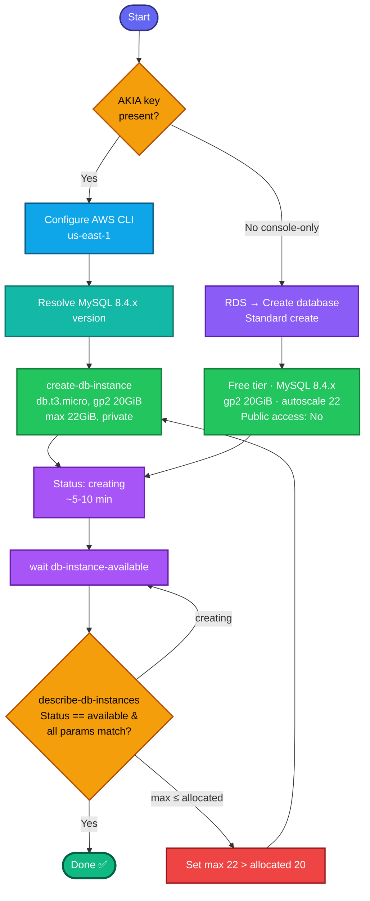

## Concept

**Amazon RDS** is a managed relational database service — AWS handles provisioning, patching, backups, and availability, so you just define the engine, size, and storage. This task creates a **private, free-tier MySQL** instance for dev/test.

Key facts:
- **Free tier template** = `db.t3.micro`, single-AZ, no Multi-AZ standby — the low-cost config the task requires.
- **Private** means **not publicly accessible** (`--no-publicly-accessible`) — the DB has no public endpoint; only resources inside the VPC can reach it.
- **Storage autoscaling** lets RDS grow storage automatically up to a ceiling (`MaxAllocatedStorage`) when it runs low — here capped at 22 GiB, just above the 20 GiB start.
- Provisioning takes **several minutes**; the task requires the instance to reach **`available`**, so you must **wait**.
- An RDS instance needs a **DB subnet group** (which subnets it can live in) — usually one exists by default; if not, you create one across ≥2 AZs.

## Prerequisites

- `showcreds` first — CLI-friendly; need working `AKIA`/secret (or console).
- Region **us-east-1**.
- A master username/password (required to create; task doesn't specify, so pick valid values).
- Exact MySQL `8.4.x` version available — resolve it dynamically.

## OTS (CLI)

```bash
REGION=us-east-1

# 0. Find an available MySQL 8.4.x engine version
ENGINE_VER=$(aws rds describe-db-engine-versions --engine mysql \
  --query "DBEngineVersions[?starts_with(EngineVersion, '8.4')].EngineVersion | [-1]" \
  --output text --region $REGION)
echo "MySQL version: $ENGINE_VER"

# 1. Create the private RDS instance
aws rds create-db-instance \
  --db-instance-identifier devops-rds \
  --db-instance-class db.t3.micro \
  --engine mysql \
  --engine-version $ENGINE_VER \
  --storage-type gp2 \
  --allocated-storage 20 \
  --max-allocated-storage 22 \
  --master-username admin \
  --master-user-password 'DevOpsRds#2024' \
  --no-publicly-accessible \
  --backup-retention-period 0 \
  --region $REGION

# 2. Wait until the instance is 'available' (blocks ~5-10 min)
aws rds wait db-instance-available --db-instance-identifier devops-rds --region $REGION
echo "RDS is available"
```

**Verify:**
```bash
aws rds describe-db-instances --db-instance-identifier devops-rds --region us-east-1 \
  --query 'DBInstances[0].{Status:DBInstanceStatus,Class:DBInstanceClass,Engine:Engine,Version:EngineVersion,Storage:AllocatedStorage,MaxStorage:MaxAllocatedStorage,Type:StorageType,Public:PubliclyAccessible}'
```
Expect `Status=available`, `Class=db.t3.micro`, `Engine=mysql`, `Version=8.4.x`, `Storage=20`, `MaxStorage=22`, `Type=gp2`, `Public=false`.

## Runbook (console path — matches the task's "Full configuration" wording)

1. Console → region **us-east-1** → **RDS → Databases → Create database**.
2. **Choose a database creation method:** **Standard create** (this is "Full configuration").
3. **Engine options:** **MySQL** → **Engine version:** pick **8.4.x**.
4. **Templates:** **Free tier**.
5. **Settings:** DB instance identifier = `devops-rds`; set master username + password.
6. **Instance configuration:** **db.t3.micro** (free tier defaults to this).
7. **Storage:**
   - Storage type: **General Purpose SSD (gp2)**
   - Allocated storage: **20** GiB
   - **Additional storage configuration → Enable storage autoscaling** → **Maximum storage threshold: 22** GiB.
8. **Connectivity → Public access: No** (private).
9. Leave the rest default → **Create database**.
10. Wait until status shows **Available** before submitting.

---

### Gotchas
- **Free tier template + db.t3.micro** — the task pins both; the free-tier template auto-selects t3.micro but confirm it (Multi-AZ off, since free tier is single-AZ).
- **`--no-publicly-accessible`** — this is what makes it "private." A public endpoint would fail the requirement.
- **MySQL 8.4.x specifically** — resolve the exact available `8.4` patch version; a made-up version throws an error. Don't use 8.0.x.
- **Max storage 22 must be > allocated 20** — autoscaling ceiling has to exceed the starting size (even by 2 GiB). RDS rejects max ≤ allocated.
- **Password rules** — master password needs 8+ chars; avoid `/`, `@`, `"`, spaces. `'DevOpsRds#2024'` is safe.
- **Must reach `available`** — provisioning takes 5–10 min. `aws rds wait db-instance-available` blocks until ready; don't submit while `creating`/`backing-up`.
- **DB subnet group** — if creation errors about subnet groups, the account lacks a default; create one spanning ≥2 AZs first. Usually not needed in these labs.
- Region **us-east-1**; identifier exactly `devops-rds`.

---

## Colorful flow diagram



The two things graders check most on RDS tasks: **`--max-allocated-storage 22` (autoscaling enabled, > allocated)** and **`--no-publicly-accessible` (private)** — plus the exact `8.4.x` engine version. The `wait db-instance-available` is what guarantees you don't submit during the ~10-minute `creating` phase. Want the Terraform `aws_db_instance` equivalent, or a beginner-friendly guide for this one?