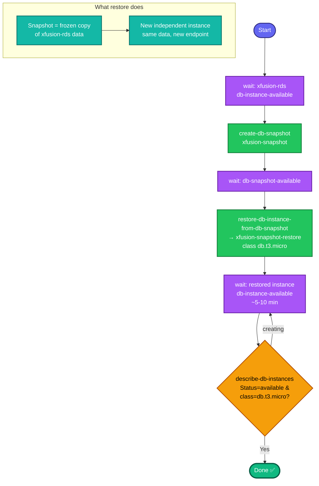

## Concept

**RDS snapshot + restore** is the backup-and-clone workflow: capture a point-in-time copy of a database (**snapshot**), then spin up a brand-new instance from that copy (**restore**). The restored instance is fully independent — same data, new endpoint — ideal for testing without touching production.

Key facts:
- **Source must be `available`** before snapshotting — you can't snapshot a `creating`/`modifying` instance cleanly.
- A **manual snapshot** (`create-db-snapshot`) persists until you delete it (unlike automated backups). It goes `creating → available`; you must wait.
- **Restore creates a NEW instance** (`restore-db-instance-from-db-snapshot`) — it doesn't overwrite the source. Most settings are inherited from the snapshot, but you can override some (like instance class).
- Both operations take **several minutes**; the task requires the restored instance to reach **`available`**, so wait at each stage.

Three waits total: source available → snapshot available → restored instance available.

## Prerequisites

- `showcreds` first — CLI-friendly; need working `AKIA`/secret (or console).
- Region **us-east-1**.
- Source instance `xfusion-rds` exists.

## OTS (CLI)

```bash
REGION=us-east-1

# 1. Ensure the source RDS is 'available' before snapshotting
aws rds wait db-instance-available --db-instance-identifier xfusion-rds --region $REGION
echo "Source available"

# 2. Take the snapshot
aws rds create-db-snapshot \
  --db-instance-identifier xfusion-rds \
  --db-snapshot-identifier xfusion-snapshot \
  --region $REGION

# 3. Wait until the snapshot is 'available' (~a few min)
aws rds wait db-snapshot-available --db-snapshot-identifier xfusion-snapshot --region $REGION
echo "Snapshot available"

# 4. Restore the snapshot into a NEW instance, overriding class to db.t3.micro
aws rds restore-db-instance-from-db-snapshot \
  --db-instance-identifier xfusion-snapshot-restore \
  --db-snapshot-identifier xfusion-snapshot \
  --db-instance-class db.t3.micro \
  --region $REGION

# 5. Wait until the restored instance is 'available' (~5-10 min)
aws rds wait db-instance-available --db-instance-identifier xfusion-snapshot-restore --region $REGION
echo "Restored instance available"
```

**Verify:**
```bash
# Snapshot done
aws rds describe-db-snapshots --db-snapshot-identifier xfusion-snapshot --region us-east-1 \
  --query 'DBSnapshots[0].{Status:Status,Source:DBInstanceIdentifier}'

# Restored instance done + correct class
aws rds describe-db-instances --db-instance-identifier xfusion-snapshot-restore --region us-east-1 \
  --query 'DBInstances[0].{Status:DBInstanceStatus,Class:DBInstanceClass,Engine:Engine}'
```
Expect snapshot `Status=available`, and restored instance `Status=available`, `Class=db.t3.micro`.

## Runbook (console path)

1. Console → region **us-east-1** → **RDS → Databases**.
2. Confirm **`xfusion-rds`** shows **Available** (wait if not).
3. Select it → **Actions → Take snapshot** → Snapshot name `xfusion-snapshot` → **Take snapshot**.
4. **RDS → Snapshots** → wait for `xfusion-snapshot` to become **Available**.
5. Select `xfusion-snapshot` → **Actions → Restore snapshot**.
6. **DB instance identifier:** `xfusion-snapshot-restore`; **DB instance class:** `db.t3.micro`.
7. Leave other settings default → **Restore DB instance**.
8. Back in **Databases**, wait for `xfusion-snapshot-restore` to reach **Available**.

---

### Gotchas
- **Wait for source `available` first** — task explicitly requires it; `wait db-instance-available` handles it.
- **Restore makes a NEW instance** — it does not modify `xfusion-rds`. Don't confuse restore with "restore in place."
- **Override the class at restore time** — `--db-instance-class db.t3.micro`. By default restore uses the snapshot's original class; the task wants t3.micro explicitly, so pass it.
- **Three separate waits** — snapshot creation and instance restore each take minutes. Don't submit until the restored instance is `available` (not `creating`/`configuring-enhanced-monitoring`/`backing-up`).
- **Restored instance inherits** engine, storage, most settings from the snapshot — you only override what you specify (class here).
- **Snapshot identifier vs instance identifier** — distinct namespaces; `xfusion-snapshot` (snapshot) vs `xfusion-snapshot-restore` (instance).
- Region **us-east-1**; exact names on all three.

---

## Colorful flow diagram



The three `aws rds wait` gates are the whole trick here — source-available → snapshot-available → restored-available — and overriding `--db-instance-class db.t3.micro` at restore is the one setting the task pins. Everything else the restored instance inherits from the snapshot. Want the Terraform equivalent (`aws_db_snapshot` + `aws_db_instance` with `snapshot_identifier`), or a consolidated RDS runbook covering both this and the previous provisioning task?