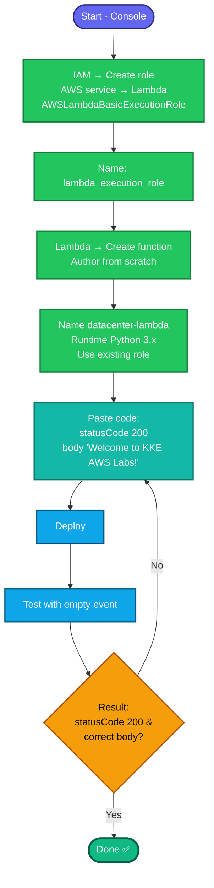

## Concept

**AWS Lambda** runs code without provisioning servers — you upload a function, and Lambda executes it on demand, scaling automatically. Two pieces are always required:

1. **The function** — your code (here, Python returning a greeting with HTTP 200).
2. **An execution role** — an IAM role Lambda *assumes* to run. Even a trivial function needs one so Lambda has permission to write logs to CloudWatch. Its **trust policy** allows `lambda.amazonaws.com` to assume it; the **permissions** typically include `AWSLambdaBasicExecutionRole` (log access).

The task pins: function name `datacenter-lambda`, Python runtime, output body `Welcome to KKE AWS Labs!`, status code `200`, and a role you create named `lambda_execution_role`. The task says **use the console**, so this is a console runbook.

## Prerequisites

- Console access via the lab username/password.
- Region **us-east-1**.
- Permission to create IAM roles + Lambda functions.

## The function code

```python
def lambda_handler(event, context):
    return {
        'statusCode': 200,
        'body': 'Welcome to KKE AWS Labs!'
    }
```
`statusCode: 200` satisfies requirement 4; `body` string satisfies requirement 3.

## Runbook (console — as the task requires)

### Step 1 — Create the IAM role `lambda_execution_role`
1. Console → **IAM → Roles → Create role**.
2. **Trusted entity type:** **AWS service**.
3. **Use case:** **Lambda** → **Next**.
4. **Add permissions:** search and tick **`AWSLambdaBasicExecutionRole`** → **Next**.
5. **Role name:** `lambda_execution_role` → **Create role**.

### Step 2 — Create the Lambda function
1. Console → **Lambda → Functions → Create function**.
2. Choose **Author from scratch**.
3. **Function name:** `datacenter-lambda`.
4. **Runtime:** **Python 3.12** (any Python 3.x satisfies "Python").
5. **Architecture:** default (x86_64).
6. Expand **Change default execution role → Use an existing role** → select **`lambda_execution_role`**.
7. **Create function**.

### Step 3 — Add the code and deploy
1. In the function's **Code** tab, open `lambda_function.py`.
2. Replace its contents with the code above.
3. Click **Deploy** (this is requirement 3 — "Deploy").

### Step 4 — Test / verify
1. Click **Test** → create a test event (any name, default `{}` payload) → **Save** → **Test**.
2. In the execution result, confirm:
   - **`statusCode: 200`**
   - **`body: "Welcome to KKE AWS Labs!"`**

## (Optional) CLI equivalent — for your reference only

```bash
# Trust policy for Lambda
cat > /tmp/lambda-trust.json <<'EOF'
{"Version":"2012-10-17","Statement":[{"Effect":"Allow","Principal":{"Service":"lambda.amazonaws.com"},"Action":"sts:AssumeRole"}]}
EOF

aws iam create-role --role-name lambda_execution_role \
  --assume-role-policy-document file:///tmp/lambda-trust.json
aws iam attach-role-policy --role-name lambda_execution_role \
  --policy-arn arn:aws:iam::aws:policy/service-role/AWSLambdaBasicExecutionRole

# Zip the code
mkdir -p /tmp/fn && cat > /tmp/fn/lambda_function.py <<'EOF'
def lambda_handler(event, context):
    return {'statusCode': 200, 'body': 'Welcome to KKE AWS Labs!'}
EOF
(cd /tmp/fn && zip function.zip lambda_function.py)

ROLE_ARN=$(aws iam get-role --role-name lambda_execution_role --query 'Role.Arn' --output text)
# small delay so the new role propagates before Lambda uses it
sleep 10

aws lambda create-function --function-name datacenter-lambda \
  --runtime python3.12 --handler lambda_function.lambda_handler \
  --role $ROLE_ARN --zip-file fileb:///tmp/fn/function.zip --region us-east-1
```
Verify: `aws lambda invoke --function-name datacenter-lambda /tmp/out.json --region us-east-1 && cat /tmp/out.json`

---

### Gotchas
- **Create the role first** — Lambda needs an existing role at creation. If you create the function before the role, you'd use an auto-generated role, not the required `lambda_execution_role`.
- **Handler name must match** — default is `lambda_function.lambda_handler` (file `lambda_function.py`, function `lambda_handler`). Don't rename the function or file without updating the handler.
- **Click Deploy** — editing code in the console doesn't take effect until you Deploy. "Save" alone isn't enough.
- **Exact body string** — `Welcome to KKE AWS Labs!` verbatim (case, spaces, exclamation).
- **Role propagation** — via CLI, a fresh role can take a few seconds to be usable (hence the `sleep 10`); the console handles this for you.
- **Task says use the console** — do it in the console for grading; the CLI block is just reference.
- Region **us-east-1**; names `datacenter-lambda` / `lambda_execution_role`.

---

## Colorful flow diagram



The role-before-function order and clicking **Deploy** (not just save) are the two things that most often trip people on Lambda console tasks. The trust policy (`lambda.amazonaws.com` can assume the role) is what the "Use case: Lambda" selection generates for you. Want the Terraform equivalent (`aws_iam_role` + `aws_lambda_function`) for your portfolio?