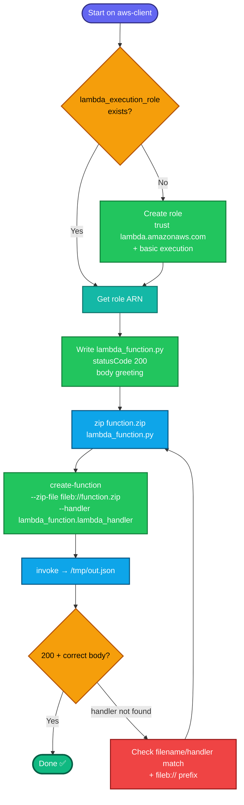

## Concept

This is the **CLI/package-based deploy** variant of the previous Lambda task. Instead of pasting code in the console, you:

1. **Write** the Python script (`lambda_function.py`) locally.
2. **Zip** it into a deployment package (`function.zip`) — Lambda expects code as a zip.
3. **Create** the function from that zip, pointing at an existing IAM role.

The **handler** naming is the crucial link: Lambda's default handler is `lambda_function.lambda_handler` — meaning file `lambda_function.py`, function `lambda_handler` inside it. The filename and function name must match the handler string.

> Despite the function being *named* `xfusion-lambda-cli`, the task says "specify Python" — the CLI needs an explicit runtime like `python3.12`. The role `lambda_execution_role` should already exist from the earlier task (or you create it).

## Prerequisites

- `showcreds` first — CLI-required task; need working `AKIA`/secret.
- Region **us-east-1**.
- `zip` installed on aws-client; Python not strictly needed to *package* (just to zip text).
- IAM role `lambda_execution_role` exists (create if not — see step 0).

## OTS (CLI, on aws-client)

```bash
REGION=us-east-1

# 0. (Only if lambda_execution_role doesn't exist yet) create it
if ! aws iam get-role --role-name lambda_execution_role >/dev/null 2>&1; then
  cat > /tmp/lambda-trust.json <<'EOF'
{"Version":"2012-10-17","Statement":[{"Effect":"Allow","Principal":{"Service":"lambda.amazonaws.com"},"Action":"sts:AssumeRole"}]}
EOF
  aws iam create-role --role-name lambda_execution_role \
    --assume-role-policy-document file:///tmp/lambda-trust.json
  aws iam attach-role-policy --role-name lambda_execution_role \
    --policy-arn arn:aws:iam::aws:policy/service-role/AWSLambdaBasicExecutionRole
  sleep 10   # let the role propagate
fi

ROLE_ARN=$(aws iam get-role --role-name lambda_execution_role --query 'Role.Arn' --output text)
echo "Role ARN: $ROLE_ARN"

# 1. Create the Python script
cat > lambda_function.py <<'EOF'
def lambda_handler(event, context):
    return {
        'statusCode': 200,
        'body': 'Welcome to KKE AWS Labs!'
    }
EOF

# 2. Zip it into function.zip
zip function.zip lambda_function.py

# 3. Create the Lambda function from the zip
aws lambda create-function \
  --function-name xfusion-lambda-cli \
  --runtime python3.12 \
  --handler lambda_function.lambda_handler \
  --role $ROLE_ARN \
  --zip-file fileb://function.zip \
  --region $REGION
```

**Verify:**
```bash
# Function exists with correct config
aws lambda get-function --function-name xfusion-lambda-cli --region us-east-1 \
  --query 'Configuration.{Name:FunctionName,Runtime:Runtime,Handler:Handler,Role:Role,State:State}'

# Invoke it and check output
aws lambda invoke --function-name xfusion-lambda-cli /tmp/out.json --region us-east-1
cat /tmp/out.json
```
Expect `State=Active`, runtime `python3.12`, and output `{"statusCode": 200, "body": "Welcome to KKE AWS Labs!"}`.

## Runbook (step-by-step)

1. `showcreds` → confirm CLI (`aws sts get-caller-identity`).
2. Ensure `lambda_execution_role` exists (step 0 creates it if missing); grab its ARN.
3. Write `lambda_function.py` with the handler returning 200 + the greeting.
4. `zip function.zip lambda_function.py`.
5. `aws lambda create-function ...` with `--zip-file fileb://function.zip` and the role ARN.
6. Invoke to verify `200` + correct body.

---

### Gotchas
- **`fileb://` not `file://`** for the zip — `fileb://` reads **binary** (the zip); `file://` would treat it as text and corrupt it. This is the #1 CLI-Lambda mistake.
- **Handler must match filename + function** — `lambda_function.lambda_handler` requires `lambda_function.py` containing `def lambda_handler`. Rename either and the invoke fails with "handler not found."
- **Zip the FILE, not a folder** — `zip function.zip lambda_function.py` puts the `.py` at the zip root. Zipping a directory nests it, so Lambda can't find the handler.
- **Role must exist first** — `create-function` needs a valid `--role` ARN. Fresh roles need a few seconds to propagate (`sleep 10`), else you may get "cannot be assumed by Lambda."
- **Runtime is explicit in CLI** — `python3.12` (or another 3.x). "Python" alone isn't a valid CLI value.
- **Exact body string** — `Welcome to KKE AWS Labs!` verbatim.
- Region **us-east-1**; function name `xfusion-lambda-cli`; script name `lambda_function.py`; zip name `function.zip`.

---

## Colorful flow diagram



The two CLI-specific traps: **`fileb://` for the zip** (binary read) and **zipping the file at the root so the handler resolves**. Everything else mirrors the console Lambda task you just did — same role, same handler pattern, same 200+greeting output. Want the Terraform equivalent, or a consolidated Lambda runbook covering both the console and CLI approaches?