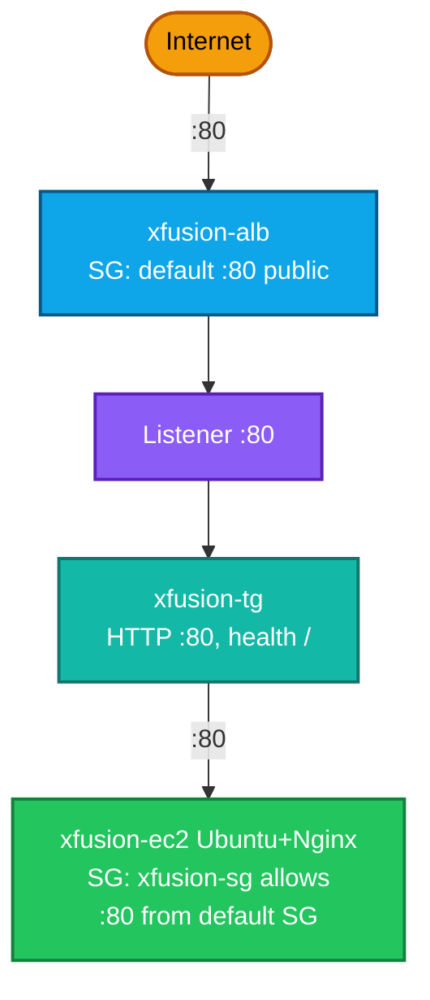
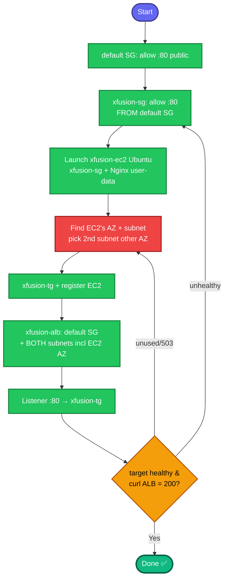

This is the ALB task you already worked through end-to-end and hit the AZ-coverage gotcha on. Since it comes up repeatedly in interviews, here's the clean, complete reference — with the exact ordering that avoids the `unused`/503 trap you ran into.

## Concept

An **ALB (Layer 7)** routes HTTP traffic to healthy backends. The security model here is a **two-SG chain**:
- **`default` SG** → attached to the **ALB**, open to the world on 80.
- **`xfusion-sg`** → attached to the **EC2**, allows 80 **from the `default` SG** (not the world).

So public traffic hits the ALB (default SG), and only the ALB can reach Nginx (xfusion-sg trusts default SG). Traffic path: `Internet → :80 → ALB (default SG) → listener → xfusion-tg → :80 → xfusion-ec2 (xfusion-sg allows default SG)`.

**The interview-critical constraint:** an ALB needs **≥2 subnets in 2 AZs**, and one of them **must be the AZ where the EC2 lives** — or the target shows `unused/Target.NotInUse` and you get **503**.

## Prerequisites

- `showcreds` first — CLI-heavy; need working `AKIA`/secret.
- Region **us-east-1**. Default VPC with ≥2 subnets.

## OTS (CLI)

```bash
REGION=us-east-1

# 0. VPC + default SG
VPC_ID=$(aws ec2 describe-vpcs --filters "Name=isDefault,Values=true" \
  --query 'Vpcs[0].VpcId' --output text --region $REGION)
DEFAULT_SG=$(aws ec2 describe-security-groups \
  --filters "Name=vpc-id,Values=$VPC_ID" "Name=group-name,Values=default" \
  --query 'SecurityGroups[0].GroupId' --output text --region $REGION)

# 1. Create xfusion-sg, allow :80 FROM the default SG (the ALB's SG)
XFUSION_SG=$(aws ec2 create-security-group --group-name xfusion-sg \
  --description "EC2 SG allow 80 from ALB default SG" --vpc-id $VPC_ID --region $REGION \
  --query 'GroupId' --output text)
aws ec2 authorize-security-group-ingress --group-id $XFUSION_SG \
  --protocol tcp --port 80 --source-group $DEFAULT_SG --region $REGION

# 2. Ensure the default SG (ALB) allows :80 from the internet
aws ec2 authorize-security-group-ingress --group-id $DEFAULT_SG \
  --protocol tcp --port 80 --cidr 0.0.0.0/0 --region $REGION 2>/dev/null

# 3. User-data for Nginx (Ubuntu = apt)
cat > /tmp/nginx-ud.sh <<'EOF'
#!/bin/bash
apt-get update -y
apt-get install -y nginx
systemctl start nginx
systemctl enable nginx
EOF

# 4. Ubuntu AMI + launch xfusion-ec2 with xfusion-sg
AMI_ID=$(aws ec2 describe-images --owners 099720109477 \
  --filters "Name=name,Values=ubuntu/images/hvm-ssd/ubuntu-jammy-22.04-amd64-server-*" \
            "Name=state,Values=available" \
  --query 'sort_by(Images, &CreationDate)[-1].ImageId' --output text --region $REGION)

IID=$(aws ec2 run-instances --image-id $AMI_ID --instance-type t2.micro \
  --security-group-ids $XFUSION_SG --associate-public-ip-address \
  --user-data file:///tmp/nginx-ud.sh \
  --tag-specifications 'ResourceType=instance,Tags=[{Key=Name,Value=xfusion-ec2}]' \
  --region $REGION --query 'Instances[0].InstanceId' --output text)
aws ec2 wait instance-running --instance-ids $IID --region $REGION

# 5. CRITICAL: find the EC2's AZ + subnet, then pick a 2nd subnet in a different AZ
EC2_AZ=$(aws ec2 describe-instances --instance-ids $IID \
  --query 'Reservations[0].Instances[0].Placement.AvailabilityZone' --output text --region $REGION)
EC2_SUBNET=$(aws ec2 describe-instances --instance-ids $IID \
  --query 'Reservations[0].Instances[0].SubnetId' --output text --region $REGION)
# a public subnet in a DIFFERENT az
SUBNET2=$(aws ec2 describe-subnets --filters "Name=vpc-id,Values=$VPC_ID" \
  "Name=map-public-ip-on-launch,Values=true" \
  --query "Subnets[?AvailabilityZone!='$EC2_AZ'].SubnetId | [0]" --output text --region $REGION)
echo "EC2 AZ=$EC2_AZ  ALB subnets: $EC2_SUBNET (EC2's AZ) + $SUBNET2"

# 6. Target group + register the instance
TG_ARN=$(aws elbv2 create-target-group --name xfusion-tg \
  --protocol HTTP --port 80 --vpc-id $VPC_ID --target-type instance \
  --health-check-protocol HTTP --health-check-path / --region $REGION \
  --query 'TargetGroups[0].TargetGroupArn' --output text)
aws elbv2 register-targets --target-group-arn $TG_ARN --targets Id=$IID --region $REGION

# 7. ALB with the default SG + BOTH subnets (incl. the EC2's AZ)
ALB_ARN=$(aws elbv2 create-load-balancer --name xfusion-alb \
  --type application --scheme internet-facing \
  --subnets $EC2_SUBNET $SUBNET2 --security-groups $DEFAULT_SG --region $REGION \
  --query 'LoadBalancers[0].LoadBalancerArn' --output text)
aws elbv2 wait load-balancer-available --load-balancer-arns $ALB_ARN --region $REGION

# 8. Listener :80 → forward to xfusion-tg
aws elbv2 create-listener --load-balancer-arn $ALB_ARN \
  --protocol HTTP --port 80 \
  --default-actions Type=forward,TargetGroupArn=$TG_ARN --region $REGION
```

**Verify:**
```bash
sleep 90
aws elbv2 describe-target-health --target-group-arn $TG_ARN --region us-east-1 \
  --query 'TargetHealthDescriptions[].TargetHealth.State' --output text   # want: healthy

ALB_DNS=$(aws elbv2 describe-load-balancers --load-balancer-arns $ALB_ARN \
  --query 'LoadBalancers[0].DNSName' --output text --region us-east-1)
echo "http://$ALB_DNS"
curl -s -o /dev/null -w "%{http_code}\n" http://$ALB_DNS   # want: 200
```

## The interview gotchas (why this task fails)

| Symptom | Cause | Fix |
|---|---|---|
| Target `unused / Target.NotInUse`, ALB returns **503** | ALB has no subnet in the **EC2's AZ** | Include the EC2's AZ subnet in `--subnets` (step 5–7) |
| Target `unhealthy` (not unused) | EC2 SG doesn't allow :80 **from the ALB's SG** | `xfusion-sg` must allow 80 sourced from `default` SG |
| `create-load-balancer` fails | Only 1 subnet given | ALB needs ≥2 subnets in 2 AZs |
| Health check fails | Nginx not up / user-data still running | Wait ~90s; Ubuntu uses `apt` (not `yum`) |
| Can't fix ALB subnets later | `SetSubnets` may be denied | Delete + recreate the ALB with correct subnets (TG survives) |

## Colorful diagram





## Interview talking points (since this is asked repeatedly)

If an interviewer asks you to walk through this, hit these in order — it shows you understand *why*, not just the commands:

1. **Two-SG chain** — "The ALB's SG is open to the world on 80; the EC2's SG only trusts the ALB's SG. That's least-privilege — the instance is never directly internet-exposed."
2. **ALB is L7** — "It reads HTTP, does path/host routing and health checks on a URL, unlike an NLB which is L4/port-only."
3. **Two AZs for HA** — "An ALB requires subnets in ≥2 AZs so it survives an AZ outage. Critically, it only routes to targets in AZs where it has a subnet — if the instance's AZ isn't covered, the target is `unused` and you get 503."
4. **`unused` vs `unhealthy`** — "`unused` is an AZ-coverage/wiring problem; `unhealthy` is a health-check problem (usually the SG rule or the app being down). Different root causes."
5. **Health check** — "The TG pings a path (`/`) expecting 200; that's how it decides which targets are live."

The single most-tested failure is **the AZ-coverage `unused`/503 issue** — leading with "make sure the ALB has a subnet in the target's AZ" signals real hands-on experience. Want this as a saved `.md` interview-prep sheet, or the Terraform version (which is also a common follow-up: "now do it as IaC")?