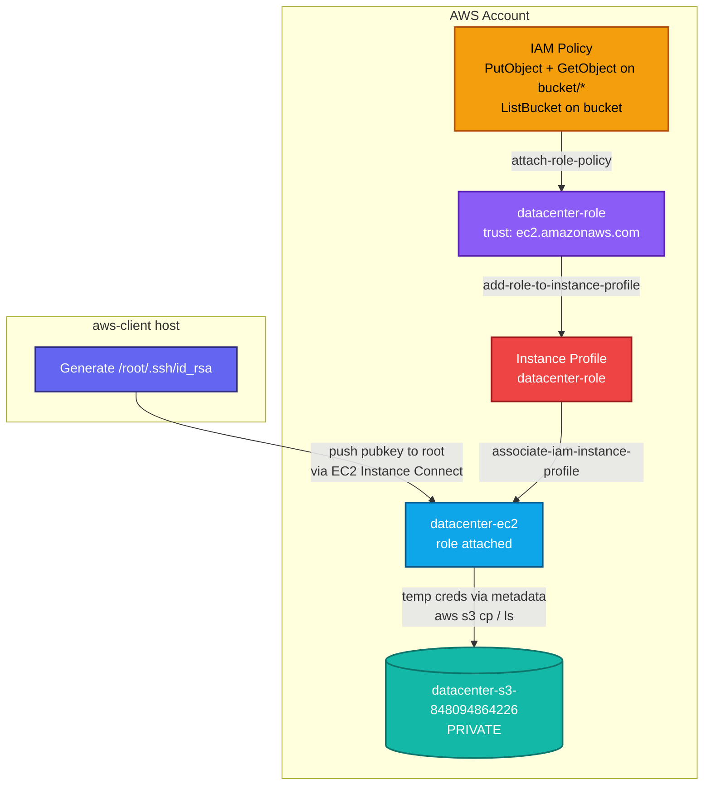
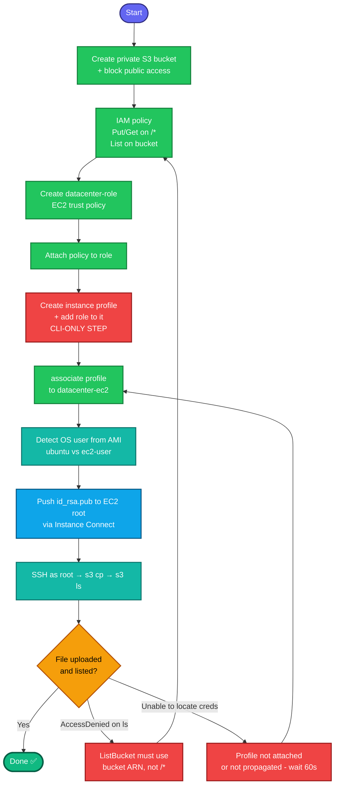

# EC2 → IAM Role → S3 Access — Complete Documentation

**A top interview task.** Give an EC2 instance permission to use an S3 bucket **without hardcoding credentials**, using an IAM role delivered through an instance profile.

---

## 1. The core concept (what interviewers test)

**Question they ask:** *"How does an EC2 instance get permission to call S3 without storing access keys on it?"*

**Answer:** An **IAM role** attached to the instance. The instance receives **temporary, auto-rotating credentials** through the **instance metadata service**, and the AWS CLI picks them up transparently — no `aws configure`, no keys on disk.

**The subtle piece most people miss:** an EC2 instance does **not** attach to a role directly. It attaches to an **instance profile**, which is a container that wraps the role.

```
IAM Policy  ──attached to──>  IAM Role  ──wrapped by──>  Instance Profile  ──attached to──>  EC2 Instance
(permissions)                (identity +               (the ONLY thing an
                              trust policy)              instance can attach to)
```

> The **console hides the instance profile** — it creates one automatically with the
> same name as the role. Via **CLI you must create it explicitly**. This is the #1
> reason CLI attempts fail where the console "just works."

---

## 2. Why a role (not access keys)?

| Approach | Problem |
|---|---|
| `aws configure` with access keys on the instance | Keys sit on disk, don't rotate, leak risk, manual management |
| **IAM role attached to instance** ✅ | Temporary creds, auto-rotated, nothing on disk, revocable centrally |

The role has two parts:
- **Trust policy** — *who* can assume it. For EC2, the principal is `ec2.amazonaws.com`.
- **Permissions policy** — *what* it can do. Here: Put/Get/List on one S3 bucket.

---

## 3. Full CLI walkthrough (on aws-client)

```bash
REGION=us-east-1
BUCKET=datacenter-s3-848094864226

# 0. Resolve the instance
IID=$(aws ec2 describe-instances --filters "Name=tag:Name,Values=datacenter-ec2" \
  "Name=instance-state-name,Values=running,stopped" \
  --query 'Reservations[0].Instances[0].InstanceId' --output text --region $REGION)
EC2_IP=$(aws ec2 describe-instances --instance-ids $IID \
  --query 'Reservations[0].Instances[0].PublicIpAddress' --output text --region $REGION)
```

**Step 1 — Private S3 bucket:**
```bash
aws s3api create-bucket --bucket $BUCKET --region $REGION   # us-east-1: NO LocationConstraint
aws s3api put-public-access-block --bucket $BUCKET \
  --public-access-block-configuration \
  BlockPublicAcls=true,IgnorePublicAcls=true,BlockPublicPolicy=true,RestrictPublicBuckets=true
```

**Step 2 — IAM policy (note the two different resource ARNs):**
```bash
cat > /tmp/s3-policy.json <<EOF
{
  "Version": "2012-10-17",
  "Statement": [
    { "Effect": "Allow",
      "Action": ["s3:PutObject", "s3:GetObject"],
      "Resource": "arn:aws:s3:::$BUCKET/*" },
    { "Effect": "Allow",
      "Action": "s3:ListBucket",
      "Resource": "arn:aws:s3:::$BUCKET" }
  ]
}
EOF
POLICY_ARN=$(aws iam create-policy --policy-name datacenter-s3-policy \
  --policy-document file:///tmp/s3-policy.json --query 'Policy.Arn' --output text)
```
> **Critical:** `s3:ListBucket` acts on the **bucket** (`arn:...:bucket`).
> `PutObject`/`GetObject` act on **objects** (`arn:...:bucket/*`). Putting all three
> on `/*` makes `aws s3 ls` fail with AccessDenied.

**Step 3 — IAM role with EC2 trust policy:**
```bash
cat > /tmp/ec2-trust.json <<'EOF'
{"Version":"2012-10-17","Statement":[{"Effect":"Allow","Principal":{"Service":"ec2.amazonaws.com"},"Action":"sts:AssumeRole"}]}
EOF
aws iam create-role --role-name datacenter-role \
  --assume-role-policy-document file:///tmp/ec2-trust.json
```

**Step 4 — Attach policy to role:**
```bash
aws iam attach-role-policy --role-name datacenter-role --policy-arn $POLICY_ARN
```

**Step 5 — Instance profile (the CLI-only step) + attach to instance:**
```bash
aws iam create-instance-profile --instance-profile-name datacenter-role
aws iam add-role-to-instance-profile \
  --instance-profile-name datacenter-role --role-name datacenter-role
sleep 10   # let the profile propagate
aws ec2 associate-iam-instance-profile --instance-id $IID \
  --iam-instance-profile Name=datacenter-role --region $REGION
```

---

## 4. SSH key setup (with the OS-user gotcha)

```bash
# Key on aws-client (create if missing)
[ -f /root/.ssh/id_rsa ] || ssh-keygen -t rsa -b 2048 -f /root/.ssh/id_rsa -N ""
PUBKEY=$(cat /root/.ssh/id_rsa.pub)
AZ=$(aws ec2 describe-instances --instance-ids $IID \
  --query 'Reservations[0].Instances[0].Placement.AvailabilityZone' --output text --region $REGION)
ssh-keygen -t rsa -b 2048 -f /tmp/eic -N "" 2>/dev/null
```

**Determine the SSH user FIRST — it depends on the OS:**
```bash
AMI=$(aws ec2 describe-instances --instance-ids $IID \
  --query 'Reservations[0].Instances[0].ImageId' --output text --region $REGION)
aws ec2 describe-images --image-ids $AMI --query 'Images[0].Name' --output text --region $REGION
```
- Name contains `ubuntu` → user is **`ubuntu`**
- Name contains `amzn`/`al2` → user is **`ec2-user`**

**Push key to root (chain within 60s; set OSUSER to the value above):**
```bash
OSUSER=ubuntu   # or ec2-user
aws ec2-instance-connect send-ssh-public-key --instance-id $IID \
  --availability-zone $AZ --instance-os-user $OSUSER \
  --ssh-public-key file:///tmp/eic.pub --region $REGION \
&& ssh -o ConnectTimeout=10 -o StrictHostKeyChecking=no -i /tmp/eic $OSUSER@$EC2_IP \
   "sudo mkdir -p /root/.ssh && echo '$PUBKEY' | sudo tee -a /root/.ssh/authorized_keys && sudo chmod 600 /root/.ssh/authorized_keys && echo KEY_ADDED"
```

---

## 5. Test (the role provides creds — no aws configure)

```bash
ssh -i /root/.ssh/id_rsa root@$EC2_IP bash -s <<'EOF'
echo "test data" > /tmp/testfile.txt
aws s3 cp /tmp/testfile.txt s3://datacenter-s3-848094864226/
aws s3 ls s3://datacenter-s3-848094864226/
EOF
```
**Success output:**
```
upload: ../tmp/testfile.txt to s3://datacenter-s3-848094864226/testfile.txt
2026-08-25 06:47:45         10 testfile.txt
```
The upload and listing succeeding **without configuring credentials** proves the role works.

---

## 6. Colorful architecture diagram



## 7. Colorful process flow



---

## 8. Troubleshooting table

| Symptom | Cause | Fix |
|---|---|---|
| `Permission denied (publickey)` on SSH | Connected but wrong SSH user | Ubuntu → `ubuntu`; Amazon Linux → `ec2-user`. Check the AMI name |
| SSH **times out** (no prompt) | Port 22 blocked / no route | Open :22 in the SG; confirm public IP |
| `aws s3 ls` → **AccessDenied** but `cp` works | `ListBucket` scoped to `/*` | `ListBucket` needs the **bucket** ARN, not `bucket/*` |
| `Unable to locate credentials` on instance | Instance profile not attached / not propagated | Verify `IamInstanceProfile`; wait 30-60s |
| `aws s3` uses wrong identity | Someone ran `aws configure` on the instance | Remove it — the role should provide creds via metadata |
| Instance can't assume role | Trust policy missing `ec2.amazonaws.com` | Fix the role's trust policy |

**Verify the profile is attached:**
```bash
aws ec2 describe-instances --instance-ids $IID \
  --query 'Reservations[0].Instances[0].IamInstanceProfile' --region us-east-1
```

---

## 9. Interview talking points

1. **"No keys on the instance."** The role delivers temporary, auto-rotating credentials via the instance metadata service; the CLI picks them up automatically. This is the secure pattern vs. embedding access keys.
2. **"Instance profile wraps the role."** An EC2 instance attaches to an instance profile, not a role directly. The console auto-creates it; the CLI needs `create-instance-profile` + `add-role-to-instance-profile` explicitly.
3. **"Trust vs permissions."** The trust policy says *who can assume* (ec2.amazonaws.com); the permissions policy says *what it can do* (S3 actions).
4. **"ListBucket vs object actions."** `ListBucket` targets the bucket ARN; `Put/GetObject` target `bucket/*`. Getting this wrong is the classic "cp works but ls fails" bug.
5. **"Timeout vs permission denied."** Timeout = network/SG; permission denied = auth/wrong-user. Different diagnoses.

---

That's the complete write-up with both diagrams. Want it saved as a downloadable `.md` file for your interview-prep folder, or the **Terraform version** (`aws_iam_role` + `aws_iam_role_policy` + `aws_iam_instance_profile` + `aws_instance` with `iam_instance_profile`) — a very common "now automate it" interview follow-up?