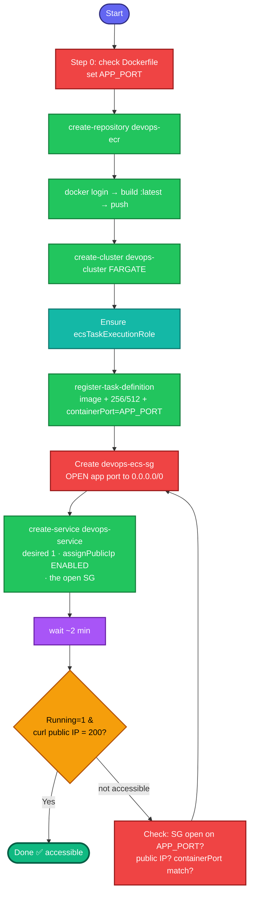

Same task, fresh lab — and this time we bake in **the SG-port-80 fix from the start** so it passes on the first go. I've folded the reachability fix directly into the service creation flow.

## Concept

Build image → push to private ECR → run on Fargate. The grader hits the app over HTTP, so the **security group must allow the app's port** and the task must have a **public IP** — the two things that caused "not accessible" last time. This version handles both up front.

## Prerequisites

- `showcreds` first — CLI + Docker; need working `AKIA`/secret.
- Region **us-east-1**. Docker running. Dockerfile at `/root/pyapp`.
- **Check the app's port first** (see step 0) so the SG + containerPort match.

## OTS (CLI, on aws-client) — run in blocks, checking each

```bash
REGION=us-east-1
REPO=devops-ecr
ACCOUNT_ID=$(aws sts get-caller-identity --query Account --output text)
ECR_URI="${ACCOUNT_ID}.dkr.ecr.${REGION}.amazonaws.com/${REPO}"

# 0. CHECK THE APP PORT FIRST (avoid last time's mismatch)
grep -iE 'EXPOSE|CMD|PORT|run' /root/pyapp/Dockerfile
APP_PORT=80    # <-- set this to whatever EXPOSE/CMD shows; default 80
```

```bash
# 1. Private ECR repo
aws ecr create-repository --repository-name $REPO --region $REGION
```

```bash
# 2. Login, build, tag :latest, push
aws ecr get-login-password --region $REGION \
  | docker login --username AWS --password-stdin "${ACCOUNT_ID}.dkr.ecr.${REGION}.amazonaws.com"
docker build -t ${ECR_URI}:latest /root/pyapp
docker push ${ECR_URI}:latest
```

```bash
# 3. Fargate cluster
aws ecs create-cluster --cluster-name devops-cluster --capacity-providers FARGATE --region $REGION
```

```bash
# Ensure ECS task execution role exists (needed to pull from ECR + log)
if ! aws iam get-role --role-name ecsTaskExecutionRole >/dev/null 2>&1; then
  cat > /tmp/ecs-trust.json <<'EOF'
{"Version":"2012-10-17","Statement":[{"Effect":"Allow","Principal":{"Service":"ecs-tasks.amazonaws.com"},"Action":"sts:AssumeRole"}]}
EOF
  aws iam create-role --role-name ecsTaskExecutionRole --assume-role-policy-document file:///tmp/ecs-trust.json
  aws iam attach-role-policy --role-name ecsTaskExecutionRole \
    --policy-arn arn:aws:iam::aws:policy/service-role/AmazonECSTaskExecutionRolePolicy
  sleep 10
fi
EXEC_ROLE_ARN=$(aws iam get-role --role-name ecsTaskExecutionRole --query 'Role.Arn' --output text)
```

```bash
# 4. Task definition (containerPort = APP_PORT)
cat > /tmp/taskdef.json <<EOF
{
  "family": "devops-taskdefinition",
  "networkMode": "awsvpc",
  "requiresCompatibilities": ["FARGATE"],
  "cpu": "256",
  "memory": "512",
  "executionRoleArn": "$EXEC_ROLE_ARN",
  "containerDefinitions": [
    {
      "name": "devops-container",
      "image": "${ECR_URI}:latest",
      "essential": true,
      "portMappings": [{ "containerPort": $APP_PORT, "protocol": "tcp" }]
    }
  ]
}
EOF
aws ecs register-task-definition --cli-input-json file:///tmp/taskdef.json --region $REGION
```

```bash
# 5a. Networking: VPC, public subnet, and a DEDICATED SG that OPENS the app port
VPC_ID=$(aws ec2 describe-vpcs --filters "Name=isDefault,Values=true" \
  --query 'Vpcs[0].VpcId' --output text --region $REGION)
SUBNET=$(aws ec2 describe-subnets --filters "Name=vpc-id,Values=$VPC_ID" \
  "Name=map-public-ip-on-launch,Values=true" \
  --query 'Subnets[0].SubnetId' --output text --region $REGION)

# create a task SG that allows the app port from the internet (THE FIX baked in)
SG=$(aws ec2 create-security-group --group-name devops-ecs-sg \
  --description "ECS task SG open app port" --vpc-id $VPC_ID --region $REGION \
  --query 'GroupId' --output text)
aws ec2 authorize-security-group-ingress --group-id $SG \
  --protocol tcp --port $APP_PORT --cidr 0.0.0.0/0 --region $REGION
echo "SUBNET=$SUBNET  SG=$SG  APP_PORT=$APP_PORT"
```

```bash
# 5b. Create the service WITH public IP + the open SG
aws ecs create-service \
  --cluster devops-cluster \
  --service-name devops-service \
  --task-definition devops-taskdefinition \
  --desired-count 1 \
  --launch-type FARGATE \
  --network-configuration "awsvpcConfiguration={subnets=[$SUBNET],securityGroups=[$SG],assignPublicIp=ENABLED}" \
  --region $REGION
```

**Verify (wait ~2 min for the task to pull + start):**
```bash
sleep 120

# service running a task
aws ecs describe-services --cluster devops-cluster --services devops-service --region us-east-1 \
  --query 'services[0].{Running:runningCount,Desired:desiredCount}'

# get the task's public IP and curl it
TASK=$(aws ecs list-tasks --cluster devops-cluster --service-name devops-service \
  --query 'taskArns[0]' --output text --region us-east-1)
ENI=$(aws ecs describe-tasks --cluster devops-cluster --tasks $TASK --region us-east-1 \
  --query 'tasks[0].attachments[0].details[?name==`networkInterfaceId`].value | [0]' --output text)
PUB_IP=$(aws ec2 describe-network-interfaces --network-interface-ids $ENI --region us-east-1 \
  --query 'NetworkInterfaces[0].Association.PublicIp' --output text)
echo "App at: http://$PUB_IP:$APP_PORT"
curl -s -o /dev/null -w "%{http_code}\n" http://$PUB_IP:$APP_PORT
curl -s http://$PUB_IP:$APP_PORT | head
```
Expect `Running=1`, HTTP `200`, and the app HTML.

## The four reachability requirements (all handled above)

| Requirement | How this version handles it | Last time |
|---|---|---|
| Task RUNNING | exec role + valid image URI + cpu/mem 256/512 | ✅ was fine |
| Public IP | `assignPublicIp=ENABLED` | ✅ was fine |
| **SG allows app port** | **dedicated `devops-ecs-sg` opens `$APP_PORT`** | ❌ **the miss** |
| containerPort matches app | `APP_PORT` from the Dockerfile, used in both taskdef + SG | ✅ was fine |

## Gotchas

- **Open the app port in the SG at creation** — last time the default SG blocked 80 → "not accessible." This version creates a dedicated SG with the port open, so it's right from the start.
- **Check the Dockerfile's port first** (step 0) — if the app serves on 8080, set `APP_PORT=8080` and everything (taskdef + SG + curl) follows automatically.
- **`assignPublicIp=ENABLED`** — without it, no public address to reach and the image can't pull.
- **Execution role required** — pull from ECR + logs.
- **cpu/memory must be a valid Fargate pair** — `256`/`512` is the minimum valid combo.
- **Wait ~2 min** before curling — pull + start takes time.
- Region **us-east-1**; exact names on repo, cluster, task family, service.

## Colorful flow diagram



The two red nodes are the exact things that failed you last time — **checking the app port** and **opening it in a dedicated SG**. Do step 0 first (`grep` the Dockerfile), set `APP_PORT` accordingly, and the rest flows correctly. Run the blocks in order, and after the `sleep 120`, the curl should return `200` on the first attempt. Paste the final curl output and I'll confirm before you submit.