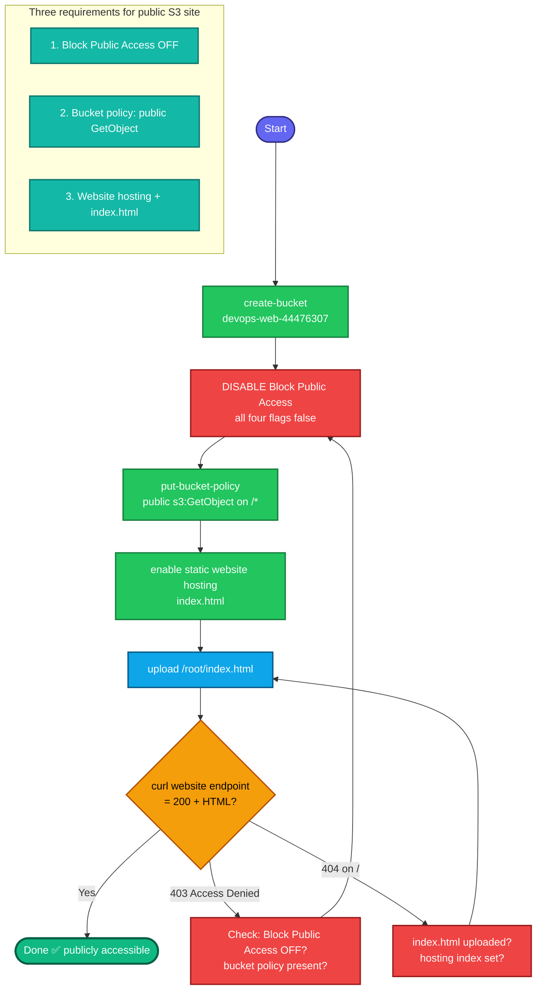

## Concept

**S3 static website hosting** turns a bucket into a web server for static content (HTML/CSS/JS) — no EC2, no server. This is the **opposite** of the "private bucket" tasks: here the bucket must be **publicly readable** so anyone can view the site.

Making an S3 site public requires **three separate things** — miss any one and you get 403 Access Denied:

1. **Disable Block Public Access** — S3's account/bucket-level safety net that blocks all public access by default. Must be turned off first.
2. **Bucket policy** — an explicit `s3:GetObject` Allow for `*` (everyone) on the bucket's objects.
3. **Enable static website hosting** — sets the index document and gives you the **website endpoint URL** (different from the normal S3 REST URL).

The website URL format is `http://<bucket>.s3-website-<region>.amazonaws.com` — note `s3-website`, not the usual `s3.amazonaws.com`.

## Prerequisites

- `showcreds` first — CLI-friendly; need working `AKIA`/secret.
- Region **us-east-1**. `index.html` at `/root/`.

## OTS (CLI, on aws-client)

```bash
REGION=us-east-1
BUCKET=devops-web-44476307

# 1. Create the bucket (us-east-1: no LocationConstraint)
aws s3api create-bucket --bucket $BUCKET --region $REGION

# 2. DISABLE Block Public Access (required before any public policy works)
aws s3api put-public-access-block --bucket $BUCKET \
  --public-access-block-configuration \
  BlockPublicAcls=false,IgnorePublicAcls=false,BlockPublicPolicy=false,RestrictPublicBuckets=false

# 3. Bucket policy: allow public read (s3:GetObject) on all objects
cat > /tmp/bucket-policy.json <<EOF
{
  "Version": "2012-10-17",
  "Statement": [
    {
      "Sid": "PublicReadGetObject",
      "Effect": "Allow",
      "Principal": "*",
      "Action": "s3:GetObject",
      "Resource": "arn:aws:s3:::$BUCKET/*"
    }
  ]
}
EOF
aws s3api put-bucket-policy --bucket $BUCKET --policy file:///tmp/bucket-policy.json

# 4. Enable static website hosting with index.html
aws s3 website s3://$BUCKET/ --index-document index.html

# 5. Upload index.html from /root/
aws s3 cp /root/index.html s3://$BUCKET/index.html
```

**Verify:**
```bash
# The website endpoint (note: s3-website, not s3)
echo "http://${BUCKET}.s3-website-${REGION}.amazonaws.com"

# Should return 200 + the HTML
curl -s -o /dev/null -w "%{http_code}\n" http://${BUCKET}.s3-website-${REGION}.amazonaws.com
curl -s http://${BUCKET}.s3-website-${REGION}.amazonaws.com | head
```
Expect `200` and the contents of `index.html`.

## Runbook (console path)

1. **S3 → Create bucket** → name `devops-web-44476307`, region us-east-1.
   - **Uncheck "Block all public access"** → acknowledge the warning → Create.
2. Open the bucket → **Properties** tab → **Static website hosting → Edit** → **Enable** → Index document `index.html` → Save. Note the **Bucket website endpoint** shown.
3. **Permissions** tab → **Bucket policy → Edit** → paste the public-read policy (above) → Save.
4. **Objects** tab → **Upload** → add `/root/index.html` → Upload.
5. Open the website endpoint URL in a browser → the page should load.

---

### Gotchas
- **Three things, all required** — Block Public Access OFF **and** bucket policy **and** website hosting. Missing any = 403. This is the mirror image of the private-bucket tasks.
- **Website URL ≠ REST URL** — use `http://<bucket>.s3-website-<region>.amazonaws.com` (the website endpoint), not `<bucket>.s3.amazonaws.com`. The REST URL won't serve the site.
- **Order matters** — disable Block Public Access **before** applying the bucket policy, or the policy is rejected/ignored (`BlockPublicPolicy`).
- **`index.html` must be uploaded** — enabling hosting without the index document = the site loads but 404s on `/`.
- **HTTP not HTTPS** — S3 website endpoints are HTTP-only. Don't test with `https://` (that's the REST endpoint, needs different setup/CloudFront).
- **us-east-1 create** — no `--create-bucket-configuration`.
- **Global name** — `devops-web-44476307` must be free (the numeric suffix makes it unique).
- Region **us-east-1**; exact bucket name.

---

## Colorful flow diagram



The make-or-break trio: **Block Public Access OFF → bucket policy → website hosting**, in that order, plus using the **`s3-website` endpoint** to test. This is the exact inverse of your private-bucket/IAM-role tasks — same S3 service, opposite security posture. Want the Terraform equivalent (`aws_s3_bucket` + `aws_s3_bucket_website_configuration` + `aws_s3_bucket_policy` + `aws_s3_bucket_public_access_block`), or this saved as an interview-prep `.md`?