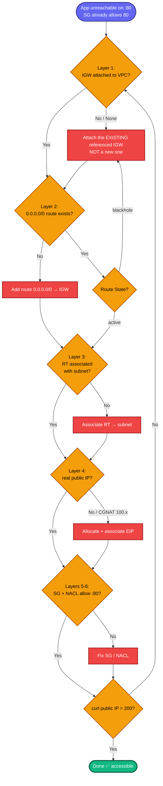
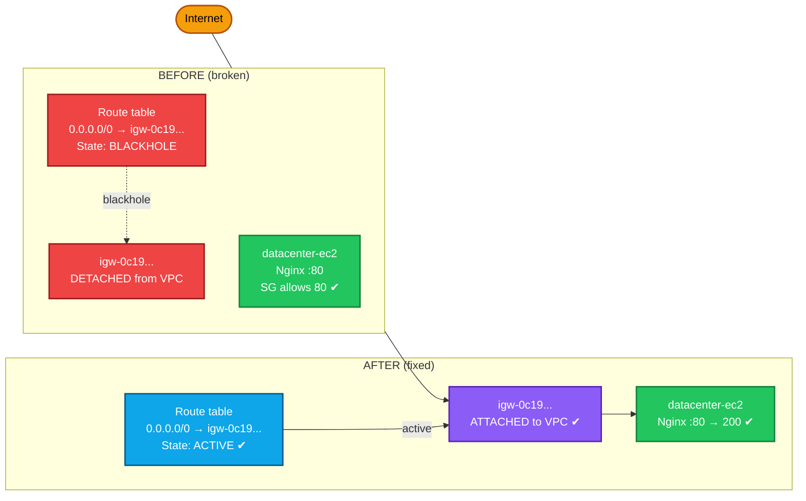

# VPC Internet Access Troubleshooting — Complete Documentation

**Scenario:** An Nginx app on EC2 is unreachable from the internet on port 80, even though the security group allows 80 and the instance is running. The fault is in the **VPC internet path**.

**Root cause found in this lab:** a **blackhole route** — the route table had `0.0.0.0/0 → IGW`, but the referenced Internet Gateway was **detached** from the VPC, so all internet-bound traffic was silently dropped.

---

## 1. Concept — the "public subnet" reachability stack

For an EC2 instance to be reachable from the internet, **every** layer below must be correct. Any single break makes it unreachable — and the symptom (a timeout) looks the same regardless of which layer failed.

```
Layer 6:  NACL         — subnet firewall (stateless) allows :80 + ephemeral return ports
Layer 5:  Security Group — instance firewall (stateful) allows :80
Layer 4:  Public IP     — instance has a real, routable public IP / EIP
Layer 3:  RT Association — the route table is associated with the instance's subnet
Layer 2:  Route          — 0.0.0.0/0 → IGW, and its State is 'active' (not blackhole)
Layer 1:  IGW           — Internet Gateway created AND attached to the VPC
```

> **The trap in this lab:** Layers 3, 4, 5 all looked fine, and Layer 2 *appeared*
> fine (a `0.0.0.0/0 → igw-...` route existed). But Layer 1 was broken — the IGW
> wasn't attached — which turned the Layer 2 route into a **blackhole**.

---

## 2. What a "blackhole" route means

A route's **target** (here, an Internet Gateway) must exist and be attached. If the target is missing, detached, or deleted, AWS marks the route **`State: blackhole`** and **silently drops** any traffic matching it.

```
Route present  ✔   0.0.0.0/0 → igw-0c192c82130bfbefb
IGW attached   �’   (IGW=None)
Result             State: blackhole  → traffic dropped → app unreachable
```

**Key lesson:** a route *existing* is not enough — check its **`State`**.
`active` = working. `blackhole` = the target gateway is gone/detached.

---

## 3. Diagnostic sequence (run these first — never guess)

```bash
REGION=us-east-1

# Resolve VPC, instance, subnet, public IP
VPC_ID=$(aws ec2 describe-vpcs --filters "Name=tag:Name,Values=datacenter-vpc" \
  --query 'Vpcs[0].VpcId' --output text --region $REGION)
IID=$(aws ec2 describe-instances --filters "Name=tag:Name,Values=datacenter-ec2" \
  --query 'Reservations[0].Instances[0].InstanceId' --output text --region $REGION)
SUBNET=$(aws ec2 describe-instances --instance-ids $IID \
  --query 'Reservations[0].Instances[0].SubnetId' --output text --region $REGION)
PUB_IP=$(aws ec2 describe-instances --instance-ids $IID \
  --query 'Reservations[0].Instances[0].PublicIpAddress' --output text --region $REGION)
echo "VPC=$VPC_ID Instance=$IID Subnet=$SUBNET PublicIP=$PUB_IP"

# LAYER 1: Is an IGW attached to the VPC?
IGW_ID=$(aws ec2 describe-internet-gateways \
  --filters "Name=attachment.vpc-id,Values=$VPC_ID" \
  --query 'InternetGateways[0].InternetGatewayId' --output text --region $REGION)
echo "IGW=$IGW_ID"    # 'None' = PROBLEM

# LAYER 2/3: The subnet's route table + its routes (check State!)
RT_ID=$(aws ec2 describe-route-tables \
  --filters "Name=association.subnet-id,Values=$SUBNET" \
  --query 'RouteTables[0].RouteTableId' --output text --region $REGION)
[ "$RT_ID" = "None" ] && RT_ID=$(aws ec2 describe-route-tables \
  --filters "Name=vpc-id,Values=$VPC_ID" "Name=association.main,Values=true" \
  --query 'RouteTables[0].RouteTableId' --output text --region $REGION)
aws ec2 describe-route-tables --route-table-ids $RT_ID --region $REGION \
  --query 'RouteTables[0].Routes'
```

**What the lab showed:**
```
IGW=None
0.0.0.0/0 → igw-0c192c82130bfbefb   State: blackhole
```
→ IGW detached → route is a blackhole → the diagnosis.

---

## 4. The fix

The route already pointed to `igw-0c192c82130bfbefb`. The IGW simply wasn't attached. **Attaching that same IGW** reactivates the existing route — no new route needed.

```bash
# Confirm the referenced IGW is detached (empty attachments)
aws ec2 describe-internet-gateways --internet-gateway-ids igw-0c192c82130bfbefb \
  --region $REGION --query 'InternetGateways[0].Attachments'   # []  = detached

# Attach it to the VPC — THIS is the fix
aws ec2 attach-internet-gateway --internet-gateway-id igw-0c192c82130bfbefb \
  --vpc-id $VPC_ID --region $REGION
```

> **Do NOT create a second IGW.** A VPC allows only **one** IGW. Creating another
> and trying to attach it fails with *"already has an internet gateway attached,"*
> and repointing the route to an unattached IGW fails with *"belong to different
> networks."* Both happened in this lab and were harmless dead-ends — the real fix
> was attaching the **existing referenced** IGW. Delete any orphan you created:
> ```bash
> aws ec2 delete-internet-gateway --internet-gateway-id <orphan-igw> --region $REGION
> ```

**Confirm the route flipped to active:**
```bash
aws ec2 describe-route-tables --route-table-ids $RT_ID --region $REGION \
  --query 'RouteTables[0].Routes'
# the 0.0.0.0/0 route State should now be "active" (was "blackhole")
```

**If the public IP is a CGNAT `100.64.0.0/10` address** (e.g. `100.61.143.95`) and still unreachable, attach a real Elastic IP:
```bash
ALLOC=$(aws ec2 allocate-address --domain vpc --region $REGION --query 'AllocationId' --output text)
aws ec2 associate-address --instance-id $IID --allocation-id $ALLOC --region $REGION
```

**Verify:**
```bash
PUB_IP=$(aws ec2 describe-instances --instance-ids $IID \
  --query 'Reservations[0].Instances[0].PublicIpAddress' --output text --region $REGION)
curl -s -o /dev/null -w "%{http_code}\n" http://$PUB_IP    # want 200
curl -s http://$PUB_IP | head
```

---

## 5. Colorful diagnostic decision tree



## 6. Colorful "what was broken" diagram



---

## 7. Troubleshooting table

| Symptom | Cause | Fix |
|---|---|---|
| Route `State: blackhole` | Target IGW detached/deleted | Attach the referenced IGW (don't make a new one) |
| `IGW=None` | No IGW attached to VPC | Attach existing or create+attach one |
| "already has an internet gateway attached" | Tried to attach a 2nd IGW | A VPC allows only 1 IGW; delete the orphan |
| "belong to different networks" (replace-route) | Repointing route to an unattached IGW | Attach the IGW first, or point to the attached one |
| Route active but still unreachable | RT not associated with subnet | Associate the route table with the instance's subnet |
| Public IP is `100.64.x` (CGNAT) | Not internet-routable | Allocate + associate a real Elastic IP |
| Everything above OK, still fails | NACL blocking :80 or ephemeral ports | Check the subnet's Network ACL |

---

## 8. Key takeaways (interview gold)

1. **A route existing ≠ a route working.** Always check `State`. `blackhole` means the target gateway is missing/detached — traffic is silently dropped.
2. **`IGW=None` + `blackhole` route together = the smoking gun.** The route referenced an IGW that wasn't attached.
3. **The fix is to attach the *referenced* IGW**, which reactivates the existing route — not to create a new IGW (a VPC allows only one).
4. **The reachability stack has 6 layers.** When a "properly configured" instance is unreachable, walk them top to bottom: IGW → route → association → public IP → SG → NACL.
5. **`100.64.0.0/10` is CGNAT**, not a real public IP — if you see it, attach an Elastic IP.
6. **Timeout = network/routing problem; permission denied = auth.** Different diagnoses.

**Interview framing** for "an instance is up but unreachable, how do you debug?": *"I'd check the internet path layer by layer — IGW attached, route table has an active (not blackhole) `0.0.0.0/0 → IGW` route, that route table is associated with the instance's subnet, the instance has a routable public IP, and finally the SG and NACL allow the port. The blackhole-route case is a classic: the route looks right but its target IGW is detached."*

---

That's the full write-up with both diagrams. Want it saved as a `.md` file for your interview-prep folder, alongside the ALB, NAT, and ECS guides?