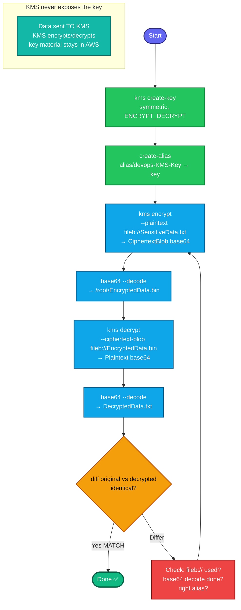

## Concept

**AWS KMS (Key Management Service)** manages encryption keys. A **symmetric KMS key** uses one key for both encrypt and decrypt, and the key material **never leaves AWS** — you send data *to* KMS to encrypt/decrypt, you never hold the raw key.

Key facts for this task:
- **"Name" is not native to a KMS key** — a KMS key is identified by its **key ID/ARN**. The human-readable name is an **alias** (`alias/devops-KMS-Key`). You create the key, then attach the alias.
- **Direct KMS encrypt has a 4 KB limit** — `kms encrypt` only handles small payloads (<4096 bytes). Since `SensitiveData.txt` is small, direct encrypt works. (For large files you'd use envelope encryption with a data key — not needed here.)
- **The CLI returns ciphertext as base64** — `kms encrypt` outputs `CiphertextBlob` base64-encoded. The task wants the **raw binary** saved, so you **base64-decode** it before writing `EncryptedData.bin`.
- Decrypt reverses it: read the binary blob → `kms decrypt` → recover plaintext.

## Prerequisites

- `showcreds` first — CLI-required; need working `AKIA`/secret.
- Region **us-east-1**. `SensitiveData.txt` at `/root/`.

## OTS (CLI, on aws-client)

```bash
REGION=us-east-1

# 1. Create a symmetric KMS key, then give it the alias (the "name")
KEY_ID=$(aws kms create-key \
  --description "devops KMS key for data encryption" \
  --key-usage ENCRYPT_DECRYPT \
  --key-spec SYMMETRIC_DEFAULT \
  --region $REGION \
  --query 'KeyMetadata.KeyId' --output text)
echo "Key ID: $KEY_ID"

aws kms create-alias \
  --alias-name alias/devops-KMS-Key \
  --target-key-id $KEY_ID \
  --region $REGION

# 2. Encrypt SensitiveData.txt → base64-decode → EncryptedData.bin
aws kms encrypt \
  --key-id alias/devops-KMS-Key \
  --plaintext fileb:///root/SensitiveData.txt \
  --output text --query CiphertextBlob \
  --region $REGION | base64 --decode > /root/EncryptedData.bin

echo "Encrypted to /root/EncryptedData.bin"

# 3. Decrypt EncryptedData.bin and verify it matches the original
aws kms decrypt \
  --ciphertext-blob fileb:///root/EncryptedData.bin \
  --output text --query Plaintext \
  --region $REGION | base64 --decode > /root/DecryptedData.txt
```

**Verify (decrypted must match original):**
```bash
echo "=== original ==="; cat /root/SensitiveData.txt
echo "=== decrypted ==="; cat /root/DecryptedData.txt

# byte-for-byte comparison — no output = identical
diff /root/SensitiveData.txt /root/DecryptedData.txt && echo "MATCH ✅"
```
`MATCH ✅` (and empty diff) = encryption/decryption round-trips correctly.

## Runbook (step-by-step)

1. `showcreds` → confirm CLI (`aws sts get-caller-identity`).
2. `create-key` (symmetric, ENCRYPT_DECRYPT) → grab the Key ID.
3. `create-alias alias/devops-KMS-Key` → target the key.
4. `kms encrypt` with `--plaintext fileb://...` → pipe `CiphertextBlob` through `base64 --decode` → write `/root/EncryptedData.bin`.
5. `kms decrypt` with `--ciphertext-blob fileb://EncryptedData.bin` → `base64 --decode` → `DecryptedData.txt`.
6. `diff` original vs decrypted → must be identical.

---

### Gotchas
- **Alias = the "name"** — the task's `devops-KMS-Key` is an **alias** (`alias/devops-KMS-Key`), not a native key name. Create the key first, then the alias pointing to it. The grader decrypts using this alias/key.
- **`fileb://` not `file://`** — both plaintext input and ciphertext input are **binary**; `fileb://` reads raw bytes. `file://` would corrupt them.
- **base64-decode the ciphertext** — `kms encrypt` returns base64 text; the task explicitly wants the decoded binary in `EncryptedData.bin`. Skipping the decode saves base64 text, not the raw blob → grader's decrypt fails.
- **`--query ... --output text`** — extracts just the blob string (no JSON wrapper) so the base64 pipe is clean.
- **4 KB limit** — direct `kms encrypt` only works for <4KB. Fine for this small file; larger files need envelope encryption (data key).
- **Decrypt needs no `--key-id`** — KMS reads which key to use from the ciphertext blob's metadata (though you can pass it). The key just needs to exist and you need decrypt permission.
- Region **us-east-1**; alias exactly `alias/devops-KMS-Key`.

---

## Colorful flow diagram



The two make-or-break details: **the "name" is an alias** (`alias/devops-KMS-Key`), and **base64-decoding the ciphertext** before saving `EncryptedData.bin` — the grader decrypts that raw binary with your key, so if you saved base64 text instead of the decoded blob, its decrypt fails. `fileb://` throughout keeps the binary intact. Want the Terraform equivalent (`aws_kms_key` + `aws_kms_alias`), or this saved as an interview-prep `.md`?