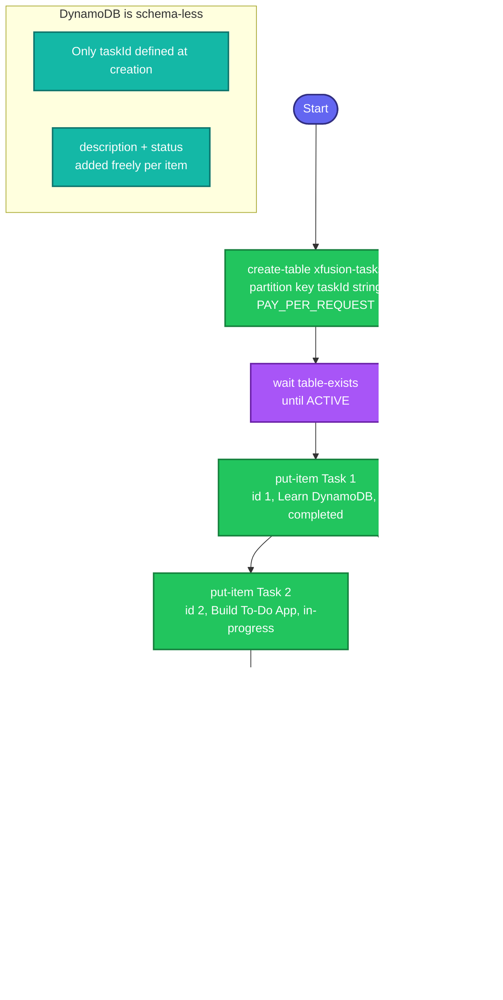

## Concept

**DynamoDB** is AWS's serverless NoSQL database. Unlike relational DBs, you don't define columns up front — only the **key schema**. Key facts:

- **Primary key** — here a simple **partition key** `taskId` (string). Every item must have it; it uniquely identifies the item. Other attributes (`description`, `status`) are **schema-less** — added per-item, no table-level definition needed.
- **Attribute types in the CLI** use type descriptors: `S` = string, `N` = number, `B` = binary. So `taskId` is `{"S": "1"}`.
- **Billing mode** — `PAY_PER_REQUEST` (on-demand, no capacity planning) is simplest for a task like this; avoids specifying read/write capacity units.
- **Table must be `ACTIVE`** before you can write to it — creation takes a few seconds.

Steps: create table → wait active → put two items → verify by reading them back.

## Prerequisites

- `showcreds` first — CLI-friendly; need working `AKIA`/secret.
- Region **us-east-1**.

## OTS (CLI)

```bash
REGION=us-east-1

# 1. Create the table (partition key taskId, string; on-demand billing)
aws dynamodb create-table \
  --table-name xfusion-tasks \
  --attribute-definitions AttributeName=taskId,AttributeType=S \
  --key-schema AttributeName=taskId,KeyType=HASH \
  --billing-mode PAY_PER_REQUEST \
  --region $REGION

# Wait until the table is ACTIVE
aws dynamodb wait table-exists --table-name xfusion-tasks --region $REGION
echo "Table active"

# 2. Insert Task 1
aws dynamodb put-item \
  --table-name xfusion-tasks \
  --item '{"taskId":{"S":"1"},"description":{"S":"Learn DynamoDB"},"status":{"S":"completed"}}' \
  --region $REGION

# 2. Insert Task 2
aws dynamodb put-item \
  --table-name xfusion-tasks \
  --item '{"taskId":{"S":"2"},"description":{"S":"Build To-Do App"},"status":{"S":"in-progress"}}' \
  --region $REGION
```

**Verify:**
```bash
# Read both items back
aws dynamodb get-item --table-name xfusion-tasks \
  --key '{"taskId":{"S":"1"}}' --region us-east-1 \
  --query 'Item.{ID:taskId.S,Desc:description.S,Status:status.S}'

aws dynamodb get-item --table-name xfusion-tasks \
  --key '{"taskId":{"S":"2"}}' --region us-east-1 \
  --query 'Item.{ID:taskId.S,Desc:description.S,Status:status.S}'

# Or scan everything at once
aws dynamodb scan --table-name xfusion-tasks --region us-east-1 \
  --query 'Items[].{ID:taskId.S,Status:status.S}' --output table
```
Expect Task 1 → `status=completed`, Task 2 → `status=in-progress`.

## Runbook (console path)

1. **DynamoDB → Tables → Create table**.
2. **Table name:** `xfusion-tasks`; **Partition key:** `taskId` (type **String**). Leave sort key blank. Default settings → **Create table**.
3. Wait for status **Active**.
4. Select the table → **Explore table items → Create item**.
5. Add item 1: `taskId` = `1`, then **Add new attribute (String)** `description` = `Learn DynamoDB`, `status` = `completed` → **Create item**.
6. Repeat for item 2: `taskId` = `2`, `description` = `Build To-Do App`, `status` = `in-progress`.
7. Confirm both items show correct statuses in the item list.

---

### Gotchas
- **Only the key is defined at table creation** — `--attribute-definitions` lists **only** attributes used in the key schema (`taskId`). Don't add `description`/`status` there; DynamoDB rejects attribute definitions not used in a key. They're added freely at `put-item` time.
- **Type descriptors are required** — every value is wrapped: `{"S":"..."}`. Forgetting the `S` wrapper (writing `"taskId":"1"`) fails.
- **`status` is a reserved word in some query contexts** — fine in `put-item`, but if you later `--projection-expression status`, you'd need an expression attribute name (`#s`). Not an issue for these plain puts/gets.
- **Wait for ACTIVE** — writing before the table is ready errors with `ResourceNotFoundException`. `wait table-exists` handles it.
- **`PAY_PER_REQUEST`** avoids specifying capacity; if you use provisioned mode instead, you must add `--provisioned-throughput`.
- Region **us-east-1**; exact names/values (`taskId`, `completed`, `in-progress`).

---

## Colorful flow diagram



The DynamoDB-specific things to remember: **only the key attribute is declared at creation** (the rest are schema-less per-item), and **every value needs a type descriptor** (`{"S":"..."}`). The `wait table-exists` prevents the common "write before ACTIVE" error. Want the Terraform equivalent (`aws_dynamodb_table` + `aws_dynamodb_table_item`), or this saved as an interview-prep `.md`?