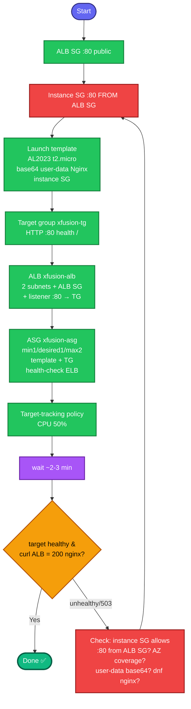

This is the most interconnected task yet — launch template + ASG + ALB + scaling policy all wired together. The port/SG configuration is the make-or-break piece (as you learned from the earlier ALB task), so I've made sure every required port is covered.

## Concept

**Auto Scaling Group (ASG) + ALB** = self-healing, elastic web tier. The ASG launches instances from a **launch template** (the blueprint), keeps a target count running, and scales on CPU. The ALB distributes traffic across whatever instances the ASG currently has, using the **target group** as the shared registration point. A **target-tracking scaling policy** adds/removes instances to hold CPU at 50%.

**Required ports (the "ensure ports enabled" part):**
- **ALB SG:** inbound **80 from `0.0.0.0/0`** (public → ALB).
- **Instance SG:** inbound **80 from the ALB's SG** (ALB → Nginx). This is the rule most often missed → targets go unhealthy.

The pieces interlock: launch template → ASG (uses template + registers into TG) → ALB (forwards to TG) → scaling policy (CPU 50%).

## Prerequisites

- `showcreds` first — CLI-heavy; need working `AKIA`/secret.
- Region **us-east-1**. Default VPC with ≥2 subnets in 2 AZs (ALB requirement).

## OTS (CLI, on aws-client)

```bash
REGION=us-east-1

# 0. VPC + two subnets in different AZs
VPC_ID=$(aws ec2 describe-vpcs --filters "Name=isDefault,Values=true" \
  --query 'Vpcs[0].VpcId' --output text --region $REGION)
mapfile -t SUBS < <(aws ec2 describe-subnets --filters "Name=vpc-id,Values=$VPC_ID" \
  "Name=map-public-ip-on-launch,Values=true" \
  --query 'Subnets[].SubnetId' --output text --region $REGION | tr '\t' '\n')
SUB1=${SUBS[0]}; SUB2=${SUBS[1]}
echo "Subnets: $SUB1 $SUB2"

# 1. Two security groups: ALB SG (public :80) and instance SG (:80 from ALB SG)
ALB_SG=$(aws ec2 create-security-group --group-name xfusion-alb-sg \
  --description "ALB public 80" --vpc-id $VPC_ID --region $REGION --query 'GroupId' --output text)
aws ec2 authorize-security-group-ingress --group-id $ALB_SG \
  --protocol tcp --port 80 --cidr 0.0.0.0/0 --region $REGION

INST_SG=$(aws ec2 create-security-group --group-name xfusion-instance-sg \
  --description "Instance 80 from ALB" --vpc-id $VPC_ID --region $REGION --query 'GroupId' --output text)
aws ec2 authorize-security-group-ingress --group-id $INST_SG \
  --protocol tcp --port 80 --source-group $ALB_SG --region $REGION

# 2. User-data (Amazon Linux 2023 = dnf) base64-encoded for the launch template
cat > /tmp/ud.sh <<'EOF'
#!/bin/bash
dnf install -y nginx
systemctl start nginx
systemctl enable nginx
EOF
UD_B64=$(base64 -w0 /tmp/ud.sh)

# 3. Resolve AL2023 AMI
AMI_ID=$(aws ssm get-parameters \
  --names /aws/service/ami-amazon-linux-latest/al2023-ami-kernel-default-x86_64 \
  --query 'Parameters[0].Value' --output text --region $REGION)

# 4. Create the launch template
LT_ID=$(aws ec2 create-launch-template \
  --launch-template-name xfusion-launch-template \
  --launch-template-data "{
    \"ImageId\":\"$AMI_ID\",
    \"InstanceType\":\"t2.micro\",
    \"SecurityGroupIds\":[\"$INST_SG\"],
    \"UserData\":\"$UD_B64\"
  }" \
  --region $REGION --query 'LaunchTemplate.LaunchTemplateId' --output text)
echo "Launch template: $LT_ID"

# 5. Target group + ALB + listener
TG_ARN=$(aws elbv2 create-target-group --name xfusion-tg \
  --protocol HTTP --port 80 --vpc-id $VPC_ID --target-type instance \
  --health-check-protocol HTTP --health-check-path / \
  --healthy-threshold-count 2 --unhealthy-threshold-count 2 \
  --region $REGION --query 'TargetGroups[0].TargetGroupArn' --output text)

ALB_ARN=$(aws elbv2 create-load-balancer --name xfusion-alb \
  --type application --scheme internet-facing \
  --subnets $SUB1 $SUB2 --security-groups $ALB_SG \
  --region $REGION --query 'LoadBalancers[0].LoadBalancerArn' --output text)
aws elbv2 wait load-balancer-available --load-balancer-arns $ALB_ARN --region $REGION

aws elbv2 create-listener --load-balancer-arn $ALB_ARN \
  --protocol HTTP --port 80 \
  --default-actions Type=forward,TargetGroupArn=$TG_ARN --region $REGION

# 6. Create the ASG (min 1, desired 1, max 2) attached to the TG, across both subnets
aws autoscaling create-auto-scaling-group \
  --auto-scaling-group-name xfusion-asg \
  --launch-template LaunchTemplateId=$LT_ID,Version='$Latest' \
  --min-size 1 --desired-capacity 1 --max-size 2 \
  --vpc-zone-identifier "$SUB1,$SUB2" \
  --target-group-arns $TG_ARN \
  --health-check-type ELB --health-check-grace-period 90 \
  --region $REGION

# 7. Target-tracking scaling policy: hold average CPU at 50%
aws autoscaling put-scaling-policy \
  --auto-scaling-group-name xfusion-asg \
  --policy-name xfusion-cpu50 \
  --policy-type TargetTrackingScaling \
  --target-tracking-configuration '{
    "PredefinedMetricSpecification": {"PredefinedMetricType": "ASGAverageCPUUtilization"},
    "TargetValue": 50.0
  }' \
  --region $REGION
```

**Verify (wait ~2-3 min for instance launch + Nginx + health checks):**
```bash
sleep 150
aws elbv2 describe-target-health --target-group-arn $TG_ARN --region us-east-1 \
  --query 'TargetHealthDescriptions[].TargetHealth.State' --output text   # want: healthy

ALB_DNS=$(aws elbv2 describe-load-balancers --load-balancer-arns $ALB_ARN \
  --query 'LoadBalancers[0].DNSName' --output text --region us-east-1)
echo "http://$ALB_DNS"
curl -s -o /dev/null -w "%{http_code}\n" http://$ALB_DNS     # want: 200
curl -s http://$ALB_DNS | grep -i nginx
```
Expect target `healthy`, HTTP `200`, and the Nginx welcome page.

## Required ports checklist (the "ensure ports enabled" ask)

| Direction | SG | Port | Source | Why |
|-----------|-----|------|--------|-----|
| Inbound | `xfusion-alb-sg` (ALB) | 80 | `0.0.0.0/0` | Public → ALB |
| Inbound | `xfusion-instance-sg` (instances) | 80 | **`xfusion-alb-sg`** | ALB → Nginx |

The **instance SG allowing 80 from the ALB SG** is the critical, easily-missed rule. Without it, targets are `unhealthy` and the ALB returns 503.

## Gotchas

- **Two SGs, chained** — ALB SG public on 80; instance SG allows 80 **from the ALB SG** (not the world). Missing the second = unhealthy targets. ← the ports requirement.
- **ALB needs ≥2 AZs** — and the ASG's `--vpc-zone-identifier` should span the same subnets so instances land where the ALB has presence (avoids the `unused` AZ-coverage trap you hit before).
- **User-data must be base64 in a launch template** (`base64 -w0`) — unlike `run-instances` which takes `file://`. Raw text fails.
- **AL2023 = `dnf`** (not `yum`/`apt`) and package `nginx`.
- **`health-check-type ELB`** on the ASG — so the ASG uses the ALB's health check to decide instance health (replaces unhealthy ones). With a grace period so Nginx has time to start.
- **Target-tracking policy** with `ASGAverageCPUUtilization` + `TargetValue 50` = the "scale on CPU at 50%" requirement. This auto-creates the CloudWatch alarms.
- **`Version='$Latest'`** — quote it so the shell doesn't expand `$Latest`.
- **Wait ~2-3 min** — instance launch + Nginx install + health checks.
- Region **us-east-1**; exact names on template, ASG, TG, ALB.

## Colorful architecture + flow diagram

```mermaid
flowchart TD
    NET([Internet]):::user -->|:80| ALB[xfusion-alb<br/>SG: alb-sg :80 public]:::alb
    ALB --> L[Listener :80]:::listener
    L --> TG[xfusion-tg<br/>HTTP :80 health /]:::tg

    subgraph ASG["xfusion-asg (min 1, desired 1, max 2)"]
      I1[EC2 t2.micro<br/>AL2023 + Nginx<br/>SG: inst-sg :80 from alb-sg]:::ec2
      I2[EC2 (scales in on CPU>50%)<br/>up to max 2]:::ec2scale
    end
    TG -->|:80| I1
    TG -.->|:80| I2

    LT[xfusion-launch-template<br/>AL2023 · t2.micro · user-data Nginx]:::lt -.blueprint.-> ASG
    CPU[Target-tracking policy<br/>CPU 50%]:::policy -.scales.-> ASG

    classDef user fill:#f59e0b,stroke:#b45309,color:#000,stroke-width:2px
    classDef alb fill:#0ea5e9,stroke:#075985,color:#fff,stroke-width:2px
    classDef listener fill:#8b5cf6,stroke:#5b21b6,color:#fff,stroke-width:2px
    classDef tg fill:#14b8a6,stroke:#0f766e,color:#fff,stroke-width:2px
    classDef ec2 fill:#22c55e,stroke:#15803d,color:#fff,stroke-width:2px
    classDef ec2scale fill:#84cc16,stroke:#4d7c0f,color:#000,stroke-width:2px,stroke-dasharray: 5 5
    classDef lt fill:#6366f1,stroke:#312e81,color:#fff,stroke-width:2px
    classDef policy fill:#ef4444,stroke:#991b1b,color:#fff,stroke-width:2px
```



The four things that make or break this: **instance SG allows 80 from the ALB SG** (the ports requirement), **user-data base64-encoded** in the launch template, **AL2023 uses `dnf`**, and **ASG + ALB spanning the same AZs**. If targets go unhealthy, it's almost always the instance-SG-from-ALB-SG rule — exactly the pattern from your earlier ALB task. Want the Terraform equivalent (`aws_launch_template` + `aws_autoscaling_group` + `aws_lb` + `aws_autoscaling_policy`), or this saved as an interview-prep `.md`?