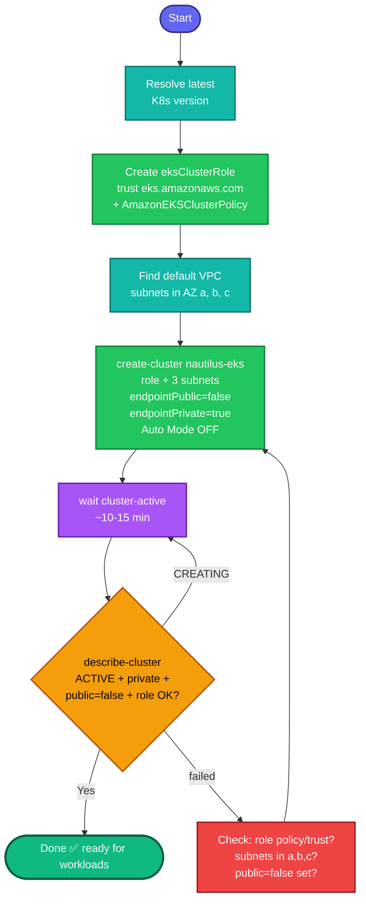

## Concept

**Amazon EKS** is managed Kubernetes — AWS runs the control plane (API server, etcd) and you provide the networking + IAM. This task creates the **control plane only** (no worker nodes), with specific settings:

- **Cluster IAM role (`eksClusterRole`)** — the role EKS assumes to manage AWS resources on your behalf (ENIs, load balancers, etc.). It needs the `AmazonEKSClusterPolicy`. Its trust policy allows `eks.amazonaws.com` to assume it.
- **Private endpoint** — the Kubernetes API endpoint is reachable only from within the VPC, not the public internet (security requirement).
- **EKS Auto Mode disabled** — Auto Mode is the newer "AWS manages compute/scaling automatically" feature; the task wants it **off** (classic custom config).
- **Subnets across AZs a, b, c** — EKS requires subnets in ≥2 AZs; this task pins three for HA.
- **Latest stable Kubernetes version** — resolve it dynamically rather than hardcoding.

EKS needs: the cluster role + a subnet list (≥2 AZs) + version + endpoint access config.

## Prerequisites

- `showcreds` first — CLI-heavy; need working `AKIA`/secret.
- Region **us-east-1**. Default VPC with subnets in `us-east-1a/b/c`.
- Permission to create IAM roles + EKS clusters.

## OTS (CLI, on aws-client)

```bash
REGION=us-east-1

# 0. Latest stable EKS Kubernetes version
K8S_VER=$(aws eks describe-addon-versions --query 'max(addons[].addonVersions[].compatibilities[].clusterVersion)' --output text --region $REGION 2>/dev/null)
# fallback: list supported versions
[ -z "$K8S_VER" ] && K8S_VER=1.31
echo "K8s version: $K8S_VER"

# 1. Create the cluster IAM role (trust: eks.amazonaws.com)
cat > /tmp/eks-trust.json <<'EOF'
{"Version":"2012-10-17","Statement":[{"Effect":"Allow","Principal":{"Service":"eks.amazonaws.com"},"Action":"sts:AssumeRole"}]}
EOF
aws iam create-role --role-name eksClusterRole \
  --assume-role-policy-document file:///tmp/eks-trust.json 2>/dev/null
aws iam attach-role-policy --role-name eksClusterRole \
  --policy-arn arn:aws:iam::aws:policy/AmazonEKSClusterPolicy
ROLE_ARN=$(aws iam get-role --role-name eksClusterRole --query 'Role.Arn' --output text)
echo "Role: $ROLE_ARN"

# 2. Default VPC + subnets in AZs a, b, c
VPC_ID=$(aws ec2 describe-vpcs --filters "Name=isDefault,Values=true" \
  --query 'Vpcs[0].VpcId' --output text --region $REGION)

SUBNET_A=$(aws ec2 describe-subnets --filters "Name=vpc-id,Values=$VPC_ID" \
  "Name=availability-zone,Values=us-east-1a" \
  --query 'Subnets[0].SubnetId' --output text --region $REGION)
SUBNET_B=$(aws ec2 describe-subnets --filters "Name=vpc-id,Values=$VPC_ID" \
  "Name=availability-zone,Values=us-east-1b" \
  --query 'Subnets[0].SubnetId' --output text --region $REGION)
SUBNET_C=$(aws ec2 describe-subnets --filters "Name=vpc-id,Values=$VPC_ID" \
  "Name=availability-zone,Values=us-east-1c" \
  --query 'Subnets[0].SubnetId' --output text --region $REGION)
echo "Subnets: $SUBNET_A $SUBNET_B $SUBNET_C"

# 3. Create the EKS cluster — private endpoint, Auto Mode off (default)
aws eks create-cluster \
  --name nautilus-eks \
  --role-arn $ROLE_ARN \
  --resources-vpc-config subnetIds=$SUBNET_A,$SUBNET_B,$SUBNET_C,endpointPublicAccess=false,endpointPrivateAccess=true \
  --kubernetes-version $K8S_VER \
  --region $REGION

# 4. Wait until the cluster is ACTIVE (~10-15 min)
aws eks wait cluster-active --name nautilus-eks --region $REGION
echo "EKS cluster active"
```

**Verify:**
```bash
aws eks describe-cluster --name nautilus-eks --region us-east-1 \
  --query 'cluster.{Status:status,Version:version,PrivateAccess:resourcesVpcConfig.endpointPrivateAccess,PublicAccess:resourcesVpcConfig.endpointPublicAccess,Role:roleArn}'
```
Expect `Status=ACTIVE`, `PrivateAccess=true`, `PublicAccess=false`, and the `eksClusterRole` ARN.

## Runbook (console path — matches "Custom configuration")

1. **EKS → Add cluster → Create**.
2. **Configuration options:** **Custom configuration**; toggle **EKS Auto Mode → OFF**.
3. **Name:** `nautilus-eks`; **Kubernetes version:** latest.
4. **Cluster service role:** `eksClusterRole` (create it in IAM first if missing — role for EKS with `AmazonEKSClusterPolicy`).
5. **Networking:** default VPC; select subnets in **us-east-1a, 1b, 1c**.
6. **Cluster endpoint access:** **Private**.
7. Create → wait for status **Active** (~10-15 min).
8. Verify config shows private endpoint, Auto Mode off, correct role.

---

### Gotchas
- **Cluster role first** — EKS needs `eksClusterRole` with `AmazonEKSClusterPolicy` and a trust policy for `eks.amazonaws.com`. Missing/misconfigured role = create fails immediately.
- **Private endpoint** — `endpointPublicAccess=false,endpointPrivateAccess=true`. Both flags matter: turning private **on** isn't enough; you must turn public **off** to make it truly private.
- **Auto Mode off** — the default `create-cluster` (without `--compute-config enabled=true`) has Auto Mode **disabled**, which is what's required. Don't enable it.
- **≥2 AZs, here 3** — subnets in a, b, c. If a subnet lookup returns `None`, that AZ has no default subnet — pick another or create one.
- **~10-15 min creation** — EKS control plane is slow to provision. `wait cluster-active` blocks until ready; don't submit while `CREATING`.
- **Latest version** — resolve dynamically; a made-up version errors.
- **This creates control plane only** — no worker nodes/node groups (task doesn't ask for them). "Ready for workloads" = control plane ACTIVE.
- Region **us-east-1**; exact names `nautilus-eks` / `eksClusterRole`.

---

## Colorful flow diagram



The task-specific settings: **private endpoint** = `endpointPublicAccess=false` **and** `endpointPrivateAccess=true` (both flags), **Auto Mode off** = the plain `create-cluster` default (don't pass `--compute-config`), and **subnets across a/b/c**. The `wait cluster-active` is essential — EKS takes 10-15 min, and you can't submit while it's `CREATING`. Want the `eksctl`/Terraform equivalent, or this saved as an interview-prep `.md`?


## Check EKS cluster provisioning status

**Quick status (one value):**
```bash
aws eks describe-cluster --name nautilus-eks --region us-east-1 \
  --query 'cluster.status' --output text
```
Returns one of: `CREATING` → `ACTIVE` (success) → or `FAILED` / `DELETING`.

**More detail (status + key config while it builds):**
```bash
aws eks describe-cluster --name nautilus-eks --region us-east-1 \
  --query 'cluster.{Status:status,Version:version,Endpoint:endpoint,Created:createdAt}' \
  --output table
```

**Block until it's ACTIVE (waits, then returns):**
```bash
aws eks wait cluster-active --name nautilus-eks --region us-east-1 && echo "ACTIVE ✅"
```
This polls automatically (every 30s, up to ~25 min) and returns when the cluster is ready — better than manually re-running describe.

**Watch it live (refresh every 30s):**
```bash
watch -n 30 "aws eks describe-cluster --name nautilus-eks --region us-east-1 --query 'cluster.status' --output text"
```
(Ctrl+C to stop.)

---

### What the statuses mean

| Status | Meaning |
|--------|---------|
| `CREATING` | Control plane provisioning — **normal, takes 10-15 min** |
| `ACTIVE` | Ready — cluster is up, can accept workloads ✅ |
| `FAILED` | Provisioning failed — check role/subnets/config |
| `UPDATING` | A config change is applying |
| `DELETING` | Being torn down |

### If it shows `FAILED`

Get the reason:
```bash
aws eks describe-cluster --name nautilus-eks --region us-east-1 \
  --query 'cluster.health.issues'
```
Usual causes: the `eksClusterRole` is missing `AmazonEKSClusterPolicy` or has a wrong trust policy, or the subnets are invalid. You'd delete and recreate after fixing.

---

**For your case:** EKS control planes take **10-15 minutes**, so `CREATING` for a while is expected — not a problem. Use the `wait cluster-active` command; it'll sit there and return `ACTIVE ✅` the moment it's ready, so you don't have to keep checking manually.