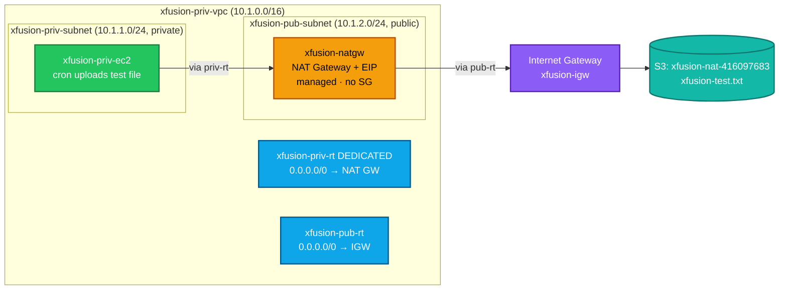
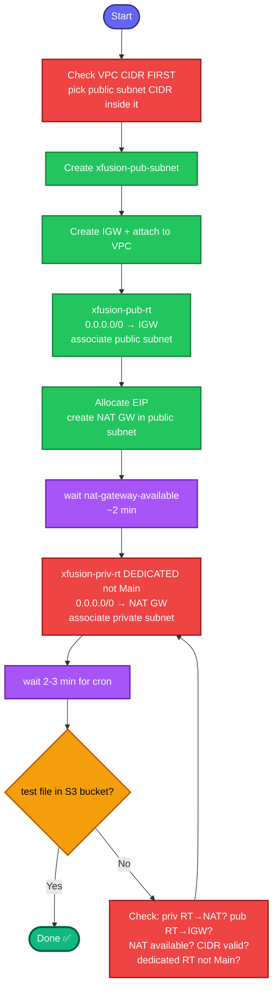

# NAT Gateway — Enable Internet Access for a Private Subnet (Complete Documentation)

**Goal:** Let an EC2 instance in a **private subnet** reach the internet (to upload a file to S3) using a managed **NAT Gateway** — while keeping the instance unreachable from the internet inbound.

**Proof of success:** the test file appears in the S3 bucket (`xfusion-test.txt` in `xfusion-nat-416097683`).

---

## 1. Concept (plain English)

A private-subnet instance has **no route to the internet** by design. A **NAT Gateway** is a managed AWS service that sits in a **public** subnet and relays the private instance's **outbound** traffic to the internet — replies come back, but nothing on the internet can initiate a connection inward.

Analogy: the NAT Gateway is a **one-way outbound door with a receptionist**. Your private instance hands its request to the receptionist (NAT GW), who forwards it out and brings the reply back. Outsiders can't walk in through that door.

### NAT Gateway vs NAT Instance

| | NAT **Instance** (DIY) | NAT **Gateway** (managed) |
|---|---|---|
| What it is | A regular EC2 you configure | Fully managed AWS service |
| Source/dest check | Must **disable** | N/A |
| iptables / IP forwarding | Configure in OS | N/A |
| Security group | You manage | **None** |
| HA / scaling | Manual | Automatic (within an AZ) |
| Cost | Cheaper | More expensive |
| Setup effort | High | Low (routing + EIP only) |

> **This task = NAT Gateway**, so there is **no OS config, no iptables, no source/dest
> check, and no security group** — the entire job is **networking/routing**.

---

## 2. The two-route-table structure (the whole point)

```
Public subnet  → route table → 0.0.0.0/0 → Internet Gateway   (NAT GW reaches the internet)
Private subnet → route table → 0.0.0.0/0 → NAT Gateway         (instance reaches the NAT GW)
```

The NAT Gateway **lives in the public subnet** but **serves the private subnet**.

Full traffic journey:
```
xfusion-priv-ec2 (private)
  → private RT: 0.0.0.0/0 → NAT Gateway
  → NAT Gateway (public subnet, has Elastic IP)
  → public RT: 0.0.0.0/0 → Internet Gateway
  → internet → S3 bucket (file uploaded)
```

---

## 3. Ports / connectivity requirements

A NAT Gateway is managed, so there are **no port rules or security groups to add**. "Ensure required ports" here means **ensure the routing is correct**:

| Component | Requirement |
|-----------|-------------|
| NAT Gateway | No SG — managed |
| Public subnet RT | `0.0.0.0/0 → IGW` |
| Private subnet RT | `0.0.0.0/0 → NAT GW` |
| Internet Gateway | Created **and attached** to the VPC |
| Instance SG | Outbound open by default (SGs are stateful) — S3 upload allowed |

---

## 4. Full command sequence

> **Run each block as single lines**, checking the `echo` output before continuing.
> Multi-line `\`-continued pastes collide commands in this terminal.

**Resolve VPC + private subnet + CIDR (do this FIRST):**
```bash
REGION=us-east-1
VPC_ID=$(aws ec2 describe-vpcs --filters "Name=tag:Name,Values=xfusion-priv-vpc" \
  --query 'Vpcs[0].VpcId' --output text --region $REGION)
VPC_CIDR=$(aws ec2 describe-vpcs --vpc-ids $VPC_ID \
  --query 'Vpcs[0].CidrBlock' --output text --region $REGION)
PRIV_SUBNET=$(aws ec2 describe-subnets --filters "Name=tag:Name,Values=xfusion-priv-subnet" \
  --query 'Subnets[0].SubnetId' --output text --region $REGION)
echo "VPC=$VPC_ID CIDR=$VPC_CIDR PrivSubnet=$PRIV_SUBNET"
```
> **Note the `$VPC_CIDR`** — the public subnet CIDR MUST fall inside it.
> If the VPC is `10.1.0.0/16`, use `10.1.2.0/24` (not `10.0.2.0/24`).

**1. Public subnet:**
```bash
PUB_SUBNET=$(aws ec2 create-subnet --vpc-id $VPC_ID --cidr-block 10.1.2.0/24 --availability-zone us-east-1a --region $REGION --tag-specifications 'ResourceType=subnet,Tags=[{Key=Name,Value=xfusion-pub-subnet}]' --query 'Subnet.SubnetId' --output text)
echo "PUB_SUBNET=$PUB_SUBNET"
```

**2. Internet Gateway + attach:**
```bash
IGW_ID=$(aws ec2 create-internet-gateway --region $REGION --tag-specifications 'ResourceType=internet-gateway,Tags=[{Key=Name,Value=xfusion-igw}]' --query 'InternetGateway.InternetGatewayId' --output text)
aws ec2 attach-internet-gateway --internet-gateway-id $IGW_ID --vpc-id $VPC_ID --region $REGION
echo "IGW=$IGW_ID"
```

**3. Public route table → IGW → associate public subnet:**
```bash
PUB_RT=$(aws ec2 create-route-table --vpc-id $VPC_ID --region $REGION --tag-specifications 'ResourceType=route-table,Tags=[{Key=Name,Value=xfusion-pub-rt}]' --query 'RouteTable.RouteTableId' --output text)
aws ec2 create-route --route-table-id $PUB_RT --destination-cidr-block 0.0.0.0/0 --gateway-id $IGW_ID --region $REGION
aws ec2 associate-route-table --route-table-id $PUB_RT --subnet-id $PUB_SUBNET --region $REGION
echo "PUB_RT=$PUB_RT"
```

**4. Elastic IP + NAT Gateway (in the PUBLIC subnet) + wait:**
```bash
EIP_ALLOC=$(aws ec2 allocate-address --domain vpc --region $REGION --query 'AllocationId' --output text)
NATGW=$(aws ec2 create-nat-gateway --subnet-id $PUB_SUBNET --allocation-id $EIP_ALLOC --region $REGION --tag-specifications 'ResourceType=natgateway,Tags=[{Key=Name,Value=xfusion-natgw}]' --query 'NatGateway.NatGatewayId' --output text)
echo "NATGW=$NATGW"
aws ec2 wait nat-gateway-available --nat-gateway-ids $NATGW --region $REGION
echo "NAT available"
```

**5. DEDICATED private route table (NOT the Main RT) → NAT GW → associate private subnet:**
```bash
PRIV_RT=$(aws ec2 create-route-table --vpc-id $VPC_ID --region $REGION --tag-specifications 'ResourceType=route-table,Tags=[{Key=Name,Value=xfusion-priv-rt}]' --query 'RouteTable.RouteTableId' --output text)
aws ec2 create-route --route-table-id $PRIV_RT --destination-cidr-block 0.0.0.0/0 --nat-gateway-id $NATGW --region $REGION
aws ec2 associate-route-table --route-table-id $PRIV_RT --subnet-id $PRIV_SUBNET --region $REGION
echo "PRIV_RT=$PRIV_RT"
```

**Verify (wait 2-3 min for the cron):**
```bash
sleep 180
aws s3 ls s3://xfusion-nat-416097683/ --region us-east-1
# success: xfusion-test.txt listed
```

---

## 5. Colorful architecture diagram



## 6. Colorful process flow



---

## 7. Troubleshooting table

| Symptom | Cause | Fix |
|---|---|---|
| `InvalidSubnet.Range` | Public subnet CIDR outside VPC CIDR | Use a CIDR inside `$VPC_CIDR` (e.g. `10.1.2.0/24` for a `10.1.0.0/16` VPC) |
| File never appears in S3 | Private RT doesn't route to NAT GW | Add `0.0.0.0/0 → NAT GW` on `xfusion-priv-rt` |
| File never appears | NAT GW has no internet | Public RT needs `0.0.0.0/0 → IGW` + IGW attached |
| File never appears | NAT GW still `pending` | Wait for `nat-gateway-available` before adding private route |
| Grader fails on route table | Edited the Main RT | Must use a **dedicated** `xfusion-priv-rt`, explicitly associated |
| Commands error / jumbled | Multi-line `\` paste collided | Run each block as single lines |

---

## 8. Key takeaways

1. **NAT Gateway = managed; no SG, no OS config, no source/dest check.** The whole task is routing.
2. **Two route tables, opposite targets:** public → IGW, private → NAT GW.
3. **NAT Gateway lives in the PUBLIC subnet** but serves the private one.
4. **Public subnet CIDR must fit inside the VPC CIDR** — check `$VPC_CIDR` first.
5. **Wait for the NAT GW to be `available`** (~2 min) before adding the private route.
6. **Use a dedicated private route table** — never edit the Main RT (best practice + grader requirement).
7. **NAT Gateway vs NAT Instance:** managed/HA/no-maintenance vs cheaper/DIY-with-iptables. Choose NAT Gateway for production.

---

That's the full write-up with both diagrams. Want it saved as a downloadable `.md` file, bundled with the NAT-instance guide as a combined "Managed vs DIY NAT" reference, or the Terraform version of this NAT Gateway setup?