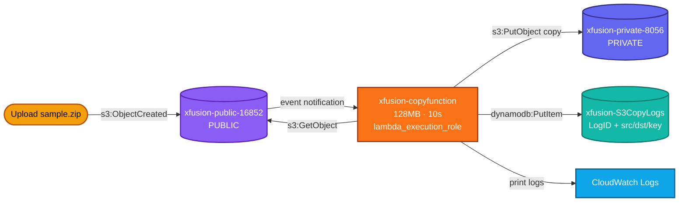
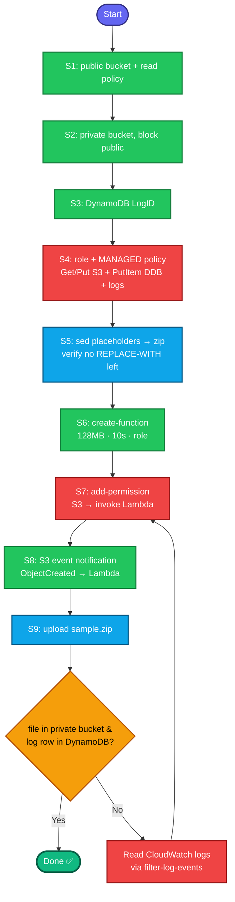

# Event-Driven S3 → Lambda → S3 + DynamoDB Pipeline (Complete Documentation)

**Goal:** When a file is uploaded to a **public** S3 bucket, a Lambda function automatically copies it to a **private** bucket and logs the operation to DynamoDB.

**A very common serverless interview scenario** — "build an event-driven pipeline."

```
Upload → public bucket → S3 event → Lambda → copy to private bucket
                                           └→ write log to DynamoDB
```

---

## 1. Concept (plain English)

This is an **event-driven serverless pipeline** — no servers, no polling. An **S3 event notification** fires a **Lambda** the instant a file lands in the public bucket. The Lambda copies the object to the private bucket and records a log row in DynamoDB.

The pipeline has **two kinds of "wiring"** that both must be correct:

1. **IAM permissions (the Lambda's role)** — what the Lambda is *allowed to do*: read source, write destination, write DynamoDB, write logs.
2. **The invoke permission** — S3's *permission to trigger* the Lambda (a resource-based policy on the function).

Miss either and the pipeline silently does nothing — no error, just no result.

---

## 2. The components and how they connect

| Component | Role in the pipeline |
|---|---|
| `xfusion-public-16852` (public bucket) | Upload target; source of the copy; fires the event |
| `xfusion-copyfunction` (Lambda) | Does the copy + writes the log; 128 MB / 10 s |
| `lambda_execution_role` | Grants the Lambda its permissions |
| `xfusion-private-8056` (private bucket) | Copy destination |
| `xfusion-S3CopyLogs` (DynamoDB) | Stores log entries (LogID + source/dest/key) |
| S3 event notification | Triggers the Lambda on `ObjectCreated` |
| Lambda resource policy | Lets S3 invoke the Lambda |

---

## 3. The "ports" of this pipeline (permissions, not network)

Unlike network tasks, connectivity here = **IAM permissions + invoke permission**:

| Permission | Granted at | Purpose |
|---|---|---|
| `AWSLambdaBasicExecutionRole` | role | Lambda writes CloudWatch logs |
| `s3:GetObject` on public bucket | role policy | Lambda reads the uploaded file |
| `s3:PutObject` on private bucket | role policy | Lambda writes the copy |
| `dynamodb:PutItem` on the table | role policy | Lambda writes the log |
| `lambda:InvokeFunction` for `s3.amazonaws.com` | function resource policy | **S3 is allowed to trigger the Lambda** |

> **The most-missed one is the invoke permission** (`add-permission`). Without it,
> S3 cannot call the Lambda and nothing happens — silently.

---

## 4. Full OTS pipeline (run stage by stage, single-line commands)

```bash
# STAGE 0 — variables
REGION=us-east-1
PUB_BUCKET=xfusion-public-16852
PRIV_BUCKET=xfusion-private-8056
TABLE=xfusion-S3CopyLogs
FUNC=xfusion-copyfunction
ROLE=lambda_execution_role
ACCOUNT_ID=$(aws sts get-caller-identity --query Account --output text)
```

```bash
# STAGE 1 — public bucket (public access ALLOWED)
aws s3api create-bucket --bucket $PUB_BUCKET --region $REGION
aws s3api put-public-access-block --bucket $PUB_BUCKET --public-access-block-configuration BlockPublicAcls=false,IgnorePublicAcls=false,BlockPublicPolicy=false,RestrictPublicBuckets=false
aws s3api put-bucket-policy --bucket $PUB_BUCKET --policy "{\"Version\":\"2012-10-17\",\"Statement\":[{\"Sid\":\"PublicRead\",\"Effect\":\"Allow\",\"Principal\":\"*\",\"Action\":\"s3:GetObject\",\"Resource\":\"arn:aws:s3:::$PUB_BUCKET/*\"}]}"
```

```bash
# STAGE 2 — private bucket (public access BLOCKED)
aws s3api create-bucket --bucket $PRIV_BUCKET --region $REGION
aws s3api put-public-access-block --bucket $PRIV_BUCKET --public-access-block-configuration BlockPublicAcls=true,IgnorePublicAcls=true,BlockPublicPolicy=true,RestrictPublicBuckets=true
```

```bash
# STAGE 3 — DynamoDB table (partition key LogID)
aws dynamodb create-table --table-name $TABLE --attribute-definitions AttributeName=LogID,AttributeType=S --key-schema AttributeName=LogID,KeyType=HASH --billing-mode PAY_PER_REQUEST --region $REGION
aws dynamodb wait table-exists --table-name $TABLE --region $REGION
```

```bash
# STAGE 4 — IAM role + permissions
# 4a. role with Lambda trust policy
aws iam create-role --role-name $ROLE --assume-role-policy-document '{"Version":"2012-10-17","Statement":[{"Effect":"Allow","Principal":{"Service":"lambda.amazonaws.com"},"Action":"sts:AssumeRole"}]}'
# 4b. basic execution (logs)
aws iam attach-role-policy --role-name $ROLE --policy-arn arn:aws:iam::aws:policy/service-role/AWSLambdaBasicExecutionRole
# 4c. permissions — via MANAGED policy (inline put-role-policy is often DENIED in labs)
POLICY_ARN=$(aws iam create-policy --policy-name xfusion-copy-policy --policy-document "{\"Version\":\"2012-10-17\",\"Statement\":[{\"Effect\":\"Allow\",\"Action\":[\"s3:GetObject\"],\"Resource\":\"arn:aws:s3:::$PUB_BUCKET/*\"},{\"Effect\":\"Allow\",\"Action\":[\"s3:PutObject\"],\"Resource\":\"arn:aws:s3:::$PRIV_BUCKET/*\"},{\"Effect\":\"Allow\",\"Action\":[\"dynamodb:PutItem\"],\"Resource\":\"arn:aws:dynamodb:$REGION:$ACCOUNT_ID:table/$TABLE\"}]}" --query 'Policy.Arn' --output text)
aws iam attach-role-policy --role-name $ROLE --policy-arn $POLICY_ARN
ROLE_ARN=$(aws iam get-role --role-name $ROLE --query 'Role.Arn' --output text)
sleep 10
```
> **Lab permission gotcha:** if `iam:PutRolePolicy` is denied (inline policy),
> use a **managed policy** (`create-policy` + `attach-role-policy`) as above. If
> `create-policy` is also denied, fall back to `AmazonS3FullAccess` +
> `AmazonDynamoDBFullAccess` (looser but always allowed).

```bash
# STAGE 5 — edit placeholders in lambda-function.py, then zip
# ALWAYS cat the file first to confirm placeholder strings + handler function name
sed -i "s/REPLACE-WITH-YOUR-DYNAMODB-TABLE/$TABLE/g; s/REPLACE-WITH-YOUR-PRIVATE-BUCKET/$PRIV_BUCKET/g" /root/lambda-function.py
grep -nE "REPLACE-WITH|dynamodb.Table|destination_bucket =" /root/lambda-function.py   # verify replaced, no REPLACE-WITH left
cd /root && zip function.zip lambda-function.py && cd -
```

```bash
# STAGE 6 — create the Lambda (handler = <file-without-.py>.<function-name>)
# lambda-function.py + def lambda_handler → lambda-function.lambda_handler
aws lambda create-function --function-name $FUNC --runtime python3.12 --handler lambda-function.lambda_handler --role $ROLE_ARN --zip-file fileb:///root/function.zip --memory-size 128 --timeout 10 --region $REGION
aws lambda wait function-active --function-name $FUNC --region $REGION
```

```bash
# STAGE 7 — allow S3 to invoke the Lambda (THE critical, most-missed step)
aws lambda add-permission --function-name $FUNC --statement-id s3invoke --action lambda:InvokeFunction --principal s3.amazonaws.com --source-arn arn:aws:s3:::$PUB_BUCKET --source-account $ACCOUNT_ID --region $REGION
```

```bash
# STAGE 8 — wire the S3 event notification → Lambda
FUNC_ARN=$(aws lambda get-function --function-name $FUNC --query 'Configuration.FunctionArn' --output text --region $REGION)
aws s3api put-bucket-notification-configuration --bucket $PUB_BUCKET --notification-configuration "{\"LambdaFunctionConfigurations\":[{\"LambdaFunctionArn\":\"$FUNC_ARN\",\"Events\":[\"s3:ObjectCreated:*\"]}]}" --region $REGION
```

```bash
# STAGE 9 — test + verify
aws s3 cp /root/sample.zip s3://$PUB_BUCKET/sample.zip --region $REGION
sleep 15
echo "=== private bucket (expect sample.zip) ==="
aws s3 ls s3://$PRIV_BUCKET/ --region $REGION
echo "=== dynamodb (expect a log row) ==="
aws dynamodb scan --table-name $TABLE --region $REGION --query 'Items[].{Log:LogID.S,Src:SourceBucket.S,Dst:DestinationBucket.S,Key:ObjectKey.S,Status:Status.S}' --output table
```

**Success = `sample.zip` in the private bucket AND a `Success` log row in DynamoDB.**

---

## 5. Colorful pipeline architecture



## 6. Colorful process flow



---

## 7. Troubleshooting table

| Symptom | Cause | Fix |
|---|---|---|
| `AccessDenied ... iam:PutRolePolicy` | Lab blocks inline policies | Use a **managed** policy (`create-policy` + `attach-role-policy`) |
| Upload does nothing, no log group | Lambda never triggered | Stage 7 invoke permission missing → add it, re-do Stage 8 |
| `AccessDenied` on copy (CloudWatch) | Role lacks S3 perms | Confirm the managed policy is attached |
| `AccessDenied` on PutItem | Role lacks DynamoDB perms | Same — check attached policies |
| Copies to wrong/no bucket | Placeholders not edited | Re-run Stage 5 sed + `update-function-code` |
| `Unable to import module` | Wrong handler name | Match `--handler` to `<file>.<function>` |
| `aws logs tail` → "Invalid choice" | CLI version lacks `tail` | Use `filter-log-events` or `get-log-events` instead |

**Reading Lambda logs (when `tail` is unavailable):**
```bash
aws logs filter-log-events --log-group-name /aws/lambda/xfusion-copyfunction \
  --region us-east-1 --start-time $(( ($(date +%s) - 300) * 1000 )) \
  --query 'events[].message' --output text
```
`ResourceNotFoundException` on the log group = the Lambda never ran = trigger/permission problem, not a code problem.

---

## 8. Key takeaways

1. **Event-driven pipeline = S3 notification → Lambda.** No polling, no servers.
2. **Two kinds of wiring:** the role's permissions (what Lambda can do) **and** the invoke permission (S3's right to trigger it). Both required.
3. **The invoke permission (`add-permission`) is the most-missed step** — without it, uploads silently do nothing. Do it *before* the event notification.
4. **Labs often block inline IAM policies** (`PutRolePolicy`) — use a managed policy instead.
5. **Always edit placeholders before zipping**, and verify with `grep` that no `REPLACE-WITH` remains.
6. **Handler = `<filename-without-.py>.<function-name>`** — here `lambda-function.lambda_handler`.
7. **The function's own `print` statements are your debugger** — CloudWatch shows exactly where it failed.
8. **`aws logs tail` isn't in every CLI build** — `filter-log-events` is the portable equivalent.

**Interview framing** for "design an S3-triggered pipeline": *"S3 event notification invokes a Lambda on ObjectCreated. The Lambda's execution role needs GetObject on the source, PutObject on the destination, and PutItem on the log table, plus basic execution for CloudWatch. Critically, the Lambda needs a resource-based policy allowing s3.amazonaws.com to invoke it — that's separate from the role and the single most common thing people forget."*

---

That's the full write-up with both diagrams. Want it saved as a downloadable `.md` file for your interview-prep folder alongside the ALB, NAT, ECS, and IAM-role guides?