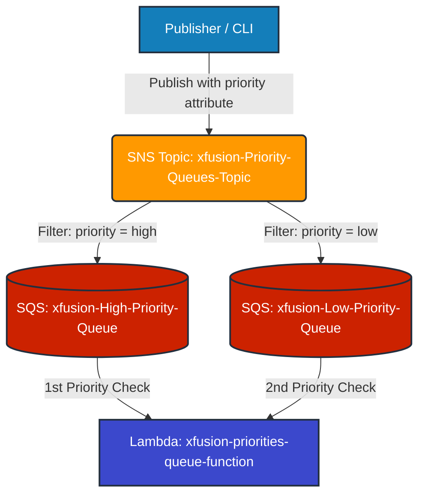

Here is the complete technical documentation for the **Priority Queuing Implementation**, including the full CloudFormation template, the Python Lambda code, the architectural flow, and the execution post-mortem.

---

## Technical Documentation & Architecture Specification

### System Architecture Flow



---

## Resource Configuration & Artifacts

### 1. CloudFormation Template (`/root/xfusion-priority-stack.yml`)

```yaml
AWSTemplateFormatVersion: '2010-09-09'
Description: AWS SQS and SNS Priority Queuing Stack with Lambda Consumer

Resources:
  # 1. IAM Execution Role for Lambda
  LambdaExecutionRole:
    Type: AWS::IAM::Role
    Properties:
      RoleName: lambda_execution_role
      AssumeRolePolicyDocument:
        Version: '2012-10-17'
        Statement:
          - Effect: Allow
            Principal:
              Service: lambda.amazonaws.com
            Action: sts:AssumeRole
      ManagedPolicyArns:
        - arn:aws:iam::aws:policy/service-role/AWSLambdaBasicExecutionRole
        - arn:aws:iam::aws:policy/AmazonSQSFullAccess

  # 2. SQS Queues
  HighPriorityQueue:
    Type: AWS::SQS::Queue
    Properties:
      QueueName: xfusion-High-Priority-Queue

  LowPriorityQueue:
    Type: AWS::SQS::Queue
    Properties:
      QueueName: xfusion-Low-Priority-Queue

  # 3. SNS Topic
  PriorityTopic:
    Type: AWS::SNS::Topic
    Properties:
      TopicName: xfusion-Priority-Queues-Topic

  # 4. SQS Queue Policies (Granting SNS permission to publish to SQS)
  HighPriorityQueuePolicy:
    Type: AWS::SQS::QueuePolicy
    Properties:
      Queues:
        - !Ref HighPriorityQueue
      PolicyDocument:
        Version: '2012-10-17'
        Statement:
          - Effect: Allow
            Principal:
              Service: sns.amazonaws.com
            Action: sqs:SendMessage
            Resource: !GetAtt HighPriorityQueue.Arn
            Condition:
              ArnEquals:
                aws:SourceArn: !Ref PriorityTopic

  LowPriorityQueuePolicy:
    Type: AWS::SQS::QueuePolicy
    Properties:
      Queues:
        - !Ref LowPriorityQueue
      PolicyDocument:
        Version: '2012-10-17'
        Statement:
          - Effect: Allow
            Principal:
              Service: sns.amazonaws.com
            Action: sqs:SendMessage
            Resource: !GetAtt LowPriorityQueue.Arn
            Condition:
              ArnEquals:
                aws:SourceArn: !Ref PriorityTopic

  # 5. SNS Subscriptions with Attribute Filtering
  HighPrioritySubscription:
    Type: AWS::SNS::Subscription
    Properties:
      TopicArn: !Ref PriorityTopic
      Protocol: sqs
      Endpoint: !GetAtt HighPriorityQueue.Arn
      RawMessageDelivery: true
      FilterPolicy:
        priority:
          - high

  LowPrioritySubscription:
    Type: AWS::SNS::Subscription
    Properties:
      TopicArn: !Ref PriorityTopic
      Protocol: sqs
      Endpoint: !GetAtt LowPriorityQueue.Arn
      RawMessageDelivery: true
      FilterPolicy:
        priority:
          - low

  # 6. Lambda Function Definition
  PriorityLambdaFunction:
    Type: AWS::Lambda::Function
    Properties:
      FunctionName: xfusion-priorities-queue-function
      Runtime: python3.9
      Handler: index.lambda_handler
      MemorySize: 128
      Timeout: 10
      Role: !GetAtt LambdaExecutionRole.Arn
      Environment:
        Variables:
          high_priority_queue: !Ref HighPriorityQueue
          low_priority_queue: !Ref LowPriorityQueue
      Code:
        ZipFile: |
          def lambda_handler(event, context):
              return "Placeholder - Code uploaded from /root/index.py"

```

---

### 2. Lambda Consumer Source Code (`/root/index.py`)

```python
import boto3
import os

sqs = boto3.client('sqs')

def delete_message(queue_url, receipt_handle, message):
    response = sqs.delete_message(QueueUrl=queue_url, ReceiptHandle=receipt_handle)
    return "Message " + "'" + message + "'" + " deleted"

def poll_messages(queue_url):
    QueueUrl = queue_url
    response = sqs.receive_message(
        QueueUrl=QueueUrl,
        AttributeNames=[],
        MaxNumberOfMessages=1,
        MessageAttributeNames=['All'],
        WaitTimeSeconds=3
    )
    if "Messages" in response:
        receipt_handle = response['Messages'][0]['ReceiptHandle']
        message = response['Messages'][0]['Body']
        delete_response = delete_message(QueueUrl, receipt_handle, message)
        return delete_response
    else:
        return "No more messages to poll"

def lambda_handler(event, context):
    # Strictly checks high priority queue before evaluating low priority queue
    response = poll_messages(os.environ['high_priority_queue'])
    if response == "No more messages to poll":
        response = poll_messages(os.environ['low_priority_queue'])
    return response

```

---

## Technical Learnings & Troubleshooting Post-Mortem

* **Event Source Mappings vs. Application-Level Polling:**
* *Discovery:* Configuring `AWS::Lambda::EventSourceMapping` attaches an AWS-managed poller that automatically drains queues asynchronously. Because `/root/index.py` handles queue polling explicitly using `boto3`, omitting the event source mappings was necessary to allow manual invocation order testing.


* **Raw Message Delivery:**
* *Discovery:* Standard SNS-to-SQS delivery wraps messages inside a JSON metadata envelope. Setting `RawMessageDelivery: true` on subscriptions ensures the raw string message payload is delivered directly to SQS matching `response['Messages'][0]['Body']`.


* **SQS Resource Authorization:**
* *Discovery:* SQS queues require an explicit `AWS::SQS::QueuePolicy` resource attached to grant `sns.amazonaws.com` permission to execute `sqs:SendMessage`.


* **CloudFormation Property Constraints:**
* *Discovery:* Specifying `FilterPolicyScope` directly caused API schema conflicts (`InvalidParameter: FilterPolicyScope: Invalid value`). Omitting the property allowed SNS to default to `MessageAttributes` scope evaluation automatically.


---

## Verification Output Log

```bash
# Invocation 1 (High Priority Message 1)
"Message 'High Priority message 1' deleted"

# Invocation 2 (High Priority Message 2)
"Message 'High Priority message 2' deleted"

# Invocation 3 (Low Priority Message 2)
"Message 'Low Priority message 2' deleted"

# Invocation 4 (Low Priority Message 1)
"Message 'Low Priority message 1' deleted"

```