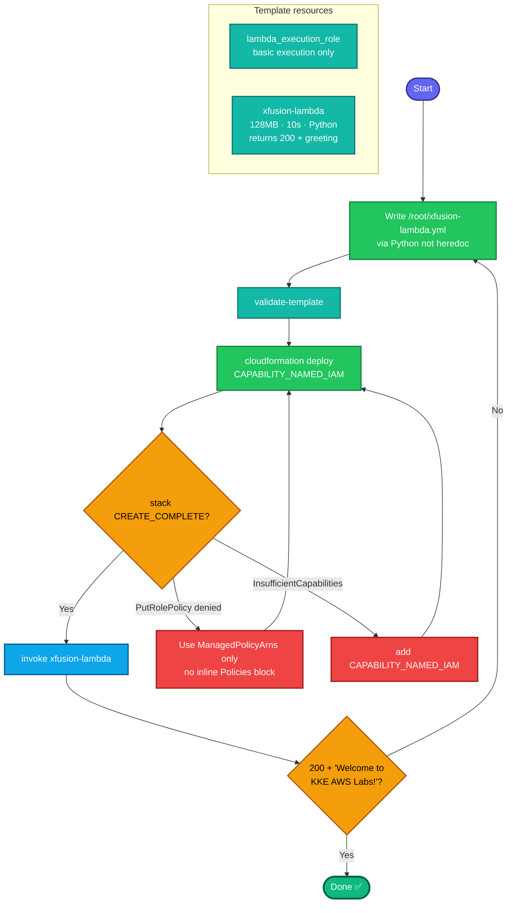

This is a simpler CloudFormation task — one Lambda + one role, all inline in the template. I've already accounted for the **`iam:PutRolePolicy` deny** you keep hitting (this role needs no custom policy anyway, just basic execution), and I'll write the template via Python to avoid the heredoc-truncation problem.

## Concept

CloudFormation deploys a Lambda + its IAM role from one YAML template. The function is trivial (returns 200 + a greeting), so the role only needs **basic execution** (CloudWatch logs) via a **managed policy ARN** — no inline policy, so no `PutRolePolicy` issue. The Lambda code is embedded inline with `Code: ZipFile`.

## Prerequisites

- `showcreds` first — CFN + Lambda; need working `AKIA`/secret.
- Region **us-east-1**.

## OTS (CLI, on aws-client)

```bash
REGION=us-east-1
STACK=xfusion-lambda-app

# 1. Write the template via Python (avoids heredoc truncation)
python3 - <<'PY'
tpl = '''AWSTemplateFormatVersion: '2010-09-09'
Description: Xfusion Lambda via CloudFormation
Resources:
  LambdaExecutionRole:
    Type: AWS::IAM::Role
    Properties:
      RoleName: lambda_execution_role
      AssumeRolePolicyDocument:
        Version: '2012-10-17'
        Statement:
          - Effect: Allow
            Principal:
              Service: lambda.amazonaws.com
            Action: sts:AssumeRole
      ManagedPolicyArns:
        - arn:aws:iam::aws:policy/service-role/AWSLambdaBasicExecutionRole
  XfusionLambda:
    Type: AWS::Lambda::Function
    Properties:
      FunctionName: xfusion-lambda
      Runtime: python3.12
      Handler: index.lambda_handler
      Role: !GetAtt LambdaExecutionRole.Arn
      MemorySize: 128
      Timeout: 10
      Code:
        ZipFile: |
          def lambda_handler(event, context):
              return {
                  'statusCode': 200,
                  'body': 'Welcome to KKE AWS Labs!'
              }
Outputs:
  FunctionName:
    Value: !Ref XfusionLambda
'''
with open('/root/xfusion-lambda.yml','w') as f:
    f.write(tpl)
print("Template written")
PY

# 2. Validate
aws cloudformation validate-template --template-body file:///root/xfusion-lambda.yml --region $REGION >/dev/null && echo "Valid"

# 3. Deploy (CAPABILITY_NAMED_IAM because of the named role)
aws cloudformation deploy \
  --template-file /root/xfusion-lambda.yml \
  --stack-name $STACK \
  --capabilities CAPABILITY_NAMED_IAM \
  --region $REGION
```

**Verify:**
```bash
# Stack resources all created
aws cloudformation describe-stack-resources --stack-name $STACK --region us-east-1 \
  --query 'StackResources[].{Type:ResourceType,Status:ResourceStatus}' --output table

# Invoke the function and check output
aws lambda invoke --function-name xfusion-lambda /tmp/out.json --region us-east-1
cat /tmp/out.json

# Confirm memory + timeout
aws lambda get-function-configuration --function-name xfusion-lambda --region us-east-1 \
  --query '{Mem:MemorySize,Timeout:Timeout,Runtime:Runtime,Role:Role}'
```
Expect all `CREATE_COMPLETE`, output `{"statusCode": 200, "body": "Welcome to KKE AWS Labs!"}`, `Mem=128`, `Timeout=10`.

## Runbook (console path)

1. Console → **CloudFormation → Create stack → With new resources**.
2. **Upload a template file** → upload `/root/xfusion-lambda.yml` (or paste it).
3. **Stack name:** `xfusion-lambda-app`.
4. **Acknowledge** the "IAM resources with custom names" checkbox (equivalent of `CAPABILITY_NAMED_IAM`).
5. **Create stack** → wait for **CREATE_COMPLETE**.
6. **Lambda → xfusion-lambda → Test** → confirm 200 + the greeting.

---

### Gotchas
- **`CAPABILITY_NAMED_IAM`** — required because the template creates a *named* role (`lambda_execution_role`). Missing it = deploy fails with InsufficientCapabilities.
- **No inline policy needed** — this Lambda only needs CloudWatch logs, satisfied by the managed `AWSLambdaBasicExecutionRole`. So you **avoid** the `iam:PutRolePolicy` deny entirely (no `Policies:` block).
- **Write via Python, not heredoc** — the `cat <<'YAML'` paste truncated your last template. The Python writer avoids that.
- **Handler `index.lambda_handler`** — the inline `ZipFile` code becomes `index.py` in Lambda; the function is `lambda_handler`.
- **Exact body** — `Welcome to KKE AWS Labs!` verbatim.
- **Inline ZipFile indentation** — the code sits indented under `ZipFile: |`; keep it consistent (the template above is correct).
- Region **us-east-1**; stack `xfusion-lambda-app`; function `xfusion-lambda`; role `lambda_execution_role`.

---

## Colorful flow diagram



This one's clean because the role needs **only basic execution** — so no inline policy, no `PutRolePolicy` deny, no workaround needed. The two things to get right: **`CAPABILITY_NAMED_IAM`** (named role) and **writing the template via Python** (not the truncation-prone heredoc). Run the OTS block, and the invoke should return `200` + the greeting on the first try. Want this saved as an interview-prep `.md` alongside the SNS/SQS CloudFormation one?