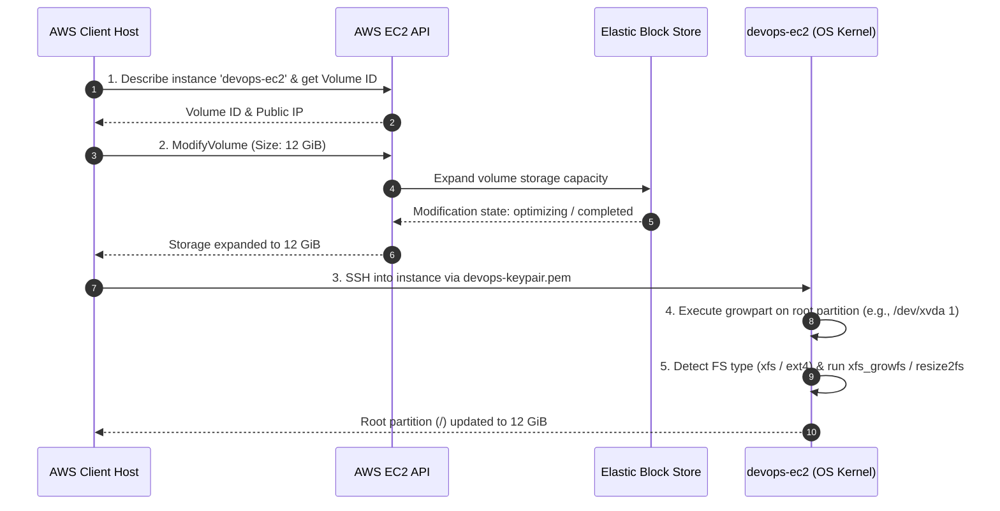

# EBS Volume Expansion: Complete Technical Documentation

This guide provides the complete documentation, architecture flow, and an automated script (`ots.sh`) to dynamically expand the EBS root volume of an active EC2 instance (`devops-ec2`) from **8 GiB to 12 GiB** and resize its filesystem on-the-fly without downtime.

---

## Technical Overview

When expanding an EC2 volume, AWS modifies the block storage capacity at the infrastructure level, but the Linux kernel and filesystem must be instructed to utilize the newly added space.

### Execution Workflow

1. **AWS EBS Modification**: Call AWS EC2 `ModifyVolume` API to scale capacity from 8 GiB to 12 GiB.
2. **Partition Expansion (`growpart`)**: Extend the partition boundary to claim unallocated disk sectors on the primary block device.
3. **Filesystem Resizing (`resize2fs` / `xfs_growfs`)**: Expand the filesystem layer over the resized partition (`/`).

---

## Architecture Flow Diagram



---

## One-Time Script (`ots.sh`)

This script handles the AWS API modification, waits for disk state optimization, SSH access detection, partition growth, and filesystem extension automatically.

```bash
#!/bin/bash
set -e

# ==========================================
# CONFIGURATION VARIABLES
# ==========================================
INSTANCE_NAME="devops-ec2"
NEW_SIZE=12
KEY_PATH="/root/devops-keypair.pem"
REGION="us-east-1" # Adjust region if needed

export AWS_DEFAULT_REGION=$REGION

chmod 400 "$KEY_PATH" 2>/dev/null || true

# ==========================================
# 1. IDENTIFY INSTANCE & VOLUME DETAILS
# ==========================================
echo "--> Fetching EC2 instance details for: $INSTANCE_NAME..."
INSTANCE_ID=$(aws ec2 describe-instances \
    --filters "Name=tag:Name,Values=$INSTANCE_NAME" "Name=instance-state-name,Values=running" \
    --query "Reservations[0].Instances[0].InstanceId" \
    --output text)

if [ "$INSTANCE_ID" == "None" ] || [ -z "$INSTANCE_ID" ]; then
    echo "ERROR: Running instance '$INSTANCE_NAME' not found."
    exit 1
fi

PUBLIC_IP=$(aws ec2 describe-instances \
    --instance-ids "$INSTANCE_ID" \
    --query "Reservations[0].Instances[0].PublicIpAddress" \
    --output text)

VOLUME_ID=$(aws ec2 describe-instances \
    --instance-ids "$INSTANCE_ID" \
    --query "Reservations[0].Instances[0].BlockDeviceMappings[0].Ebs.VolumeId" \
    --output text)

CURRENT_SIZE=$(aws ec2 describe-volumes \
    --volume-ids "$VOLUME_ID" \
    --query "Volumes[0].Size" \
    --output text)

echo "Instance ID:   $INSTANCE_ID"
echo "Public IP:     $PUBLIC_IP"
echo "Volume ID:     $VOLUME_ID"
echo "Current Size:  ${CURRENT_SIZE} GiB"

# ==========================================
# 2. EXPAND EBS VOLUME VIA AWS API
# ==========================================
if [ "$CURRENT_SIZE" -lt "$NEW_SIZE" ]; then
    echo "--> Expanding EBS Volume $VOLUME_ID to ${NEW_SIZE} GiB..."
    aws ec2 modify-volume --volume-id "$VOLUME_ID" --size "$NEW_SIZE" > /dev/null
    
    echo "--> Waiting for volume state to update..."
    until [ "$(aws ec2 describe-volumes-modifications --volume-ids "$VOLUME_ID" --query "VolumesModifications[0].ModificationState" --output text 2>/dev/null)" == "completed" ] || \
          [ "$(aws ec2 describe-volumes-modifications --volume-ids "$VOLUME_ID" --query "VolumesModifications[0].ModificationState" --output text 2>/dev/null)" == "optimizing" ]; do
        sleep 3
    done
    echo "Volume expansion initiated successfully."
else
    echo "--> Volume $VOLUME_ID is already ${CURRENT_SIZE} GiB. Skipping AWS volume modification."
fi

# ==========================================
# 3. DETECT VALID SSH USER
# ==========================================
echo "--> Testing SSH user access..."
SSH_USER=""
if ssh -o StrictHostKeyChecking=no -o ConnectTimeout=5 -i "$KEY_PATH" ubuntu@"$PUBLIC_IP" "echo ready" &>/dev/null; then
    SSH_USER="ubuntu"
elif ssh -o StrictHostKeyChecking=no -o ConnectTimeout=5 -i "$KEY_PATH" ec2-user@"$PUBLIC_IP" "echo ready" &>/dev/null; then
    SSH_USER="ec2-user"
else
    echo "ERROR: Unable to establish SSH connection with key $KEY_PATH."
    exit 1
fi

echo "Connecting as: $SSH_USER"

# ==========================================
# 4. EXPAND PARTITION AND FILESYSTEM
# ==========================================
echo "--> Resizing partition and filesystem inside host OS..."
ssh -o StrictHostKeyChecking=no -i "$KEY_PATH" "$SSH_USER@$PUBLIC_IP" << 'EOF'
  set -e

  # Determine root filesystem device
  ROOT_DEV=$(df / | tail -n1 | awk '{print $1}')
  
  # Strip trailing partition numbers (e.g. /dev/xvda1 -> /dev/xvda, /dev/nvme0n1p1 -> /dev/nvme0n1)
  PARENT_DISK=$(echo "$ROOT_DEV" | sed -E 's/p?[0-9]+$//')
  PART_NUM=$(echo "$ROOT_DEV" | grep -o '[0-9]*$')

  echo "Target Disk: $PARENT_DISK, Partition: $PART_NUM"

  # Expand partition table entry
  sudo growpart "$PARENT_DISK" "$PART_NUM" || true

  # Determine FS type and trigger resize
  FS_TYPE=$(df -T / | tail -n1 | awk '{print $2}')
  echo "Filesystem Type: $FS_TYPE"

  if [ "$FS_TYPE" == "xfs" ]; then
      sudo xfs_growfs /
  else
      sudo resize2fs "$ROOT_DEV"
  fi

  echo "--> Verification - Current Disk Usage:"
  df -h /
EOF

echo "=========================================="
echo "VOLUME EXPANSION COMPLETED SUCCESSFULLY"
echo "=========================================="

```

---

## Step-by-Step Execution Guide

### 1. Save and Prepare the Script

Run these commands on the `aws-client` host:

```bash
vi ots.sh
chmod +x ots.sh

```

### 2. Run the Script

```bash
./ots.sh

```

---

## Verification Runbook

Confirm that the changes are reflected on the target instance manually:

```bash
# 1. Fetch Instance Public IP
PUBLIC_IP=$(aws ec2 describe-instances --filters "Name=tag:Name,Values=devops-ec2" --query "Reservations[0].Instances[0].PublicIpAddress" --output text)

# 2. Check Disk Partition Layout
ssh -i /root/devops-keypair.pem ubuntu@$PUBLIC_IP "lsblk"

# 3. Check Root Mount Filesystem Size
ssh -i /root/devops-keypair.pem ubuntu@$PUBLIC_IP "df -h /"

```

### Expected Result

The output of `df -h /` will display approximately **12 GiB** for the `/` mount point:

```text
Filesystem      Size  Used Avail Use% Mounted on
/dev/root        12G  1.2G   11G  10% /

```