Your Azure Load Balancer setup completed successfully. The public load balancer `xfusion-lb`, frontend public IP `xfusion-lb-ip`, backend pool `xfusion-backend-pool`, health probe `xfusion-health-probe`, load-balancing rule `xfusion-lb-rule`, and NSG rule `allow-http-80` were all created successfully, and the load balancer now exposes the Nginx VM through public IP `40.87.18.222`.[user query]

## OTS

```bash
#!/usr/bin/env bash
set -euo pipefail

echo "=== STEP 0: Azure login ==="
az account show >/dev/null 2>&1 || az login --use-device-code >/dev/null

echo
echo "=== STEP 1: Discover default resource group dynamically ==="
RG="$(az group list --query "[0].name" -o tsv)"
if [[ -z "${RG}" ]]; then
  echo "ERROR: No resource group found."
  exit 1
fi
echo "Resource Group : ${RG}"

echo
echo "=== STEP 2: Discover VM, NIC and NSG dynamically ==="
VM_NAME="$(az vm list -g "${RG}" --query "[0].name" -o tsv)"
if [[ -z "${VM_NAME}" ]]; then
  echo "ERROR: No VM found in resource group."
  exit 1
fi

VM_ID="$(az vm show -g "${RG}" -n "${VM_NAME}" --query id -o tsv)"
NIC_ID="$(az vm show -g "${RG}" -n "${VM_NAME}" --query "networkProfile.networkInterfaces[0].id" -o tsv)"
if [[ -z "${NIC_ID}" ]]; then
  echo "ERROR: Could not determine NIC for VM ${VM_NAME}."
  exit 1
fi

NIC_NAME="$(basename "${NIC_ID}")"
NIC_RG="$(echo "${NIC_ID}" | awk -F/ '{print $5}')"

IPCONFIG_NAME="$(az network nic show \
  --resource-group "${NIC_RG}" \
  --name "${NIC_NAME}" \
  --query "ipConfigurations[0].name" -o tsv)"

if [[ -z "${IPCONFIG_NAME}" ]]; then
  echo "ERROR: Could not determine NIC IP configuration name."
  exit 1
fi

NSG_ID="$(az network nic show \
  --resource-group "${NIC_RG}" \
  --name "${NIC_NAME}" \
  --query "networkSecurityGroup.id" -o tsv)"

if [[ -z "${NSG_ID}" ]]; then
  echo "ERROR: No NSG attached to NIC ${NIC_NAME}."
  exit 1
fi

NSG_NAME="$(basename "${NSG_ID}")"
NSG_RG="$(echo "${NSG_ID}" | awk -F/ '{print $5}')"

echo "VM Name         : ${VM_NAME}"
echo "VM Resource ID  : ${VM_ID}"
echo "NIC Name        : ${NIC_NAME}"
echo "NIC Resource Gp : ${NIC_RG}"
echo "IP Config Name  : ${IPCONFIG_NAME}"
echo "NSG Name        : ${NSG_NAME}"
echo "NSG Resource Gp : ${NSG_RG}"

echo
echo "=== STEP 3: Create public IP for load balancer frontend ==="
az network public-ip create \
  --resource-group "${RG}" \
  --name xfusion-lb-ip \
  --sku Standard \
  --allocation-method Static \
  -o table

echo
echo "=== STEP 4: Create Azure Load Balancer ==="
az network lb create \
  --resource-group "${RG}" \
  --name xfusion-lb \
  --sku Standard \
  --public-ip-address xfusion-lb-ip \
  --frontend-ip-name xfusion-lb-ip \
  --backend-pool-name xfusion-backend-pool \
  -o table

echo
echo "=== STEP 5: Add VM NIC to backend pool ==="
az network nic ip-config address-pool add \
  --resource-group "${NIC_RG}" \
  --nic-name "${NIC_NAME}" \
  --ip-config-name "${IPCONFIG_NAME}" \
  --lb-name xfusion-lb \
  --address-pool xfusion-backend-pool \
  -o table

echo
echo "=== STEP 6: Create health probe ==="
az network lb probe create \
  --resource-group "${RG}" \
  --lb-name xfusion-lb \
  --name xfusion-health-probe \
  --protocol tcp \
  --port 80 \
  -o table

echo
echo "=== STEP 7: Create load balancer rule ==="
az network lb rule create \
  --resource-group "${RG}" \
  --lb-name xfusion-lb \
  --name xfusion-lb-rule \
  --protocol tcp \
  --frontend-port 80 \
  --backend-port 80 \
  --frontend-ip-name xfusion-lb-ip \
  --backend-pool-name xfusion-backend-pool \
  --probe-name xfusion-health-probe \
  --disable-outbound-snat true \
  -o table

echo
echo "=== STEP 8: Add NSG inbound rule for HTTP ==="
az network nsg rule create \
  --resource-group "${NSG_RG}" \
  --nsg-name "${NSG_NAME}" \
  --name allow-http-80 \
  --priority 100 \
  --direction Inbound \
  --access Allow \
  --protocol Tcp \
  --source-address-prefixes '*' \
  --source-port-ranges '*' \
  --destination-address-prefixes '*' \
  --destination-port-ranges 80 \
  -o table

echo
echo "=== STEP 9: Fetch load balancer public IP ==="
LB_PUBLIC_IP="$(az network public-ip show \
  --resource-group "${RG}" \
  --name xfusion-lb-ip \
  --query ipAddress -o tsv)"

if [[ -z "${LB_PUBLIC_IP}" ]]; then
  echo "ERROR: Could not retrieve load balancer public IP."
  exit 1
fi

echo "Load Balancer Public IP : ${LB_PUBLIC_IP}"

echo
echo "=== SUCCESS ==="
echo "Load Balancer Name : xfusion-lb"
echo "Frontend IP Name   : xfusion-lb-ip"
echo "Backend Pool Name  : xfusion-backend-pool"
echo "Probe Name         : xfusion-health-probe"
echo "Rule Name          : xfusion-lb-rule"
echo "NSG Rule           : allow-http-80"
echo "Public IP          : ${LB_PUBLIC_IP}"
```

## Runbook

1. The script dynamically discovered the default resource group as `kml_rg_main-443004eb0dae427d` and the target VM as `xfusion-vm`.[user query]
2. It correctly identified the VM NIC `xfusion-vmVMNic`, real IP configuration `ipconfigxfusion-vm`, and NSG `xfusion-vmNSG`, then attached that NIC IP configuration to the load balancer backend pool.[user query]
3. After that, it created the TCP health probe on port 80, created the load-balancing rule from frontend port 80 to backend port 80, added the NSG inbound allow rule on port 80, and exposed the service on public IP `40.87.18.222`.[user query]

## Documentation

The deployment succeeded because the load balancer frontend was backed by a Standard public IP, the VM NIC was attached to the backend pool using its actual IP configuration name, and the health probe was configured on port 80 where Nginx is listening.[user query] The NSG rule `allow-http-80` was necessary so HTTP traffic from the load balancer path could reach the VM, and the load balancer rule now forwards requests from `40.87.18.222:80` to the backend VM on port 80.[user query]

## Mermaid diagram

```mermaid
flowchart LR
    U[User / Browser] --> PIP[Public IP<br/>40.87.18.222<br/>xfusion-lb-ip]
    PIP --> LB[Azure Load Balancer<br/>xfusion-lb]
    LB --> FE[Frontend IP Config<br/>xfusion-lb-ip]
    FE --> RULE[LB Rule<br/>xfusion-lb-rule<br/>80 to 80]
    RULE --> BP[Backend Pool<br/>xfusion-backend-pool]
    BP --> NIC[NIC<br/>xfusion-vmVMNic<br/>ipconfigxfusion-vm]
    NIC --> NSG[NSG Rule<br/>allow-http-80]
    NSG --> VM[VM<br/>xfusion-vm]
    VM --> NGINX[Nginx Service<br/>Port 80]
    LB --> PROBE[Health Probe<br/>xfusion-health-probe<br/>TCP 80]
    PROBE --> NGINX

    style U fill:#E3F2FD,stroke:#1E88E5,stroke-width:2px,color:#0D47A1
    style PIP fill:#FFF3E0,stroke:#FB8C00,stroke-width:2px,color:#E65100
    style LB fill:#E8F5E9,stroke:#43A047,stroke-width:2px,color:#1B5E20
    style FE fill:#F3E5F5,stroke:#8E24AA,stroke-width:2px,color:#4A148C
    style RULE fill:#FCE4EC,stroke:#D81B60,stroke-width:2px,color:#880E4F
    style BP fill:#E0F7FA,stroke:#00ACC1,stroke-width:2px,color:#006064
    style NIC fill:#F1F8E9,stroke:#7CB342,stroke-width:2px,color:#33691E
    style NSG fill:#FFF8E1,stroke:#F9A825,stroke-width:2px,color:#F57F17
    style VM fill:#E8EAF6,stroke:#3949AB,stroke-width:2px,color:#1A237E
    style NGINX fill:#EDE7F6,stroke:#5E35B1,stroke-width:2px,color:#311B92
    style PROBE fill:#FFEBEE,stroke:#E53935,stroke-width:2px,color:#B71C1C
```



The diagram shows the real flow: the user connects to the public IP, the load balancer applies the frontend and rule, forwards traffic to the backend pool, the VM NIC receives it through the NSG rule, and Nginx serves the page while the health probe continuously checks port 80.[user query]