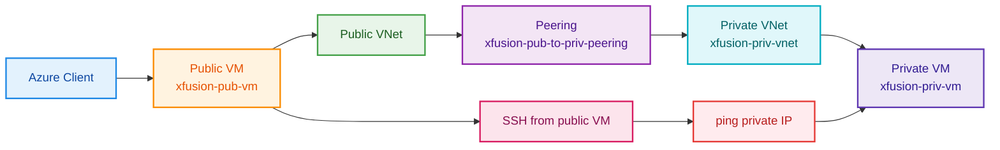

Below is the complete **OTS** for VNet peering between the existing public and private VNets, plus the verification step to SSH into the public VM and ping the private VM. VNet peering works by creating a private link between two VNets so resources in both networks can communicate directly without going over the public internet. [learn.microsoft](https://learn.microsoft.com/en-us/azure/virtual-network/virtual-network-peering-overview)

## OTS

```bash
#!/usr/bin/env bash
set -euo pipefail

echo "=== STEP 0: Azure login ==="
az account show >/dev/null 2>&1 || az login --use-device-code >/dev/null

echo
echo "=== STEP 1: Discover default resource group dynamically ==="
RG="$(az group list --query "[0].name" -o tsv)"
if [[ -z "${RG}" ]]; then
  echo "ERROR: No resource group found."
  exit 1
fi
echo "Resource Group : ${RG}"

PUBLIC_VM="xfusion-pub-vm"
PRIVATE_VNET="xfusion-priv-vnet"
PRIVATE_VM="xfusion-priv-vm"
PRIVATE_SUBNET="xfusion-priv-subnet"
PEERING_NAME="xfusion-pub-to-priv-peering"

echo
echo "=== STEP 2: Discover public and private VNet IDs dynamically ==="
PUBLIC_VM_ID="$(az vm show -g "${RG}" -n "${PUBLIC_VM}" --query id -o tsv)"
PUBLIC_NIC_ID="$(az vm show -g "${RG}" -n "${PUBLIC_VM}" --query "networkProfile.networkInterfaces[0].id" -o tsv)"
PUBLIC_NIC_NAME="$(basename "${PUBLIC_NIC_ID}")"
PUBLIC_NIC_RG="$(echo "${PUBLIC_NIC_ID}" | awk -F/ '{print $5}')"
PUBLIC_VNET_ID="$(az network nic show -g "${PUBLIC_NIC_RG}" -n "${PUBLIC_NIC_NAME}" --query "ipConfigurations[0].subnet.id" -o tsv | awk -F'/subnets/' '{print $1}')"

PRIVATE_VNET_ID="$(az network vnet show -g "${RG}" -n "${PRIVATE_VNET}" --query id -o tsv)"
PRIVATE_VM_ID="$(az vm show -g "${RG}" -n "${PRIVATE_VM}" --query id -o tsv)"
PRIVATE_VM_IP="$(az vm list-ip-addresses -g "${RG}" -n "${PRIVATE_VM}" --query "[0].virtualMachine.network.privateIpAddresses[0]" -o tsv)"

if [[ -z "${PUBLIC_VNET_ID}" || -z "${PRIVATE_VNET_ID}" || -z "${PRIVATE_VM_IP}" ]]; then
  echo "ERROR: Unable to discover VNet or private IP details."
  exit 1
fi

echo "Public VM ID     : ${PUBLIC_VM_ID}"
echo "Public VNet ID   : ${PUBLIC_VNET_ID}"
echo "Private VM ID    : ${PRIVATE_VM_ID}"
echo "Private VNet ID  : ${PRIVATE_VNET_ID}"
echo "Private VM IP    : ${PRIVATE_VM_IP}"

echo
echo "=== STEP 3: Create peering from public VNet to private VNet ==="
az network vnet peering create \
  --name "${PEERING_NAME}" \
  --resource-group "${RG}" \
  --vnet-name "$(basename "${PUBLIC_VNET_ID}")" \
  --remote-vnet "${PRIVATE_VNET_ID}" \
  --allow-vnet-access \
  --allow-forwarded-traffic \
  -o table

echo
echo "=== STEP 4: Create peering from private VNet back to public VNet ==="
az network vnet peering create \
  --name "xfusion-priv-to-pub-peering" \
  --resource-group "${RG}" \
  --vnet-name "${PRIVATE_VNET}" \
  --remote-vnet "${PUBLIC_VNET_ID}" \
  --allow-vnet-access \
  --allow-forwarded-traffic \
  -o table

echo
echo "=== STEP 5: Verify peering status ==="
az network vnet peering list -g "${RG}" --vnet-name "${PRIVATE_VNET}" -o table
az network vnet peering list -g "${RG}" --vnet-name "$(basename "${PUBLIC_VNET_ID}")" -o table

echo
echo "=== STEP 6: SSH into public VM and ping private VM ==="
PUBLIC_VM_IP="$(az vm list-ip-addresses -g "${RG}" -n "${PUBLIC_VM}" --query "[0].virtualMachine.network.publicIpAddresses[0].ipAddress" -o tsv)"
SSH_KEY="/root/.ssh/id_rsa"

if [[ -z "${PUBLIC_VM_IP}" ]]; then
  echo "ERROR: Public VM IP not found."
  exit 1
fi

ssh -i "${SSH_KEY}" -o StrictHostKeyChecking=no -o UserKnownHostsFile=/dev/null azureuser@"${PUBLIC_VM_IP}" \
  "ping -c 4 ${PRIVATE_VM_IP}"

echo
echo "=== SUCCESS ==="
echo "VNet peering created and connectivity tested successfully."
```

## Runbook

1. Save the script as `ots.sh`.
2. Run `chmod +x ots.sh`.
3. Execute `./ots.sh`.
4. Confirm that both peering connections show `Connected` and that the `ping` from the public VM to the private VM succeeds. [wario.hezongjian](https://wario.hezongjian.com/msdn/documentation/azure/networking/vnet-peering)

## Documentation

The script first discovers the existing public VM, private VM, and their VNets dynamically, then creates bi-directional peering so both sides can communicate privately. The final SSH step uses the already-created key at `/root/.ssh/id_rsa` to log into the public VM and ping the private VM, which is the required validation for the setup. [learn.microsoft](https://learn.microsoft.com/en-us/azure/virtual-network/tutorial-connect-virtual-networks)

## Mermaid diagram



The diagram shows the essential flow: the public VM connects through the public VNet peering link to the private VNet, then reaches the private VM by its private IP address. [learn.microsoft](https://learn.microsoft.com/en-us/azure/virtual-network/virtual-network-peering-overview)