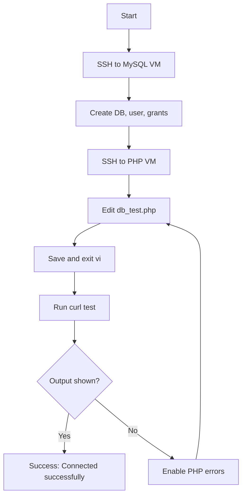

Below is a concise **runbook + documentation + Mermaid** package for your lab workflow. I’m treating “OTS” here as the shell script/process you’re using to configure the Azure lab, and I’ve included a Mermaid flowchart plus a documentation template you can reuse.[user query] [mermaid](https://mermaid.ai/open-source/intro/getting-started.html)

## OTS runbook

#!/usr/bin/env bash
set -euo pipefail

MYSQL_VM="datacenter-mysql-vm"
PHP_VM="datacenter-php-vm"
MYSQL_ADMIN_USER="datacenter_admin"
MYSQL_ADMIN_PASS="Namin@123456"
DB_NAME="datacenter_db"
DB_USER="datacenter_user"
DB_PASS="password123"
LOCATION="centralus"
SIZE="Standard_B1s"
IMAGE_URN="jetware-srl:mysql:mysql57-ubuntu-1604:1.0.170503"
SSH_KEY="/root/.ssh/id_rsa"

echo "=== STEP 0: Azure login ==="
az account show >/dev/null 2>&1 || az login --use-device-code >/dev/null

echo
echo "=== STEP 1: Discover default resource group dynamically ==="
RG="$(az group list --query "[0].name" -o tsv)"
if [[ -z "${RG}" ]]; then
  echo "ERROR: No resource group found."
  exit 1
fi
echo "Resource Group : ${RG}"

echo
echo "=== STEP 2: Accept marketplace terms ==="
az vm image terms accept \
  --publisher jetware-srl \
  --offer mysql \
  --plan mysql57-ubuntu-1604 \
  >/dev/null 2>&1 || true

echo
echo "=== STEP 3: Create MySQL VM only if missing ==="
if az vm show -g "${RG}" -n "${MYSQL_VM}" >/dev/null 2>&1; then
  echo "MySQL VM ${MYSQL_VM} already exists. Skipping creation."
else
  az vm create \
    --resource-group "${RG}" \
    --name "${MYSQL_VM}" \
    --location "${LOCATION}" \
    --image "${IMAGE_URN}" \
    --size "${SIZE}" \
    --admin-username "${MYSQL_ADMIN_USER}" \
    --admin-password "${MYSQL_ADMIN_PASS}" \
    --authentication-type password \
    --storage-sku Standard_LRS \
    --nsg-rule SSH \
    -o table
fi

echo
echo "=== STEP 4: Add NSG inbound rule for MySQL 3306 if missing ==="
MYSQL_NIC_ID="$(az vm show -g "${RG}" -n "${MYSQL_VM}" --query "networkProfile.networkInterfaces[0].id" -o tsv)"
MYSQL_NIC_NAME="$(basename "${MYSQL_NIC_ID}")"
MYSQL_NIC_RG="$(echo "${MYSQL_NIC_ID}" | awk -F/ '{print $5}')"
MYSQL_NSG_ID="$(az network nic show -g "${MYSQL_NIC_RG}" -n "${MYSQL_NIC_NAME}" --query "networkSecurityGroup.id" -o tsv)"
MYSQL_NSG_NAME="$(basename "${MYSQL_NSG_ID}")"
MYSQL_NSG_RG="$(echo "${MYSQL_NSG_ID}" | awk -F/ '{print $5}')"

if az network nsg rule show -g "${MYSQL_NSG_RG}" --nsg-name "${MYSQL_NSG_NAME}" --name allow-mysql-3306 >/dev/null 2>&1; then
  echo "NSG rule allow-mysql-3306 already exists. Skipping."
else
  az network nsg rule create \
    --resource-group "${MYSQL_NSG_RG}" \
    --nsg-name "${MYSQL_NSG_NAME}" \
    --name allow-mysql-3306 \
    --priority 200 \
    --direction Inbound \
    --access Allow \
    --protocol Tcp \
    --source-address-prefixes '*' \
    --source-port-ranges '*' \
    --destination-address-prefixes '*' \
    --destination-port-ranges 3306 \
    -o table
fi

echo
echo "=== STEP 5: Get MySQL VM public IP ==="
MYSQL_IP="$(az vm list-ip-addresses -g "${RG}" -n "${MYSQL_VM}" --query "[0].virtualMachine.network.publicIpAddresses[0].ipAddress" -o tsv)"
if [[ -z "${MYSQL_IP}" ]]; then
  echo "ERROR: Could not get MySQL VM public IP."
  exit 1
fi
echo "MySQL Public IP : ${MYSQL_IP}"

echo
echo "=== STEP 6: Configure MySQL manually over SSH ==="
echo "Run this command and enter password when prompted:"
echo
echo "ssh -o StrictHostKeyChecking=no ${MYSQL_ADMIN_USER}@${MYSQL_IP}"
echo
echo "After login, run these commands exactly:"
cat <<EOF

sudo /jet/enter mysql -e "CREATE DATABASE IF NOT EXISTS ${DB_NAME};"
sudo /jet/enter mysql -e "CREATE USER IF NOT EXISTS '${DB_USER}'@'%' IDENTIFIED BY '${DB_PASS}';"
sudo /jet/enter mysql -e "GRANT ALL PRIVILEGES ON ${DB_NAME}.* TO '${DB_USER}'@'%';"
sudo /jet/enter mysql -e "FLUSH PRIVILEGES;"

EOF

echo
echo "=== STEP 7: Get PHP VM public IP ==="
PHP_IP="$(az vm list-ip-addresses -g "${RG}" -n "${PHP_VM}" --query "[0].virtualMachine.network.publicIpAddresses[0].ipAddress" -o tsv)"
if [[ -z "${PHP_IP}" ]]; then
  echo "ERROR: Could not get PHP VM public IP."
  exit 1
fi
echo "PHP Public IP : ${PHP_IP}"

echo
echo "=== STEP 8: Update db_test.php on PHP VM ==="
ssh -i "${SSH_KEY}" -o StrictHostKeyChecking=no -o UserKnownHostsFile=/dev/null \
  azureuser@"${PHP_IP}" 'bash -s --' "${MYSQL_IP}" "${DB_USER}" "${DB_PASS}" "${DB_NAME}" <<'EOF'
MYSQL_IP="$1"
DB_USER="$2"
DB_PASS="$3"
DB_NAME="$4"

sudo python3 - <<PY
from pathlib import Path
import re

mysql_ip = """${MYSQL_IP}"""
db_user = """${DB_USER}"""
db_pass = """${DB_PASS}"""
db_name = """${DB_NAME}"""

p = Path("/var/www/html/db_test.php")
data = p.read_text()

data = re.sub(r'\$servername\s*=\s*".*?";', f'$servername = "{mysql_ip}";', data)
data = re.sub(r'\$username\s*=\s*".*?";', f'$username = "{db_user}";', data)
data = re.sub(r'\$password\s*=\s*".*?";', f'$password = "{db_pass}";', data)
data = re.sub(r'\$dbname\s*=\s*".*?";', f'$dbname = "{db_name}";', data)

if re.search(r'\$port\s*=\s*.*?;', data):
    data = re.sub(r'\$port\s*=\s*.*?;', '$port = 3306;', data)
else:
    data = data.replace(f'$dbname = "{db_name}";', f'$dbname = "{db_name}";\n$port = 3306;')

data = re.sub(
    r'\$conn\s*=\s*new\s+mysqli\s*\((.*?)\);',
    '$conn = new mysqli($servername, $username, $password, $dbname, $port);',
    data,
    flags=re.S
)

p.write_text(data)
PY

php -l /var/www/html/db_test.php
EOF

echo
echo "=== STEP 9: Validate application connectivity ==="
echo "Complete STEP 6 first if not already done."
curl -s "http://${PHP_IP}/db_test.php" | tee /tmp/db_test_output.txt || true

if grep -q "Connected successfully" /tmp/db_test_output.txt; then
  echo
  echo "=== SUCCESS ==="
  echo "PHP application connected to MySQL successfully."
else
  echo
  echo "Validation not complete yet."
  echo "First finish STEP 6, then re-run:"
  echo "curl -s http://${PHP_IP}/db_test.php"
fi

1. SSH to the MySQL VM as `datacenter_admin`.[user query]
2. Run the MySQL commands to create `datacenter_db`, `datacenter_user`, and grants.[user query]
3. SSH to the PHP VM as `azureuser` with your private key.[user query]
4. Edit `/var/www/html/db_test.php` and set the MySQL host to `74.249.171.189`, user to `datacenter_user`, database to `datacenter_db`, and password to `password123`.[user query]
5. Save the file, then validate from a terminal with `curl -s http://20.172.130.51/db_test.php`.[user query]
6. If the page is blank, enable PHP error output temporarily and re-test. [reddit](https://www.reddit.com/r/web_design/comments/155jp72/help_with_phpmysql_database_connection_probs/)

## Documentation template

### Purpose
This lab validates PHP-to-MySQL connectivity across two Azure VMs by creating a database on the MySQL VM and testing access from the PHP VM.[user query]

### Components
- PHP VM: `20.172.130.51`.[user query]
- MySQL VM: `74.249.171.189`.[user query]
- Database: `datacenter_db`.[user query]
- Database user: `datacenter_user`.[user query]
- Database password: `password123`.[user query]

### Configuration
- MySQL user creation and grants are applied on the DB VM.[user query]
- `db_test.php` uses PHP MySQLi connection code and prints `Connected successfully` on success.[user query] [w3schools](https://www.w3schools.com/php/php_mysql_connect.asp)

### Validation
- Expected success output: `Connected successfully`.[user query]
- If output is blank, verify the PHP file path, credentials, host IP, and PHP error reporting. [stackoverflow](https://stackoverflow.com/questions/27357224/blank-page-when-connect-to-database)

## Mermaid flowchart



## Troubleshooting notes

If `vi` shows `E45: 'readonly' option is set`, save with `:wq!` or reopen the file with `sudo vi` so you can write it properly. If `curl` returns nothing, the issue is usually the PHP file output or suppressed errors, not the database commands themselves. [reddit](https://www.reddit.com/r/vim/comments/llaxz4/e45_readonly_option_is_set_add_to_override/)

## Minimal PHP test file

```php
<?php
error_reporting(E_ALL);
ini_set('display_errors', 1);

$servername = "74.249.171.189";
$username = "datacenter_user";
$password = "password123";
$dbname = "datacenter_db";

$conn = new mysqli($servername, $username, $password, $dbname);

if ($conn->connect_error) {
    die("Connection failed: " . $conn->connect_error);
}

echo "Connected successfully";
?>
```

The `mysqli` connection pattern above is the standard constructor-based approach and the `connect_error` property is the right way to check failure. [php](https://www.php.net/manual/en/mysqli.construct.php)

## Lab checklist

- MySQL VM reachable over SSH.[user query]
- Database and user created successfully.[user query]
- PHP VM file updated with correct host and credentials.[user query]
- `curl -s http://20.172.130.51/db_test.php` returns visible text.[user query]
- Read-only save issues handled with sudo or `:wq!`. [blog.slowb](https://blog.slowb.ro/e45-readonly-option-is-set-add-to-override/)

Would you like this turned into a cleaner one-page Markdown document or a `.md` file for download?