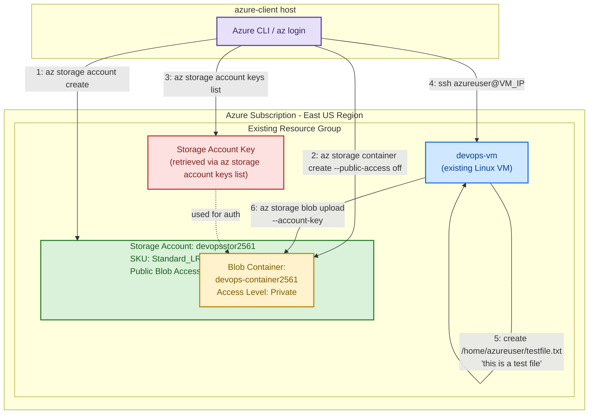

Fair — here's the full runbook content inline so you can copy it directly.

## Azure VM to Blob Storage Integration — Runbook

### Purpose

Enable the existing `devops-vm` (East US) to store and retrieve data in a private Azure Blob Storage container. This covers creating a locally-redundant (LRS) storage account, a private blob container, retrieving the account access key, and validating the end-to-end upload path from the VM using the Azure CLI.

### Scope / Requirements

| Item | Value |
|---|---|
| Existing VM | `devops-vm` (East US — already provisioned, no changes needed) |
| Storage account | `devopsstor2561` |
| Storage account region | East US |
| Storage redundancy | Locally-redundant storage (LRS) |
| Blob container | `devops-container2561` |
| Container access level | Private (no anonymous/public access) |
| Test file | `/home/azureuser/testfile.txt` containing `this is a test file` |
| Upload tool | Azure CLI (`az storage blob upload`) run against the container using the account key |

### Prerequisites

- Logged into the Azure Portal or CLI with the lab credentials below.
- `az` CLI available on the `azure-client` host (or Cloud Shell).
- SSH access to `devops-vm` as `azureuser`.

**Lab credentials (session-scoped, single hour window)**

| Field | Value |
|---|---|
| Portal | https://portal.azure.com |
| Username | `kk_lab_user_main-2711a7d032ac4be5@azurefreekmlprod.onmicrosoft.com` |
| Password | `5@KU5YQ6` |
| Valid window | Thu Jul 30 15:03:16 UTC 2026 → Thu Jul 30 16:03:16 UTC 2026 |

Credentials can also be retrieved by running `showcreds` on the `azure-client` host.

> Note: as of now (~8:44 PM IST / ~15:14 UTC) this window is active with roughly 49 minutes remaining.

### Architecture (Mermaid)



### Step-by-step procedure

**Step 1 — Confirm login and locate the resource group**

```bash
az login
az account show -o table
az vm list --query "[?name=='devops-vm'].{Name:name, RG:resourceGroup, Location:location}" -o table

RESOURCE_GROUP="$(az vm list --query "[?name=='devops-vm'].resourceGroup" -o tsv)"
echo "$RESOURCE_GROUP"
```

**Step 2 — Create the private Storage Account (LRS, East US)**

```bash
az storage account create \
  --name devopsstor2561 \
  --resource-group "$RESOURCE_GROUP" \
  --location eastus \
  --sku Standard_LRS \
  --kind StorageV2 \
  --allow-blob-public-access false \
  --min-tls-version TLS1_2
```

- `--sku Standard_LRS` → Locally-redundant storage as required.
- `--allow-blob-public-access false` → blocks anonymous/public blob access at the account level.
- `--min-tls-version TLS1_2` → hardens transport security.

**Step 3 — Retrieve the storage account access key**

```bash
ACCOUNT_KEY="$(az storage account keys list \
  --resource-group "$RESOURCE_GROUP" \
  --account-name devopsstor2561 \
  --query '[0].value' -o tsv)"

echo "$ACCOUNT_KEY"
```

**Step 4 — Create the private Blob container**

```bash
az storage container create \
  --name devops-container2561 \
  --account-name devopsstor2561 \
  --account-key "$ACCOUNT_KEY" \
  --public-access off
```

**Step 5 — SSH into `devops-vm` and create the test file**

```bash
VM_PUBLIC_IP="$(az vm show -d \
  --resource-group "$RESOURCE_GROUP" \
  --name devops-vm \
  --query publicIps -o tsv)"

ssh azureuser@"$VM_PUBLIC_IP"
```

Once connected:

```bash
echo "this is a test file" > /home/azureuser/testfile.txt
cat /home/azureuser/testfile.txt
```

**Step 6 — Upload the file to Blob Storage from the VM**

```bash
# Only if az is not already installed on the VM:
curl -sL https://aka.ms/InstallAzureCLIDeb | sudo bash

az storage blob upload \
  --account-name devopsstor2561 \
  --account-key <access-key> \
  --container-name devops-container2561 \
  --name testfile.txt \
  --file /home/azureuser/testfile.txt
```

Replace `<access-key>` with the value captured in Step 3.

**Step 7 — Validate the upload**

```bash
az storage blob list \
  --account-name devopsstor2561 \
  --account-key "$ACCOUNT_KEY" \
  --container-name devops-container2561 \
  -o table

az storage blob show \
  --account-name devopsstor2561 \
  --account-key "$ACCOUNT_KEY" \
  --container-name devops-container2561 \
  --name testfile.txt \
  --query '{name:name, size:properties.contentLength, lastModified:properties.lastModified}' \
  -o table
```

### Validation checklist

- `devops-vm` exists and is running in East US (pre-existing).
- Storage account `devopsstor2561` exists in East US with SKU `Standard_LRS`.
- Public blob access disabled at account level.
- Blob container `devops-container2561` exists with access level `off` (private).
- Storage account key retrieved successfully.
- `/home/azureuser/testfile.txt` exists on `devops-vm` containing exactly `this is a test file`.
- `testfile.txt` appears in `devops-container2561`.
- Blob content length/metadata matches the local file.

### Security notes

- Account-level public access disabled + container `--public-access off` = no anonymous access anywhere.
- Treat the storage account key as a secret; prefer a scoped SAS token or Azure AD/Managed Identity in production.
- Lab credentials are time-boxed — don't reuse outside the stated window.

### Cleanup (optional)

```bash
az storage account delete \
  --name devopsstor2561 \
  --resource-group "$RESOURCE_GROUP" \
  --yes
```