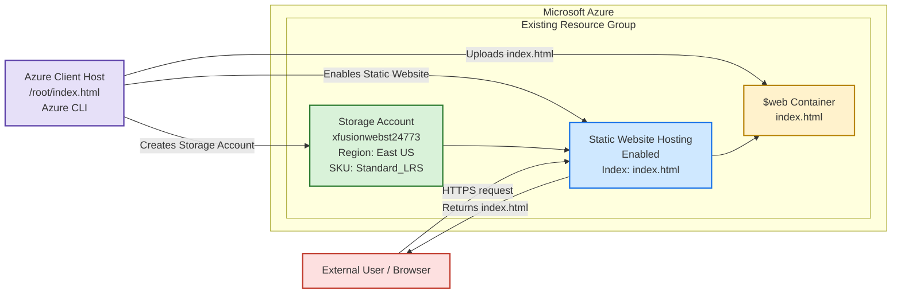

# Azure Storage Static Website OTS and Runbook

## Requirements

| Component | Configuration |
|---|---|
| Storage account | `xfusionwebst24773` |
| Resource group | Existing resource group |
| Region | East US |
| Account type | StorageV2 |
| Redundancy | Standard LRS |
| Static website | Enabled |
| Index document | `index.html` |
| Source file | `/root/index.html` |
| Target container | `$web` |
| Accessibility | Public static website URL |

## Mermaid Architecture Diagram



## OTS Script

Create the script on the `azure-client` host:

```bash
vi ots.sh
```

Paste the following content:

```bash
#!/usr/bin/env bash

###############################################################################
# OTS: Azure Storage Static Website
# Storage account: xfusionwebst24773
# Region: East US
# Source file: /root/index.html
# Container: $web
###############################################################################

set -euo pipefail

LOCATION="eastus"
STORAGE_ACCOUNT="xfusionwebst24773"
STORAGE_SKU="Standard_LRS"
INDEX_DOCUMENT="index.html"
SOURCE_FILE="/root/index.html"

echo "============================================================"
echo "Step 1: Validate Azure CLI session"
echo "============================================================"

az account show -o table

echo "============================================================"
echo "Step 2: Identify the existing resource group"
echo "============================================================"

az group list -o table

RESOURCE_GROUP="$(az group list --query '[0].name' -o tsv)"

if [[ -z "$RESOURCE_GROUP" ]]; then
    echo "ERROR: No existing resource group was found."
    exit 1
fi

echo "Using resource group: $RESOURCE_GROUP"

echo "============================================================"
echo "Step 3: Validate the index.html source file"
echo "============================================================"

if [[ ! -f "$SOURCE_FILE" ]]; then
    echo "ERROR: $SOURCE_FILE does not exist."
    exit 1
fi

echo "Source file found:"
ls -l "$SOURCE_FILE"

echo "============================================================"
echo "Step 4: Create the Storage account"
echo "============================================================"

az storage account create \
    --name "$STORAGE_ACCOUNT" \
    --resource-group "$RESOURCE_GROUP" \
    --location "$LOCATION" \
    --sku "$STORAGE_SKU" \
    --kind StorageV2 \
    --allow-blob-public-access true \
    --min-tls-version TLS1_2 \
    -o table

echo "============================================================"
echo "Step 5: Retrieve the Storage account access key"
echo "============================================================"

ACCOUNT_KEY="$(az storage account keys list \
    --resource-group "$RESOURCE_GROUP" \
    --account-name "$STORAGE_ACCOUNT" \
    --query '[0].value' \
    -o tsv)"

if [[ -z "$ACCOUNT_KEY" ]]; then
    echo "ERROR: Unable to retrieve the Storage account key."
    exit 1
fi

echo "Storage account key retrieved successfully."

echo "============================================================"
echo "Step 6: Enable static website hosting"
echo "============================================================"

az storage blob service-properties update \
    --account-name "$STORAGE_ACCOUNT" \
    --account-key "$ACCOUNT_KEY" \
    --static-website \
    --index-document "$INDEX_DOCUMENT"

echo "Static website hosting enabled."
echo "The \$web container is created automatically."

echo "============================================================"
echo "Step 7: Upload index.html to the \$web container"
echo "============================================================"

az storage blob upload \
    --account-name "$STORAGE_ACCOUNT" \
    --account-key "$ACCOUNT_KEY" \
    --container-name '$web' \
    --name "$INDEX_DOCUMENT" \
    --file "$SOURCE_FILE" \
    --overwrite \
    -o table

echo "============================================================"
echo "Step 8: Verify the uploaded file"
echo "============================================================"

az storage blob list \
    --account-name "$STORAGE_ACCOUNT" \
    --account-key "$ACCOUNT_KEY" \
    --container-name '$web' \
    --query "[].{
        Name:name,
        Size:properties.contentLength,
        Type:properties.contentSettings.contentType
    }" \
    -o table

echo "============================================================"
echo "Step 9: Retrieve the static website URL"
echo "============================================================"

WEBSITE_URL="$(az storage account show \
    --resource-group "$RESOURCE_GROUP" \
    --name "$STORAGE_ACCOUNT" \
    --query primaryEndpoints.web \
    -o tsv)"

if [[ -z "$WEBSITE_URL" ]]; then
    echo "ERROR: Unable to retrieve the static website URL."
    exit 1
fi

echo "Static website URL: $WEBSITE_URL"

echo "Waiting 10 seconds for endpoint propagation..."
sleep 10

echo "============================================================"
echo "Step 10: Verify public website accessibility"
echo "============================================================"

HTTP_STATUS="$(curl \
    --silent \
    --show-error \
    --output /dev/null \
    --max-time 30 \
    --write-out '%{http_code}' \
    "$WEBSITE_URL")"

echo "HTTP status: $HTTP_STATUS"

if [[ "$HTTP_STATUS" == "200" ]]; then
    echo "SUCCESS: The static website is publicly accessible."
else
    echo "WARNING: Expected HTTP 200 but received HTTP $HTTP_STATUS."
    echo "Wait briefly and retry:"
    echo "curl -I \"$WEBSITE_URL\""
fi

echo "============================================================"
echo "Deployment summary"
echo "============================================================"
echo "Resource group  : $RESOURCE_GROUP"
echo "Storage account : $STORAGE_ACCOUNT"
echo "Region          : $LOCATION"
echo "Container       : \$web"
echo "Index document  : $INDEX_DOCUMENT"
echo "Website URL     : $WEBSITE_URL"
echo "============================================================"
```

Make the script executable and run it:

```bash
chmod +x ots.sh
./ots.sh
```

> If more than one resource group exists, replace the automatic resource-group assignment with the correct name:
>
> ```bash
> RESOURCE_GROUP="<existing-resource-group-name>"
> ```

## Manual Runbook

### Check Azure authentication

```bash
az account show -o table
```

If authentication is required:

```bash
az login
```

### Identify the existing resource group

```bash
az group list -o table
```

Set the correct resource group:

```bash
RESOURCE_GROUP="<existing-resource-group-name>"
```

Alternatively, if the subscription has only one resource group:

```bash
RESOURCE_GROUP="$(az group list --query '[0].name' -o tsv)"
echo "$RESOURCE_GROUP"
```

### Confirm the source file exists

```bash
ls -l /root/index.html
cat /root/index.html
```

The file must exist before continuing.

### Create the Storage account

```bash
az storage account create \
    --name xfusionwebst24773 \
    --resource-group "$RESOURCE_GROUP" \
    --location eastus \
    --sku Standard_LRS \
    --kind StorageV2 \
    --allow-blob-public-access true \
    --min-tls-version TLS1_2 \
    -o table
```

Important configuration:

- `eastus` creates the resource in East US.
- `Standard_LRS` configures locally redundant storage.
- `StorageV2` supports static website hosting.
- `--allow-blob-public-access true` permits public website access.

### Retrieve the Storage account key

```bash
ACCOUNT_KEY="$(az storage account keys list \
    --resource-group "$RESOURCE_GROUP" \
    --account-name xfusionwebst24773 \
    --query '[0].value' \
    -o tsv)"
```

Confirm that the variable contains a value:

```bash
if [[ -n "$ACCOUNT_KEY" ]]; then
    echo "Storage account key retrieved successfully."
else
    echo "Storage account key retrieval failed."
fi
```

Do not print or expose the access key unnecessarily.

### Enable static website hosting

```bash
az storage blob service-properties update \
    --account-name xfusionwebst24773 \
    --account-key "$ACCOUNT_KEY" \
    --static-website \
    --index-document index.html
```

Enabling static website hosting automatically creates the special `$web` container.

### Verify static website configuration

```bash
az storage blob service-properties show \
    --account-name xfusionwebst24773 \
    --account-key "$ACCOUNT_KEY" \
    --query "staticWebsite" \
    -o json
```

Expected configuration:

```json
{
  "enabled": true,
  "errorDocument404Path": null,
  "indexDocument": "index.html"
}
```

### Verify the `$web` container

The single quotes prevent the shell from interpreting `$web` as a variable:

```bash
az storage container show \
    --name '$web' \
    --account-name xfusionwebst24773 \
    --account-key "$ACCOUNT_KEY" \
    -o table
```

### Upload `index.html`

```bash
az storage blob upload \
    --account-name xfusionwebst24773 \
    --account-key "$ACCOUNT_KEY" \
    --container-name '$web' \
    --name index.html \
    --file /root/index.html \
    --overwrite \
    -o table
```

### Verify the uploaded file

```bash
az storage blob list \
    --account-name xfusionwebst24773 \
    --account-key "$ACCOUNT_KEY" \
    --container-name '$web' \
    -o table
```

Verify the specific blob:

```bash
az storage blob show \
    --account-name xfusionwebst24773 \
    --account-key "$ACCOUNT_KEY" \
    --container-name '$web' \
    --name index.html \
    --query '{
        Name:name,
        Size:properties.contentLength,
        ContentType:properties.contentSettings.contentType,
        LastModified:properties.lastModified
    }' \
    -o table
```

### Retrieve the static website URL

```bash
WEBSITE_URL="$(az storage account show \
    --resource-group "$RESOURCE_GROUP" \
    --name xfusionwebst24773 \
    --query primaryEndpoints.web \
    -o tsv)"

echo "$WEBSITE_URL"
```

The URL should be similar to:

```text
https://xfusionwebst24773.z13.web.core.windows.net/
```

The exact regional endpoint can differ, so always retrieve it through Azure CLI.

### Verify public accessibility

```bash
curl -I "$WEBSITE_URL"
```

Expected result:

```text
HTTP/1.1 200 OK
```

Retrieve the actual website content:

```bash
curl "$WEBSITE_URL"
```

The output should match `/root/index.html`.

## Validation Commands

### Validate the Storage account region and SKU

```bash
az storage account show \
    --resource-group "$RESOURCE_GROUP" \
    --name xfusionwebst24773 \
    --query '{
        Name:name,
        Location:location,
        SKU:sku.name,
        Kind:kind,
        PublicBlobAccess:allowBlobPublicAccess,
        WebsiteURL:primaryEndpoints.web
    }' \
    -o table
```

Expected values:

| Property | Expected value |
|---|---|
| Name | `xfusionwebst24773` |
| Location | `eastus` |
| SKU | `Standard_LRS` |
| Kind | `StorageV2` |
| Public blob access | `true` |
| Website URL | Azure static website endpoint |

### Validate static website settings

```bash
az storage blob service-properties show \
    --account-name xfusionwebst24773 \
    --account-key "$ACCOUNT_KEY" \
    --query staticWebsite \
    -o json
```

### Validate the uploaded blob

```bash
az storage blob exists \
    --account-name xfusionwebst24773 \
    --account-key "$ACCOUNT_KEY" \
    --container-name '$web' \
    --name index.html \
    --query exists \
    -o tsv
```

Expected result:

```text
true
```

### Validate the HTTP response

```bash
curl \
    --silent \
    --output /dev/null \
    --write-out "HTTP Status: %{http_code}\n" \
    "$WEBSITE_URL"
```

Expected result:

```text
HTTP Status: 200
```

## Validation Checklist

- [ ] Existing resource group was used.
- [ ] Storage account name is `xfusionwebst24773`.
- [ ] Storage account region is `eastus`.
- [ ] Storage SKU is `Standard_LRS`.
- [ ] Storage account type is `StorageV2`.
- [ ] Public blob access is enabled.
- [ ] Static website hosting is enabled.
- [ ] Index document is configured as `index.html`.
- [ ] `$web` container exists.
- [ ] `/root/index.html` was uploaded as `$web/index.html`.
- [ ] Static website endpoint was retrieved.
- [ ] Website returns HTTP status `200`.
- [ ] Website content is accessible without authentication.

## Troubleshooting

### Storage account name unavailable

Storage account names are globally unique. Check availability:

```bash
az storage account check-name \
    --name xfusionwebst24773 \
    -o table
```

If the required name is unavailable because it already exists in the current subscription, check whether the resource was created by an earlier attempt:

```bash
az storage account list \
    --query "[?name=='xfusionwebst24773'].{
        Name:name,
        ResourceGroup:resourceGroup,
        Location:location
    }" \
    -o table
```

### `/root/index.html` not found

```bash
ls -la /root/
```

The required file must exist at:

```text
/root/index.html
```

### `$web` interpreted as an empty variable

Always quote the container name:

```bash
--container-name '$web'
```

Do not use this unquoted:

```bash
--container-name $web
```

### Website returns HTTP 404

Confirm that `index.html` exists in `$web`:

```bash
az storage blob list \
    --account-name xfusionwebst24773 \
    --account-key "$ACCOUNT_KEY" \
    --container-name '$web' \
    -o table
```

Confirm that `index.html` is configured as the index document:

```bash
az storage blob service-properties show \
    --account-name xfusionwebst24773 \
    --account-key "$ACCOUNT_KEY" \
    --query staticWebsite \
    -o json
```

### Website URL is empty

Verify that static website hosting is enabled, then retrieve the URL again:

```bash
az storage account show \
    --resource-group "$RESOURCE_GROUP" \
    --name xfusionwebst24773 \
    --query primaryEndpoints.web \
    -o tsv
```

### Website does not respond immediately

Allow a short propagation period:

```bash
sleep 15
curl -I "$WEBSITE_URL"
```

## Optional Cleanup

Run cleanup only if the lab requires resource removal:

```bash
az storage account delete \
    --name xfusionwebst24773 \
    --resource-group "$RESOURCE_GROUP" \
    --yes
```

This deletes the Storage account, `$web` container, and `index.html`.